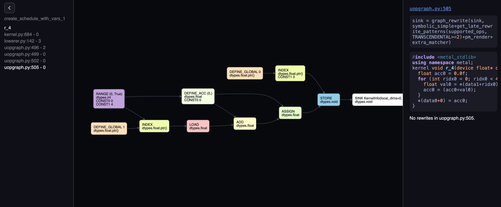

# Build Tinygrad from scratch

> Pre-requisite: https://www.youtube.com/playlist?list=PLAqhIrjkxbuWI23v9cThsA9GvCAUhRvKZ

Let's build tinygrad from the ground up and train an MNIST at the end! While this
won't be a full fledged tinygrad clone, it sure does cover many core ideas, such as
lazy evaluation, backward propgation, code generation etc. It would be
fun and eductional. Hopefully that inspires you to contribute to tinygrad and
even build your own version!

## Chapter 1 - arithmetic engine

At its core, an ML framework enables arithmetic operation on multi dimensional
data, for example, a 2 by 2 matrix can be multiplied with another 2 by 2
matrix, and get the resulting 2 by 2 matrix. We would like to do something 
like below:

```python
a = Tensor([1,2,3])
b = Tensor([1,2,3])
c = a.mul(b) # --> c would have result [1,4,9]
```

The implementation is trivial for now:

```python
class Tensor:
    def __init__(self, data): self.data = data

    def mul(self, other): return Tensor([a * b for a, b in zip(self.data, other.data)])
```

There are a few things we need to address though:

## Generalizing the elementwise pattern

If you were to implement addition, you will notice that it looks very much
the same as the multiplication:

```python
    def add(self, other): return Tensor([a + b for a, b in zip(self.data, other.data)])
```

As a result, we can extract this to a general method called elementwise. You 
will see later how almost all the operation can be boiled down to "elementwise"
and "reduce" (more on reduce later).

```python
def elementwise(op_func, tensor_a, tensor_b):
    return Tensor([op_func(a, b) for a, b in zip(self.data, other.data)])

class Tensor:
    def add(self, other): return elementwise(lambda x, y: x + y, self, other)
    def mul(self, other): return elementwise(lambda x, y: x + y, self, other)
```

What we just did is considered binary operation, because it takes two elements
and produce a single output. There are also unary operation, for example, 
logarithm, negation, exponentiation, and reciprocal (one application is
when calculating negative log likelihood). We will also see ternary operation,
`x ? y : z`, for example when doing a `tril` operation. These are in fact can 
all be covered with our `elementwise` by making it take variable length arguments:

```python
def e(op_func, *tensors):
    tensor_data = map(lambda t: t.data, tensors)
    return Tensor([op_func(*args) for args in zip(*tensor_data)])

class Tensor:
    def __init__(self, data): self.data = data
    def __repr__(self): return f"Tensor({self.data})"
    def add(self, other): return e(lambda x, y: x + y, self, other)
    def mul(self, other): return e(lambda x, y: x + y, self, other)
    def neg(self): return e(lambda x: -x, self)
    def log(self): return e(lambda x: math.log(x), self)
    def recip(self): return e(lambda x: 1/x, self)
    def where(self, x, y): return e(lambda condition, x, y: x if condition else y, self, x, y)

a = Tensor([1,2,3])
b = Tensor([4,5,6])
c = a.mul(b).log()
print(c) # Tensor([1.6094379124341003, 1.9459101490553132, 2.1972245773362196])

d = Tensor([1,0,0]).where(a, b)
print(d) # Tensor([1,5,6])
```

While this may not seem super helpful, after all, it's just some nested for loop,
but if you recognize the fact that multi dimensional data are usually represented 
as linear contiguous memory (aka a single list), our simple Tensor class is actually
capable of processing arbitrary dimensional data! To do that, let's add *shapetracker*.

## Elementary Shapetracker

Suppose we have a 2 by 2 matrix:

```
[
    [1,2],
    [3,4]
]
```

the underlying memory is the same as a 4 by 1 matrix that 
contains data `[1,2,3,4]`. As a result, doing a negation or log operation on
such 4 by 4 matrix is equivalent to doing it on the 4 by 1 matrix. The only
difference is when the user asks for the data, you have to reshape it into
this nested list before returning. To accomplish this functionality, we add
a shape attribute to our tensor class, and a method to retrieve the user specified
shape, let's call that `numpy`:

```python
    def numpy(self):
        row, col = self.shape # (2,2)
        _data = []
        for row_number in row:
            _row = []
            for col_number in self.shape[1]:
                _row.append(self.data[row_number * col + col_number])
            _data.append(_row)
        return _data
```

Let's see how this works as an example:

```python
def e(op_func, *tensors):
    tensor_data = map(lambda t: t.data, tensors)
    return Tensor([op_func(*args) for args in zip(*tensor_data)], tensors[0].shape)

class Tensor:
    def __init__(self, data, shape): self.data, self.shape = data, shape
    def __repr__(self): return f"Tensor({self.data})"
    def add(self, other): return e(lambda x, y: x + y, self, other)
    def mul(self, other): return e(lambda x, y: x + y, self, other)
    def neg(self): return e(lambda x: -x, self)
    def log(self): return e(lambda x: math.log(x), self)
    def recip(self): return e(lambda x: 1/x, self)
    def where(self, x, y): return e(lambda condition, x, y: x if condition else y, self, x, y)
    def numpy(self):
        row, col = self.shape
        _data = []
        for row_number in range(row):
            _row = []
            for col_number in range(col):
                _row.append(self.data[row_number * col + col_number])
            _data.append(_row)
        return _data

a = Tensor([1,2,3,4], (2,2))
b = Tensor([5,6,7,8], (2,2))
print(a.add(b).numpy()) # [[6, 8], [10, 12]]
```

This is a powerful pattern that can be extended to more than a 2 dimensional matrix.
For that, let me introduce the concept of strides. In the above code, we
indexed into the `.data` by calculating the value of `row_number * col + col_number`.
In English, this is like saying "The value of the item on the first row
and second column, we multiply the row number by the total number of columns,
and add the column number, that's the position of the item". Stride refers
to how many steps to take to advance one item in a specified dimension. The
reason we were doing row_number * col + col_number, is because this
shape has a stride of `(col, 1)` (or `(2, 1)` where col has value 2).
So the formula to find the index of an element is its value at the current
dimension multiplied by the corresponding stride.

There may be better resources online that explain this, and I also made a tool
to visualize how things are presented and stored given any shape and stride,
for our example:



> [Link here](https://mesozoic-egg.github.io/shape-stride-visualizer/#/shape-stride)

So this is how things look when generalized to arbitrary dimensions, for example,
a 2 by 2 by 2 cube. Take some time to play around with this script and make sure you understand it:

```python

def e(op_func, *tensors):
    tensor_data = map(lambda t: t.data, tensors)
    return Tensor([op_func(*args) for args in zip(*tensor_data)], tensors[0].shape)

def find_strides_for_contiguous_shape(shape):
    strides = [1]  # (1)
    for s in shape[::-1][:-1]:  # (3, 2)
        strides.append(strides[-1] * s)
    return tuple(strides[::-1])
    
class Tensor:
    def __init__(self, data, shape):
        self.data, self.shape = data, shape
        self.strides = find_strides_for_contiguous_shape(shape)
    def __repr__(self): return f"Tensor({self.data})"
    def add(self, other): return e(lambda x, y: x + y, self, other)
    def mul(self, other): return e(lambda x, y: x + y, self, other)
    def neg(self): return e(lambda x: -x, self)
    def log(self): return e(lambda x: math.log(x), self)
    def recip(self): return e(lambda x: 1/x, self)
    def where(self, x, y): return e(lambda condition, x, y: x if condition else y, self, x, y)
    def numpy(self):
        def recurse(shape, idx = 0, indices = []):
            if idx == len(shape):
                data_index = 0
                for i, index in enumerate(indices):
                    data_index += index * self.strides[i]
                return self.data[data_index]
            else:
                dim_data = []
                for i in range(shape[idx]):
                    dim_data.append(recurse(shape, idx + 1, indices + [i]))
                return dim_data

        data = recurse(self.shape)
        return data

a = Tensor([1,2,3,4,5,6,7,8], (2,2,2))
b = Tensor([5,6,7,8,9,10,11,12], (2,2,2))
c = a.add(b)
print(c.numpy()) # [[[6, 8], [10, 12]], [[14, 16], [18, 20]]]
```