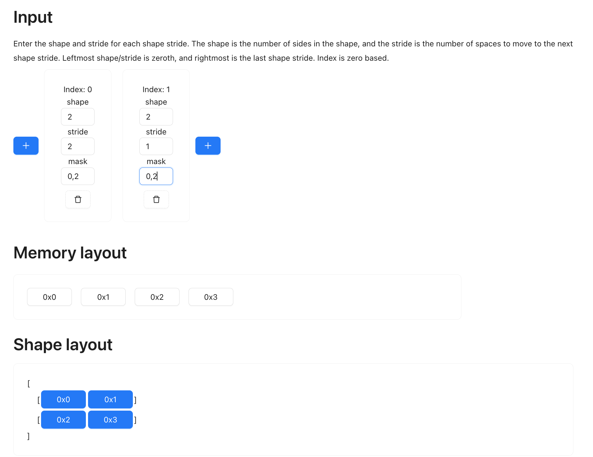

# Build Tinygrad from scratch

> Pre-requisite: https://www.youtube.com/playlist?list=PLAqhIrjkxbuWI23v9cThsA9GvCAUhRvKZ

Let's build tinygrad from the ground up and train an MNIST at the end! 
It is an extremely simplified version, but it still covers many core ideas, such as
lazy evaluation, backward propgation, UOp, shapdetracker, autograd, etc.
It would be fun and eductional. Hopefully that inspires you to contribute to tinygrad!

## Chapter 1 - arithmetic engine

At its core, an ML framework enables arithmetic operation on multi dimensional
data, for example, a 2 by 2 matrix can be multiplied with another 2 by 2
matrix, and get the resulting 2 by 2 matrix. We would like to do something 
like below:

```python
a = Tensor([1,2,3])
b = Tensor([1,2,3])
c = a.mul(b) # --> c would have result [1,4,9]
```

The implementation is trivial for now:

```python
class Tensor:
    def __init__(self, data):
        self.data = data

    def mul(self, other):
        return Tensor([a * b for a, b in zip(self.data, other.data)])
```

There are a few things we need to address though:

## Generalizing the elementwise pattern

If you were to implement addition, you will notice that it looks very much
the same as the multiplication:

```python
    def add(self, other):
        return Tensor([a + b for a, b in zip(self.data, other.data)])
```

As a result, we can extract this to a general method called elementwise. You 
will see later how almost all the operation can be boiled down to "elementwise"
and "reduce" (more on reduce later).

```python
def elementwise(op_func, tensor_a, tensor_b):
    return Tensor([op_func(a, b) for a, b in zip(self.data, other.data)])

class Tensor:
    def add(self, other): return elementwise(lambda x, y: x + y, self, other)
    def mul(self, other): return elementwise(lambda x, y: x + y, self, other)
```

What we just did is considered binary operation, because it takes two elements
and produce a single output. There are also unary operation, for example, 
logarithm, negation, exponentiation, and reciprocal (one application is
when calculating negative log likelihood). We will also see ternary operation,
`x ? y : z`, for example when doing a `tril` operation. These are in fact can 
all be covered with our `elementwise` by making it take variable length arguments:

```python
def e(op_func, *tensors):
    tensor_data = map(lambda t: t.data, tensors)
    result_data = [op_func(*args) for args in zip(*tensor_data)]
    return Tensor(result_data)

class Tensor:
    def __init__(self, data): self.data = data
    def __repr__(self): return f"Tensor({self.data})"
    def add(self, other): return e(lambda x, y: x + y, self, other)
    def mul(self, other): return e(lambda x, y: x + y, self, other)
    def neg(self): return e(lambda x: -x, self)
    def log(self): return e(lambda x: math.log(x), self)
    def recip(self): return e(lambda x: 1/x, self)
    def where(self, x, y): return e(lambda condition, x, y: x if condition else y, self, x, y)

a = Tensor([1,2,3])
b = Tensor([4,5,6])
c = a.mul(b).log()
print(c) # Tensor([1.6094379124341003, 1.9459101490553132, 2.1972245773362196])

d = Tensor([1,0,0]).where(a, b)
print(d) # Tensor([1,5,6])
```

While this may not seem super helpful, after all, it's just some nested for loop,
but if you recognize the fact that multi dimensional data are usually represented 
as linear contiguous memory (aka a single list), our simple Tensor class is actually
capable of processing arbitrary dimensional data! To do that, let's add *shapetracker*.

## Elementary Shapetracker

Suppose we have a 2 by 2 matrix:

```
[
    [1,2],
    [3,4]
]
```

the underlying memory is the same as a 4 by 1 matrix that 
contains data `[1,2,3,4]`. As a result, doing a negation or log operation on
such 4 by 4 matrix is equivalent to doing it on the 4 by 1 matrix. The only
difference is when the user asks for the data, you have to reshape it into
this nested list before returning. To accomplish this functionality, we add
a shape attribute to our tensor class, and a method to retrieve the user specified
shape, let's call that `numpy`:

```python
    def numpy(self):
        row, col = self.shape # (2,2)
        _data = []
        for row_number in row:
            _row = []
            for col_number in self.shape[1]:
                _row.append(self.data[row_number * col + col_number])
            _data.append(_row)
        return _data
```

Our `e` function will now have to inherit the shape from the input tensors:

```python
def e(op_func, *tensors):
    shape = tensors[0].shape
    tensor_data = map(lambda t: t.data, tensors)
    result_data = [op_func(*args) for args in zip(*tensor_data)]
    return Tensor(result_data, shape)
```

See this example usage, the two initial tensors are passed a 4 element list,
with a tuple specifying that shape is 2 by 2. Doing addition on them would result
in a 4 element list, but since shape is 2 by 2, when we extract the value out
for presentation, we see a nested list as the desired shape:

```python
a = Tensor([1,2,3,4], (2,2))
b = Tensor([5,6,7,8], (2,2))
c = a.add(b)
print(c.data) # [6, 8, 10, 12]
print(c.numpy()) # [[6, 8], [10, 12]]
```

This is a powerful pattern that can be extended to more than a 2 dimensional matrix.
For that, let me introduce the concept of strides. In the above code, we
indexed into the `.data` by calculating the value of `row_number * col + col_number`.
In English, this is like saying "The value of the item on the first row
and second column, we multiply the row number by the total number of columns,
and add the column number, that's the position of the item". Stride refers
to how many steps to take to advance one item in a specified dimension. The
reason we were doing row_number * col + col_number, is because this
shape has a stride of `(col, 1)` (or `(2, 1)` where col has value 2).
So the formula to find the index of an element is its value at the current
dimension multiplied by the corresponding stride.

There may be better resources online that explain this, and I also made a tool
to visualize how things are presented and stored given any shape and stride,
for our example:



> [Link here](https://mesozoic-egg.github.io/shape-stride-visualizer/#/shape-stride)

After playing around with the tool for some time, you may realize there are
two types of data layout, contiguous, and non-contiguous. Contiguous means
all the data items are placed adjacent to each other. What we have seen so far
are all contiguous tensors, for example, if you have the data [1,2,3,4,5,6],
you can shape it as `(2,3)` (2 rows and 3 cols), as `(3,2)`, `(6, 1)` or
`(1 6)` without ever touching the underlying data, then this is a contiguous 
tensors. And the strides for a contiguous tensor can be calculated with the
follows:

```python
def find_strides_for_contiguous_shape(shape):
    strides = [1]  # (1)
    for s in shape[::-1][:-1]:  # (3, 2)
        strides.append(strides[-1] * s)
    return tuple(strides[::-1])
```

For example, if you pass in shape `(3,2)` as the input, the strides that
comes out is `(2, 1)`, you have obtained a formula to find any element in the
memory position. If you are looking for the element at position `[2][1]`
(the element at row 2 and column 1, zero-indexed), the formula would be
`2 * 2 + 1 * 1 = 5`, which is the last element:

```
   0 1
0  A B
1  C D
2  E F --> F is the element at row 2 and column 1 (zero indexed)
```

Now, recognize that this don't matter for our arithemtic, because elementwise
operation just applies the op to the data element one by one, regardless of the
shape so long as the inputs' shapes match each other. This only matters when
we are presenting the tensors, so we only have to incorprate the idea to
`numpy` function and the tensor initialization:

```python
    def numpy(self):
            def recurse(shape, idx = 0, indices = []):
                if idx == len(shape):
                    data_index = 0
                    for i, index in enumerate(indices):
                        data_index += index * self.strides[i] # ---> Here is the strides
                    return self.data[data_index]
                else:
                    dim_data = []
                    for i in range(shape[idx]):
                        dim_data.append(recurse(shape, idx + 1, indices + [i]))
                    return dim_data

            data = recurse(self.shape)
            return data
```

When we init:

```python
    def __init__(self, data, shape):
        self.strides = find_strides_for_contiguous_shape(shape)
```

Let's see an example

```python
a = Tensor([1,2,3,4,5,6,7,8], (2,2,2))
print(a.strides) # (4,2,1)
b = Tensor([5,6,7,8,9,10,11,12], (2,2,2))
c = a.add(b)
print(c.data) # [6, 8, 10, 12, 14, 16, 18, 20]
print(c.numpy()) # [[[6, 8], [10, 12]], [[14, 16], [18, 20]]]
```

And the exciting part comes, let's do reshape. As you see earlier,
reshape doesn't change the data layout (I will discuss the case that does),
so our reshape function just has to modify the shape and strides:

```python
    def reshape(self, new_shape):
        new_strides = find_strides_for_contiguous_shape(new_shape)
        ret = Tensor(self.data, new_shape)
        ret.shape = new_shape
        ret.strides = new_strides
        return ret
```

Let's see an example usage:

```python
a = Tensor([1,2,3,5,6], (2,3))
print(a.numpy()) # [[1,2,3],[4,5,6]]
b = a.reshape((3, 2))
print(b.numpy()) # [[1,2],[3,4],[5,6]]
```

## Permute and contiguous

While reshaping doesn't change the data layout and result in a contiguous
tensor, that's not the case with permute. A common example is a permute followed
by reshape, that you will see when we implement matrix multiplication.


The following example may seem contrived, so feel free to skip to matrix
multiplication and revisit here when you get some motivation. But below we
start off with a contiguous tensor of shape (3,2), you can see that when
we call .numpy(), we get a three rows and two columns nested list. Next
we permute the row and column (this is also referred to as transpose), 
and we swap the row and column. Take a moment to think about what the
strides would look like, in order to achieve the .numpy() result in the middle:

```
                                                 
         Permute((1,0))       Reshape((3,2))      
          ───────►             ──────►           
  Data             Data             Data         
  [1,2,3,4,5,6]    [1,2,3,4,5,6]    [1,2,3,4,5,6]
                                                 
  .numpy()         .numpy()         .numpy()     
    [1,2]             [1,3,5]          [1,3]     
    [3,4]             [2,4,6]          [5,2]     
    [5,6]                              [4,6]     
                                                 
                                                
```

The answer is we simplify swap the strides values. So here's what the
permute would look like:

```python
    def permute(self, orders):
        new_strides = self.strides
        new_shape = self.shape
        for i, j in enumerate(orders):
            new_shape[i] = self.shape[j]
            new_strides[i] = self.strides[j]
        ret = Tensor(self.data, new_shape)
        ret.strides = new_strides
        return ret

# Example:
# a = Tensor([1,2,3,4,5,6], (2,3))
# b = a.permute((1,0))
# print(b.numpy())
```

Now, if we were to reshape the permuted tensor back to (3,2), it is not a reverse
operation, the .numpy() result actually look quite differently from the original.
The reason is that permute operation does not result in a contiguous tensor,
the elements are no longer next to each other when you present them as the
full shape. So when we do reshape on the permuted tensor, we cannot simply 
modify the shape and strides. 

There are many ways to support this permute + reshape operation, I will use the
most simple one: add a `c` function that takes a non-contiguous tensor and
make it contiguous. c is short for "contiguous".

```python
def c(tensor):
    if tensor.contiguous is True:
        return tensor
    data = []
    def recurse(i, indices):
        if i === len(self.shape):
            data_position = 0
            for _shape, _stride in zip(self.shape, self.strides):
                data_position += _shape * _stride
            data.append(self.data[data_position])
        else:
            for _i in range(self.shape[i]):
                recurse(i + 1, indices + [_i])
    recurse(0, [])
    return Tensor(data, self.shape)
```

Now we have to also change our tensor to set up `.contiguous`

```python
    def __init__(self, data, shape):
        self.contiguous = True

    def permute(self, order):
        # ... 
        ret.contiguous = False
        return ret
```

Let's see an example:

```python
a = Tensor([1,2,3,4,5,6], (2,3))
b = permute((1,0))
contiguous_b = c(b)
c = contiguous_b.reshape((2,3))

print(c.numpy()) # --> [[1,3],[5,2],[4,6]]
```

