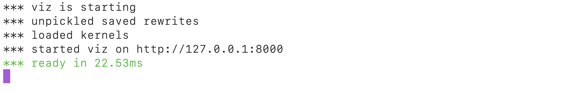
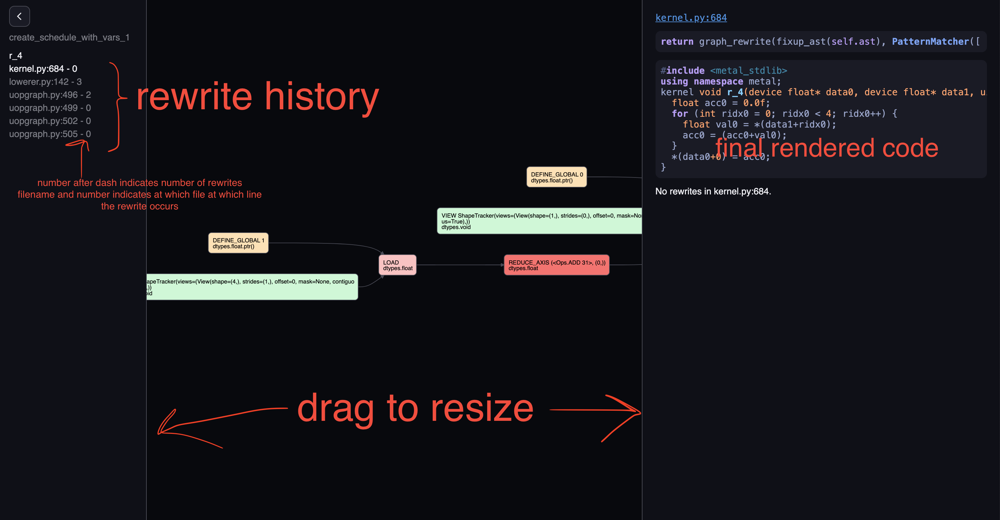
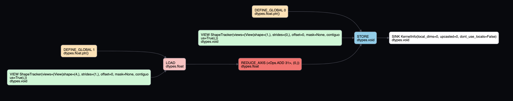
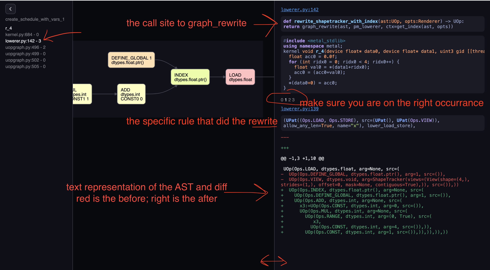
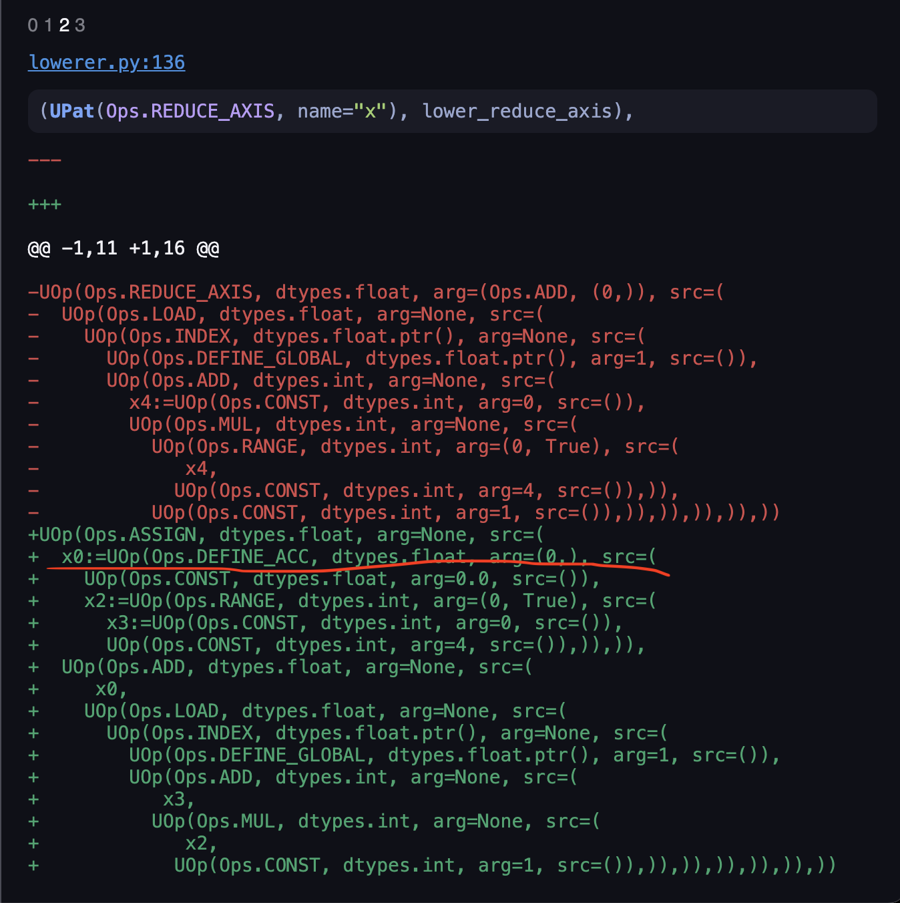
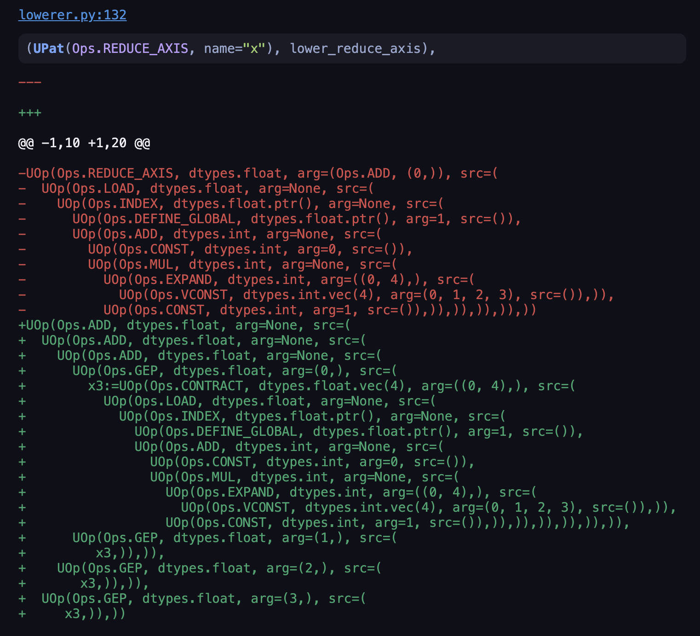
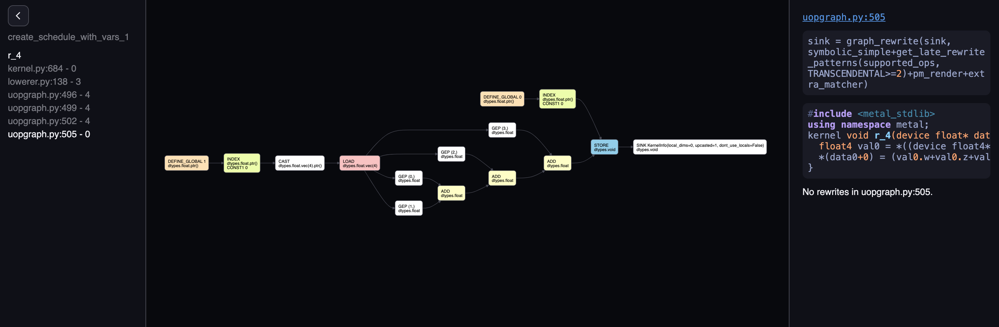

# Understanding the VIZ=1 tool

Many frameworks talks about optimization as some form of archane spell that you should not worry about, but
tinygrad makes that explicit and comes with a visualization tool, allowing you to pry under the hood easily:


## Loop unrolling example

I will use a loop unrolling example to illustrate the tool:

```python
from tinygrad import Tensor
a = Tensor.empty(4)
a.sum(0).realize()
```

First we see what the result looks like without loop unrolling: `DEBUG=5 NOOPT=1 python script.py`, the DEBUG flag
will allow us to see the generated code, and NOOPT tells tinygrad not to enable optimization. In the output you should
see the generated metal/cuda code:

```c++
kernel void r_4(device float* data0, device float* data1, uint3 gid [[threadgroup_position_in_grid]], uint3 lid [[thread_position_in_threadgroup]]) {
  float acc0 = 0.0f;
  for (int ridx0 = 0; ridx0 < 4; ridx0++) {
    float val0 = *(data1+ridx0);
    acc0 = (acc0+val0);
  }
  *(data0+0) = acc0;
}
```

The sum is managed by a loop that iterates four times. We know that for small numbers like this, we can take advantage 
of vectorized data type, and remove the loop. In fact, that's what the optimization does, let's run it with optimization
on this time `DEBUG=5 python script.py`:

```c++
kernel void r_4(device float* data0, device float* data1, uint3 gid [[threadgroup_position_in_grid]], uint3 lid [[thread_position_in_threadgroup]]) {
  float4 val0 = *((device float4*)((data1+0)));
  *(data0+0) = (val0.w+val0.z+val0.x+val0.y);
}
```

## VIZ=1 

To use the tool: `VIZ=1 NOOPT=1 python script.py`, the VIZ=1 flag will cause tinygrad to save all the pattern matching
history, and start a web server upon script exit. You can see my other post on [pattern matching](20241112_pm.md). I'm 
using the NOOPT=1 flag to help us dissect the "before" of the optimization. You should see something similar to the first
picture of this post. 



On the left column, it shows "scheduler" patterns and a list of kernels. I'll skip the scheduler part for now.
For kernels in our case, we only have one kernel called `r_4`, clicking on it gives you this:



Let's look at the center part, it's an AST representating our "intended computation": sum four numbers that are stored
on some buffer, and store the result in another buffer. On the far right end, we have a "SINK", this is an arbitrary way
of saying the computation ends here. It's parent is a "STORE" node, we can guess this means store the computed result. To
store something, we need three pieces of information, where to store, how to store, and what to store. Intuitively, this 
maps to the three parents it has. We can deduce that "DEFINE_GLOBAL" with argument 0 would be the "where", and it maps to
`device float* data0` in our generated code. The "VIEW" node is the how. We see that the generated code, we are storing it
as `*(data0+0)`, meaning that there's only one element. The shape looking code corrobarates this, as its shape is `(1,)`.
The "what" is what comes after the "=" sign in the C++ code, and its the result of a previous computation. In the graph,
it is a "REDUCE_AXIS" node. It has an argument 0, this refers to the fact we are doing a reduce op in the 0th axis, which
makes sense since our input tensor has just 1 dimension. Furthermore, it has an op called "ADD", this also makes sense,
because we are summing things up. Notice how this doesn't translate to the loop and accumulator. This is because at this
stage we have just a high level representation, it is up to the optimizer to decide how this should be accomplished. As
such, this graph will look almost identical should you have optimization on. Regardless of whether you do float4 vector 
or a loop, the high level operation is alawys "REDUCE_AXIS on axis 0, with op ADD". The rest should be self explanatory,
the input to the reduce is a loaded from "DEFINE_GLOBAL 1", which is `device float* data1`, with shape `(4,)`.



Now we are ready to look into how this AST is rewritten into the loop form. Use your the arrow key up and down to move
between the file name that rewrite happens, and left right to move across rewrites within a single file. The rewrite
mechanism is covered in my pattern matcher post. Each filename represents a call to `graph_rewrite`, and this usually
consists of a `PatternMatcher` instance. Within a pattern matcher, the AST may be rewritten multiple times, depending on
how many times it matches the rules defined, and that's what's being navigated when moving left and right.



Let's navigate to "lowerer"'s rewrite, and move horizontally to the first rewrite occurrance. On the right hand side,
we have the place where the call to "graph_rewrite" takes place, so you can navigate to the file to make changes if needed,
we also have the actual rule you passed to `PatternMatcher` that did this rewrite. And finally, we have the text representation
of the AST as a diff. The text form has the same content as the nodes graph, just different form. We can see that the
function `lower_load_store` did a rewrite that matches the `LOAD` op, it turned its two srcs ("DEFINE_GLOBAL", "VIEW") into
an "INDEX" node. Let's see the definition of `loader_load_store`, by following the code path indicated:

```python
def lower_load_store(ctx: IndexContext, x: UOp):
  idx, valid = x.st_arg.to_indexed_uops(ctx.ridxs if x.op is Ops.LOAD and x.src[0].op is Ops.DEFINE_LOCAL else ctx.idxs)
  # TODO: check has_valid in UPat, not here
  has_valid = valid.op is not Ops.CONST or valid.arg is not True
  buf = x.src[0]
  if x.op is Ops.LOAD:
    barrier = (UOp(Ops.BARRIER, dtypes.void, (x.src[2],)),) if x.src[0].op is Ops.DEFINE_LOCAL else ()
    return UOp(Ops.LOAD, x.dtype, (buf.index(idx, valid if has_valid else None),) + barrier)
  # NOTE: only store the local reduceop in the threads that are actually doing the reduce
  if cast(PtrDType, x.src[0].dtype).local and x.src[2].op is Ops.ASSIGN:
    reduce_input = x.src[2].src[1].src[1] if x.src[2].src[1].src[1] is not x.src[2].src[0] else x.src[2].src[1].src[0]
    store_back = reduce_input.op is Ops.LOAD and cast(PtrDType, reduce_input.src[0].dtype).local
  else: store_back = False
  # NOTE: If we're storing the reduced value back into each thread, need to zero-out the reduced axes
  if store_back: idx, _ = x.st_arg.to_indexed_uops([u.const_like(0) if u in x.src[2].src else u for u in ctx.idxs])
  if (not cast(PtrDType, x.src[0].dtype).local) or store_back:
    for oidx, ridx in zip(ctx.idxs, ctx.ridxs):
      if oidx is not ridx: valid = valid * oidx.eq(0)
    has_valid = valid.op is not Ops.CONST or valid.arg is not True
  return UOp(Ops.STORE, dtypes.void, (buf.index(idx, valid if has_valid else None), x.src[2]))
```

The implementation will change, but I just want to demystify the mechanism. the `x` argument is a `LOAD`, and this branches
into the first return. It returns a `UOp(Ops.LOAD)` with its source being set to an `index` node (`buf.index`), and hence
our green result.

Click again on the right arrow to see the next match, and you should see that the mechanism is roughly the same. But this
time there's something interesting:



We have the `DEFINE_ACC` being shown, this is the unoptimized version, as it indicates we are doing the reduce with a plain
accumulator and loop. The name of the function always gives out some hints `lower_reduce_axis`, telling us it is gonna turn
the REDUCE_OP into the specific implementation. Let's peek into the implementation:

```python
def lower_reduce_axis(ctx: IndexContext, x: UOp):
  # NOTE: always using ridxs is fine here
  reduce_range, reduce_expand = partition([ctx.ridxs[i] for i in x.axis_arg], lambda y: y.op is Ops.RANGE)
  assert all(x.op is Ops.EXPAND for x in reduce_expand), f"not all EXPANDS in {reduce_expand} for {x.axis_arg}"
  alu_op: Ops = x.arg[0]
  ret = x.src[0]
  if len(contract_axis:=flatten(x.arg for x in reduce_expand)):
    ret = UOp(Ops.CONTRACT, x.dtype.vec(prod(x[1] for x in contract_axis)), (ret,), tuple(contract_axis))
    ret = functools.reduce(lambda x,y: x.alu(alu_op, y), [ret.gep(i) for i in range(ret.dtype.count)])
  if not len(reduce_range): return ret
  # create ACC and assign
  acc = UOp(Ops.DEFINE_ACC, x.dtype, (x.const_like(identity_element(alu_op, x.dtype.scalar())),) + tuple(reduce_range), (ctx.acc_num,))
  ctx.acc_num += 1
  return acc.assign(acc.alu(alu_op, ret))
```

We can deduce that we returned from the last line with teh `acc` variable, eventually leading to a loop being rendered.
However, if we have `reduce_range` of length zero, then it would return something differently. To confirm this guess,
let's run the script with `VIZ=1 python script.py` without the NOOPT flag. And head to the same place:



our result is now four consecutive "ADD", roughly mapping to `(val0.w+val0.z+val0.x+val0.y);` in the vectorized code. 
Examining `lower_reduce_axis`, we see that the flag that controls whether it returns the `functools.reduce()` depends on
whether `ctx.ridx[i]` is a "RANGE" or not. So we examine what's inside `ctx`. VIZ tool tells us the call site to this
graph_rewrite is on line 138 of lowerer, and the ctx variable being passed is returned from `get_index`. 

```python
def rewrite_shapetracker_with_index(ast:UOp, opts:Renderer) -> UOp: return graph_rewrite(ast, pm_lowerer, ctx=get_index(ast, opts))
```

Inside `get_index`, we can see that the `ridx` variable ultimately came from this conditional branch:
```python
  # upcast loops
  for i,g in enumerate(full_shape[first_upcasted:], start=first_upcasted):
    assert isinstance(g, int), "needs to be int to upcast/unroll"
    idxs.append(UOp(Ops.EXPAND, dtypes.int, (UOp.const(dtypes.int.vec(g), tuple(range(g))),), ((i,g),)))
```

I have ommitted lots of details here, but you can deduce that `EXPAND` with vectorized source matches what's in the green
diff, and its' controlled by the `first_upcasted` variable. In other words, if you set upcast to `1`, then the reduce will occur
through this unrolled fashion, otherwise it defaults to a loop. 

# Final rendered form

Heading to the last file, you should see the final rendered form, let me show you the unrolled form:



The four consecutive adds were illustrated nicely, and the element they get are represented by `GEP 0`, `GEP 1`,
`GEP 2` and `GEP 3`, four elements exactly. This graph is then passed to renderer, which does some further processing
until a final pattern matcher goes to each node, and translate that into the actual code snippets. 


