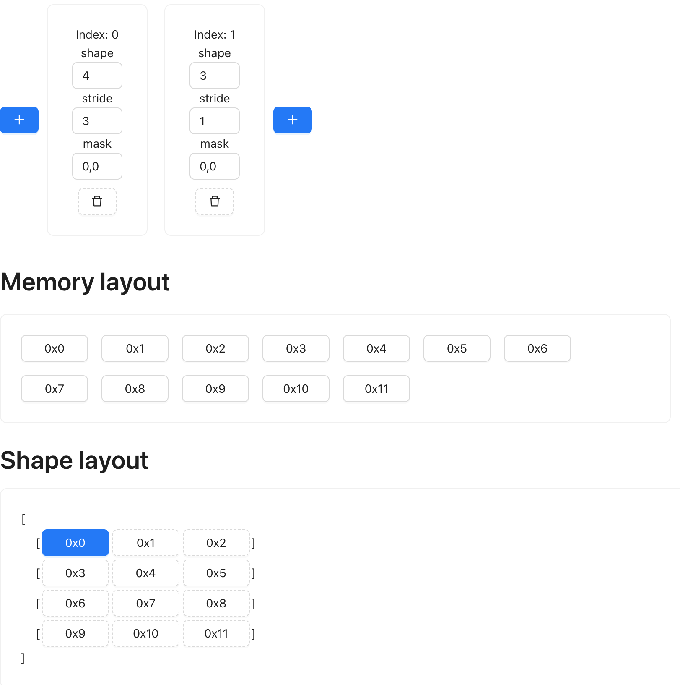
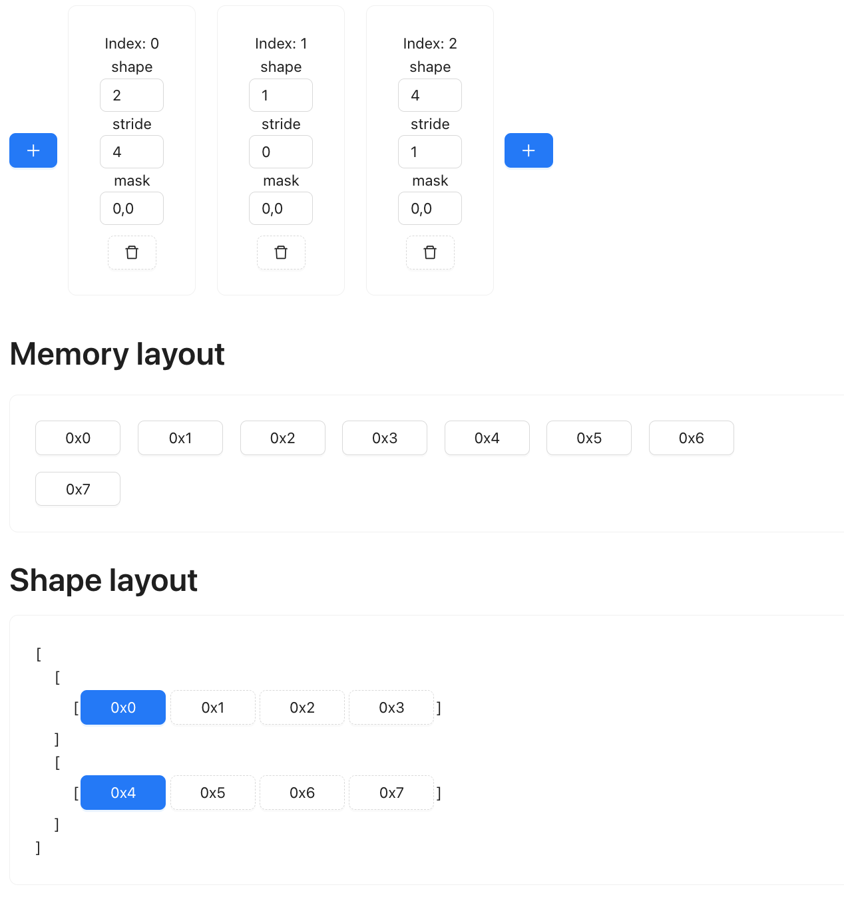
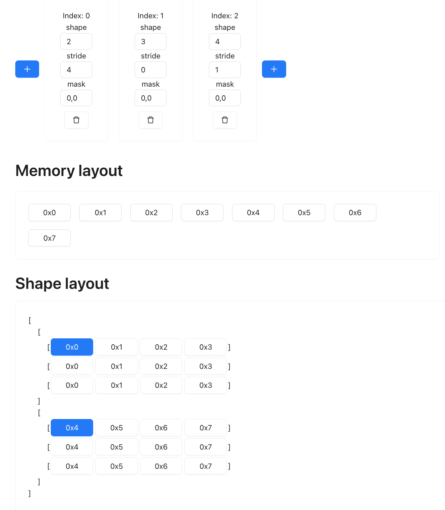
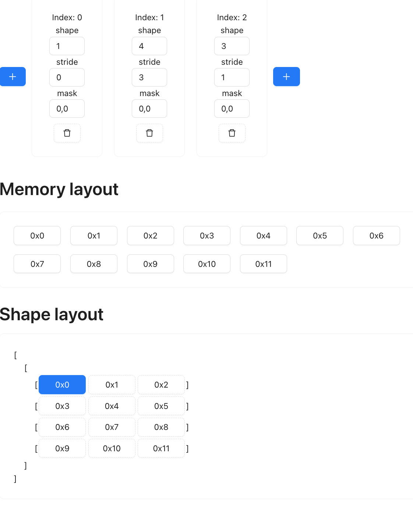
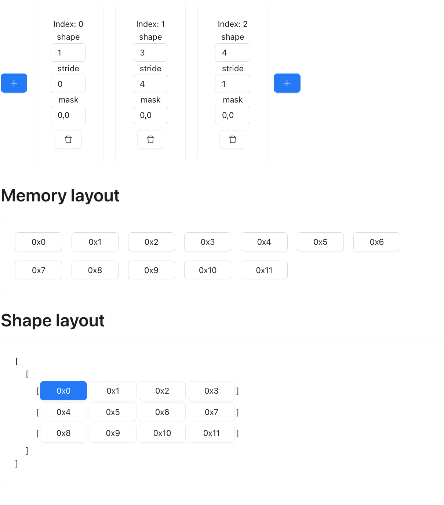
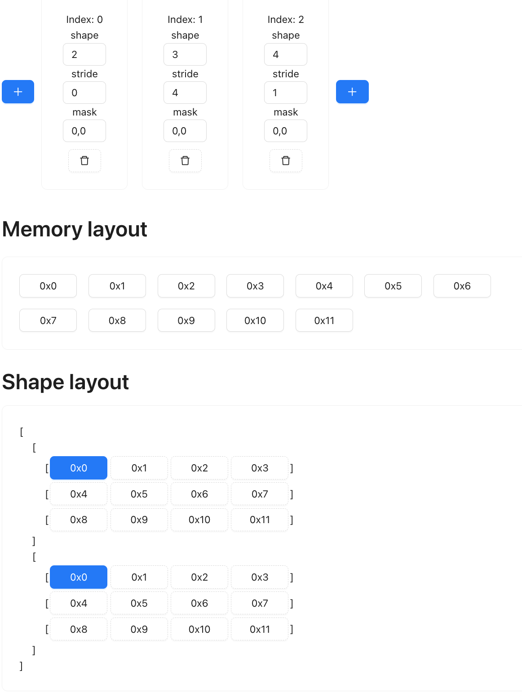
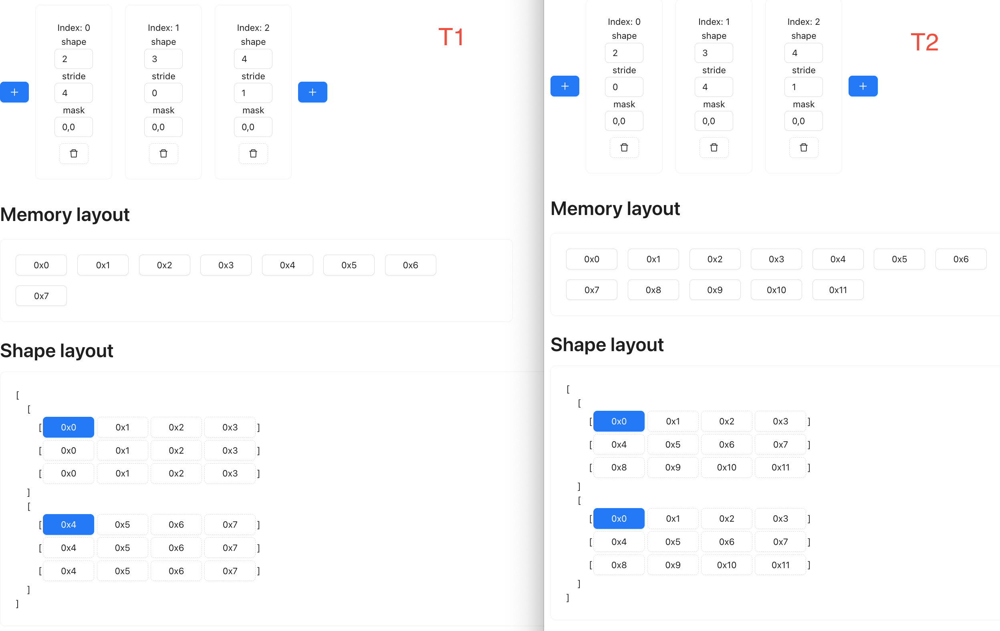

# The trick in matrix multiplication

There are many [animated explanation](https://www.google.com/search?q=matrix+multiplication+animation&oq=matrix+multiplication+animation&gs_lcrp=EgZjaHJvbWUyCQgAEEUYORiABDIICAEQABgWGB4yCAgCEAAYFhgeMggIAxAAGBYYHjINCAQQABiGAxiABBiKBTINCAUQABiGAxiABBiKBTINCAYQABiGAxiABBiKBTINCAcQABiGAxiABBiKBdIBCDM5NDdqMGo3qAIAsAIA&sourceid=chrome&ie=UTF-8). 
for matrix multiplication, and tend to lead us into thinking of the implementation as something like:

```python
def matmul(a: Tensor, b: Tensor):
  for row in a:
    for col in b:
      #...
```

The pattern here is that you are thinking of the tensor operation as rows and columns, manipulating elements indivisually.
the most scalable approach because it requires you to hand code every possible variations and optimize them individually. 
Tinygrad takes advantage of the fact that every tensor operation is either elementwise, or reduction. The obvious advantage
is to build up abstraction that makes optimization easier (think of this in the context of Complex Instruction Set Architecture
vs RISC).

An elementwise op describes operation with no changes to the number of element, for example, multiplication:

```python
Tensor.empty(4, 4) * Tensor.empty(4, 4) # ---> output shape is (4, 4)
```

A reduce op is something that reduces the number of elment, usually along an axis, for example, sum

```python
Tensor.empty(4, 4).sum(0) # --> output shape is (1, 4) or (4,) depending on whether the dim is kept
```

We can combine the two to handle pretty much all the arithmetic, for example, to calculate the mean

```python
def mean(self, axis):
  summed = self.reduce(ADD, axis)
  divided = summed.elementwise(DIVIDE, self.shape[axis])
  return divided
```

to handle max

```python
def max(self, axis):
  return self.reduce(MAX, axis)
```

to handle softmax
```python
def softmax(self, axis):
  _max = self.max(axis)
  subtracted = self.elementwise(MINUS, _max)
  exp = self.elementwise(EXP)
  return exp
```

The idea is just that you can combine elementwise and reduce op to achieve any arithmetic operation. In the implementation 
of each, the code generation is largely the same for all the possible OP (MAX, EXP, ADD) you can pass to it. For example,
the code generation process for elementwise might look like

```python
def elementwise(self, op, other):
  return f"""
float res = self {op} other;
  """
```

and the reduce

```python
def reduce(self, op, axis):
  return f"""
float acc = 0;
for (int i = 0; i < 16; i++) {{
  acc = {op}(acc, val);
}}
return acc;
"""
```

where op might be "max" or "sum". The key here is recognizing the boilerplate code that's repeated whether you are doing
a sum or a max or a min operation.

If you look closely at the code gen, you should notice we didn't specify how to access the data. That's what shape and
strides come into play.

In the first example where we did `Tensor.empty(4, 4) * Tensor.empty(4, 4)`, we should expect the final generated code to
look like:

```c++
void elementwise(float* data0, float* data1, float* data2) {
  data0[i] = data1[i] * data2[i];  
}
```

and this function will be invoked 16 times, each time with an incremented i (from 0 to 15), that will make sure every 
element in the first tensor (data1) is multiplied with every element in the second tensor (data2), with the result
stored in the output tensor (data0).

This illustrates a key aspect of the input tensor, that the memory layout is contiguous. Although it should appear as
a 4 by 4 matrix, we can process the element as if it's a 16 element list.

However, sometimes we do want to process them as a matrix, suppose we launching a total of 16 threads to process them,
and each thread has a position x and y so they are arranged as 4 by 4.

```c++
void elementwise() {
  data[4 * x + y] = data1[4 * x + y] + data2[4 * x + y];
}
```

This should be the expected code that gets generated, notice that we are fetching the memory by calculating their index.
For example (0 indexed), the element on the 1st row and second column is the 6th element in the 4 by 4 matrix in terms of
memory layout. The index 6 is calculated by multiplying 1 (2nd row) by 4 plus 2 (3rd column).

```
    0  1 `2` 3  

0   0  1  2  3    
1`  4  5 `6` 7   # the memory layout is 0 - 15, number 6 refers to the 6th element, and it's on 2nd column, 1st row 
2   8  9  10 11   
3   12 13 14 15  
```

The reason we can find its position with the formula `x * 4 + y` is because it has a stride of `(4, 1)`, so given two
indices (x and y), the formula is (x * 4 + y * 1).

Here's a [website](https://mesozoic-egg.github.io/shape-stride-visualizer/#/shape-stride) you can play around with the
concept of shape and strides

Now we can write out the full implementation of elementwise, just assume the shape is always two dimension for now

```python
def elementwise(self, op, other):
  shape = self.shape
  strides = self.strides
  index = f"x * {strides[0]} + y * {strides[1]}"
  return f"""
void elementwise(float* data0, float* data1, float*, data2) {{
  int x = threadIdx.x;
  int y = threadIdx.y;
  data0[{index}] = data1[{index}] {op} data2[{index}]; 
}}
"""
```

With all the prerequisite out of the way, we can start looking at how matrix multiplication can be expressed as a combination
of elementwise operation and reduce op.

To start, our two input tensor:

```
t1: shape (2, 4) strides (4, 1)
t2: shape (4, 3) strides (3, 1)
```

We can visualize their shape and memory layout using the website linked above:




Our first step is add an extra dimension to t1, so its shape is now (2, 1, 4):



We then expand that added axis so it matches the rows of t2, such that the shape now
becomes (2, 3, 4)



That's it for t1. To summarize, the shape change is:

```
(2, 4) --> (2, 1, 4) --> (2, 3, 4)
```

Now for t2, we also add a dimension, but at the start: (1, 4, 3)



Next we permute the last two axis: (1, 3, 4):



Next, we expand it to the col of t1: (4, 4, 3)



```
(4, 3) --> (1, 4, 3) --> (1, 3, 4) --> (2, 3, 4)
```

Notice that during our shape changes, the memory layout never changed, it's only
the presentation that changes.

Now, if you compare the two tensor side by side, you should notice that if you were
to do a multiplication elementwise, it's the exact same operation of multiplying
every row of t1 with every column of t2.



After elementwise multiplication, we have essentially done the first half of dot
product, the last is simply sum up the value, along the last dimension. If we do
a reduce op on the last dimension of shape (2, 3, 4), then the resulting shape is
(2, 3), which is the expected output for the matmul. 

