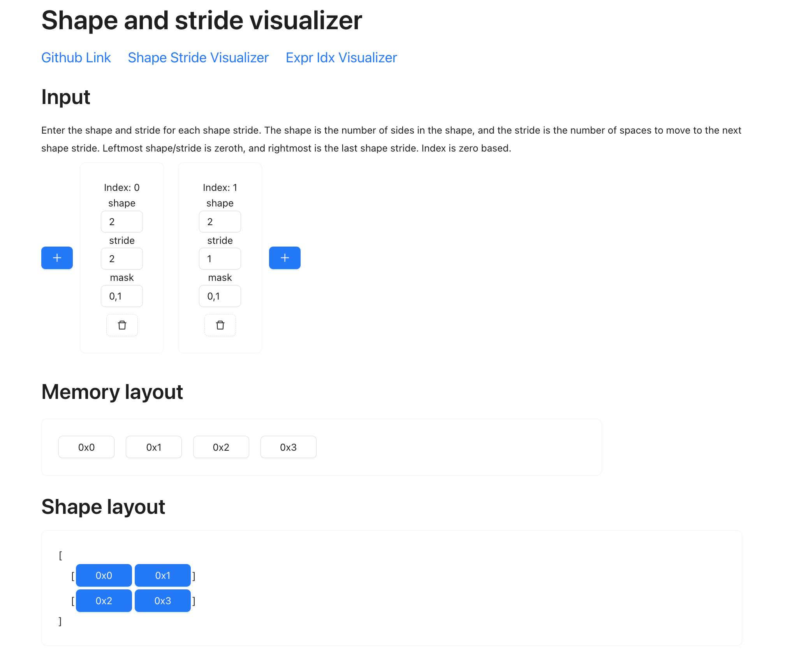
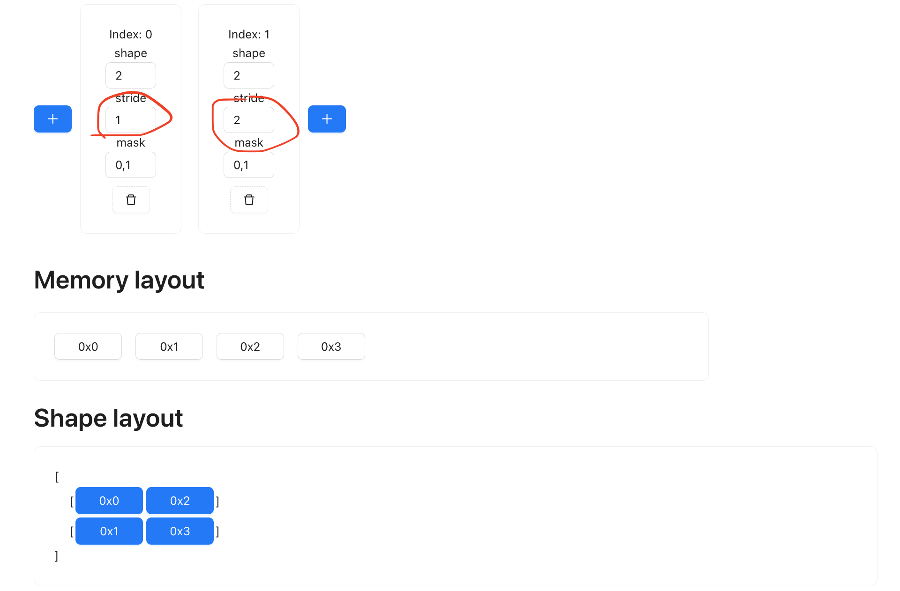
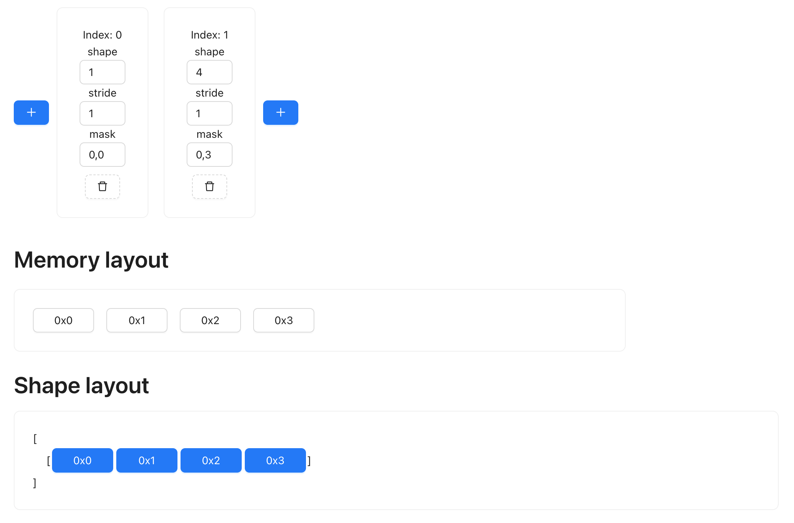
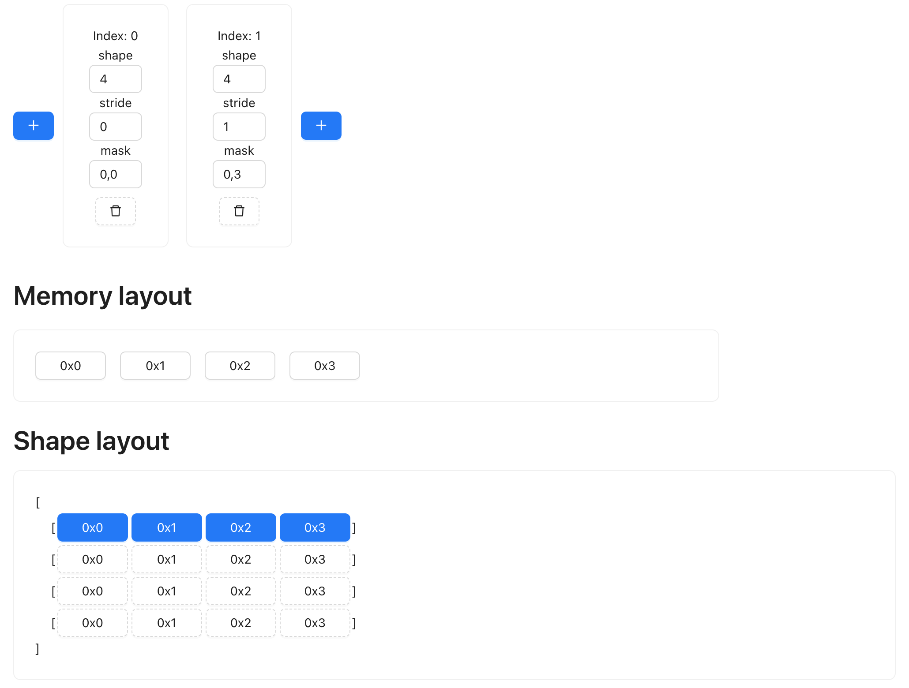
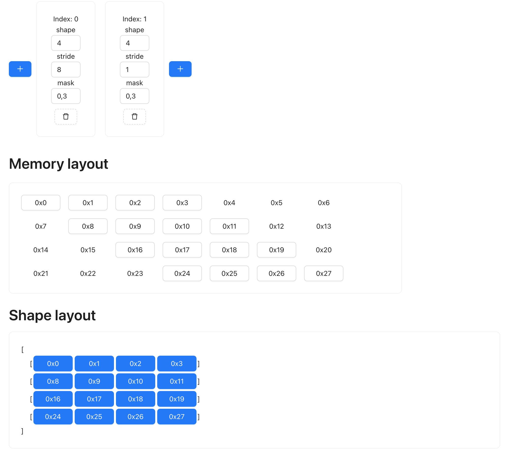
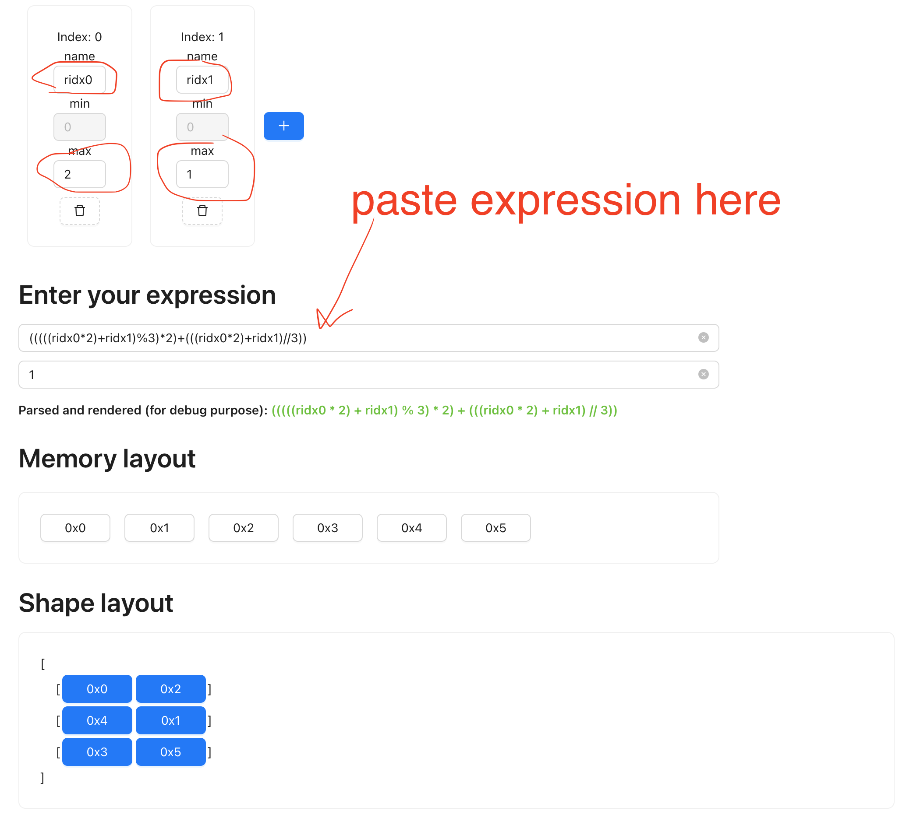

# Shapetracker

> examples were tested on commit a2a4ff30dcfafc8e7763303e9d8f0955900e8617 (in case things go out of date)

Suppose you have a 2 by 2 matrix containing values 1, 2, 3, 4. These four numbers are not stored in memory as a matrix,
but as a linear strip. As such, you need a strategy to know that when you access the element at second row, first column,
you are referring to the third element in the memory layout. That's one of the motivations of shapetracker.

In this example, such a strategy can be illustrated as `row_number * 2 + column_number` equals the memory index (things
may be off by one depending on whether you count from zero or from one).

Here, the number 2 is called a stride. A stride
refers to how many steps to take when you increment the value. Because going from the first element of one row, to the next
row, involves skipping 2 elements, the stride for the row is 2. Similarly, the stride for the column (moving from one column
to the next) is 1.

```
going from first row -->1 2
to the second row   --->3 4
skips two elements
```

You can see that in the equation above 1 is just omitted. Using row and column is not very scalable when
you have larger dimensions. Hence, a general way to express this is by the dimension. Row is the 0th dimension,
column is the 1st dimension. We can say that our zeroth dimension has a stride of 2, and first dimension has a stride of 1.
These two values actually are the input to the shapetracker implementation:

```python
View.create(shape=(2, 2), strides=(2, 1))
```

Here's a tool for visualization: https://mesozoic-egg.github.io/shape-stride-visualizer/#/shape-stride



The top boxes refers to the dimensions you have. "Index 0" is dimension 0, "Index 1" is dimension 1. Within each dimension
you put in the shape, stride, and mask. The memory layout now shows the four elements that are physically represented on
the storage, and each has a memory address (0x00, 0x01, 0x02, 0x03). Then in the shape layout section, you can see how
they are transformed into the shape that a shapetracker specifies, in this case, as a matrix. Note how each element maps to
a certain position, for example, the element at 0x02 is the element on the second row, first column.

Note that a mask for a dimension refers to the start and end (inclusive) value that's valid.
The blue highlight refers to the values that are valid here. If you put the mask value for the zeroth dimension as "0, 0",
then only the first row will be highlighted.

This is a powerful concept, because we can now manipulate complex shape without changing the data. For example, if I want
to transpose the matrix, so that instead of

```
[
  0x00, 0x01
  0x02, 0x03
]
```

I want:
```
[
  0x00, 0x02
  0x01, 0x03
]
```

You can easily achieve it by just flipping the strides:



Note how the memory layout didn't change? This is a nice thing to have, it means we are manipulating the tensor
at almost zero cost. Sometimes you may transpose something, only to later transpose it back. If every transpose requires
you to physically move the memory content, the computation will be slow. Doing it symbolically saves a lot of compute time.

There are a few layers of abstraction in the shapetracker API, let's start from the bottom: View

```python
from tinygrad.shape.view import View

# The two by two matrix is represneted as shape being (2, 2), strides being (2, 1)
a = View.create(shape=(2, 2), strides=(2, 1))

# In order to get the "strategy" we talked about (row * 2 + col), we call a special method:
idx, valid = a.to_indexed_uops()

# This method returns two objects. The first one is the access strategy I kept referring to, the second is for the mask.
# Let's focus on the first.
print(idx)

# If you print it, it may look a bit scary:
# UOp(Ops.ADD, dtypes.int, arg=None, src=(
#   UOp(Ops.ADD, dtypes.int, arg=None, src=(
#     x1:=UOp(Ops.CONST, dtypes.int, arg=0, src=()),
#     UOp(Ops.MUL, dtypes.int, arg=None, src=(
#       UOp(Ops.RANGE, dtypes.int, arg=0, src=(
#          x1,
#         UOp(Ops.CONST, dtypes.int, arg=3, src=()),)),
#       x5:=UOp(Ops.CONST, dtypes.int, arg=2, src=()),)),)),
#   UOp(Ops.MUL, dtypes.int, arg=None, src=(
#     UOp(Ops.RANGE, dtypes.int, arg=1, src=(
#        x1,
#        x5,)),
#     UOp(Ops.CONST, dtypes.int, arg=1, src=()),)),))
# Fortunately, there's a render method to show you something more sane:
print(idx.render()`)
# ((ridx0*2)+ridx1)
# This is the equivalent to "row * 2 + col"!
```

Keep in mind that `.render()` method is just for debugging, it's the scary looking UOp AST that's actually used to
render the access pattern when doing kernel computation. In fact, if you follow the AST tree, you should notice that
it actually translates to the readable render output:

The outer most node is an addition, this is the + sign.
  The first child is yet another addition, it adds a zero const, and a multiplication. We can deduce that the zero is some
  artifacts that's not shown. THe multiplication multiplies two things:
    the first is a range, ranging from zero to three. This is the ridx0.
    the second is a const, value is 2.

  the second child is a multiplication, between a range and 1. The range is ranging from zero to two which is ridx1.

## Stride of zero

Having stride value being zero means you are taking the same element regardless of how many steps you take in that
direction. For example, we may have a single row of data, and want to repeat it four times.



We can repeat in the row (0th) dimension. To expand it four times, we simply set the shape of dimension zero to value
4, and set its stride to 0:



## Elements with gaps

Sometimes the memory layout is not contiguous, and there could be a gap between, say, the first and second row of data.
This could happen because of slicing operation (for example, you might want just the even rows of a grid). Regardless of
the use case, we can easily represent it with shapetracker too:



See how the memory layout has some gaps, and every row of the data is 4 elements apart?


## Multi views

So far I have been dealing with shapes that can be represented with just 1 view. This means that given a shape, a stride,
you can rescontruct the full tensor by indexing into the correct position in its linear memory data layout. This isn't
always the case with certain transformation though. Suppose we have a matrix of shape 3 by 2, then we transpose it,
and then we reshape it back to 3 by 2, is there a way to represent it with a single pair of shape and stride?

```
 (3,2)                        (2,3)                    (3,2)
0x00 0x01   transpose    0x00 0x02 0x04  reshape     0x00 0x02
0x02 0x03 ------------>  0x01 0x03 0x05 ---------->  0x04 0x01
0x04 0x05                                            0x03 0x05
```

So despite the final result being still (3,2), the data is not the same before. We can look at how tinygrad handles
such a situation:

```python
a = View.create(shape=(3, 2), strides=(2,1))

# Tranpose it
a = a.permute((1, 0))
print(a.shape) # (2, 3)
print(a.strides) # (1, 2)

a = reshape((3, 2))
print(a)
```

The returned value is actually None, because a single view cannot be reshaped to accommodate it. In other words, tinygrad
detects that the desired layout cannot be represented with just a single pair of shape and stride. That brings us to the
actual objects that is used for a general case, the Shapetracker class. You can think of it just as a container that
can hold multiple views. Let's rewrite our example:

```python
from tinygrad.shape.shapetracker import ShapeTracker

a = ShapeTracker.from_shape((3, 2))
a = a.permute((1, 0))
a = a.reshape((3, 2))
print(a)
# ShapeTracker(views=(View(shape=(2, 3), strides=(1, 2), offset=0, mask=None, contiguous=False), View(shape=(3, 2), strides=(2, 1), offset=0, mask=None, contiguous=True)))
```

So we have two views now. Let's get the index expression:
```python
idx, valid = a.to_indexed_uops()
print(idx.render())
# (((((ridx0*2)+ridx1)%3)*2)+(((ridx0*2)+ridx1)//3))
```

It's definitely a lot more complicated than the "row * 2 + col" example, but the visualizer has a mode to handle this too.
First we look at the variable, `ridx0` refers to the 0th dim, which ranges from 0 to 2 (Recall that the shape is 3 by 2).
`ridx1` refers to 1st dim, ranging from 0 to 1 (shape is 2). And we can compute all the combination between the two variables
and find out what the layout should look like, on the expre viewer: https://mesozoic-egg.github.io/shape-stride-visualizer/#/expr-idx



Make sure you put in the correct variable name, min and max value and paste in the expression. The second box is for the "valid"
variable, in our case, everything is valid because we didn't apply any mask. Typing in a `1` means True for all.

You can see that the rendered output is what we have gotten when writing it out by hand. Now when you look at the two views,
you can think of it as somehow "projecting" the first view, onto the second view, and it's in fact how it's implemented:

```python
def views_to_indexed_uops(views: Tuple[View, ...], _idxs:Optional[Tuple[UOp, ...]]=None) -> Tuple[UOp, UOp]:
  idx, valid = views[-1].to_indexed_uops(_idxs)
  for view in reversed(views[0:-1]):
    view = view.minify()
    acc, idxs = 1, []
    for d in reversed(view.shape):
      idxs.append((idx//acc)%d)
      acc *= d
    idx, valid = view.to_indexed_uops(idxs[::-1], valid)
  return idx, valid
```
