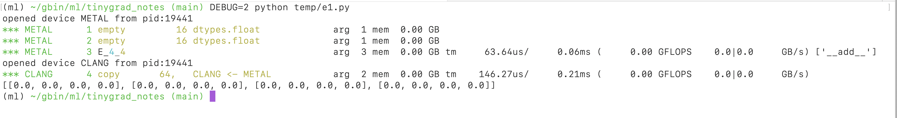

# Introduction to the internals

There are two facades of tinygrad: the deep learning part, and the compiler part. The former 
concerns how weights are updated, how neurons are represented as tensors and matrix multiplication. This is
better explained by [Karpathy's Youtube tutorial](https://www.youtube.com/watch?v=VMj-3S1tku0&list=PLAqhIrjkxbuWI23v9cThsA9GvCAUhRvKZ)

The second part is the compiler, its main concern is how to generate GPU code for any given tensor computation and
handle the relevant scheduling (i.e. "when and how to run those generated code").

Let's use a simple computation example, where we are adding two tensors element-wise:

```python
from tinygrad import Tensor

a = Tensor.empty(4, 4)
b = Tensor.empty(4, 4)
print((a+b).tolist())
# [[0.0, 0.0, 0.0, 0.0], [0.0, 0.0, 0.0, 0.0], [0.0, 0.0, 0.0, 0.0], [0.0, 0.0, 0.0, 0.0]]
```

The result is unsurprisingly boring, just a nested list of zeros. But this small example illustrates a myriad of 
interesting details on the compiler aspect.

First, the computation is lazy, you have to call one of `tolist()`, `numpy()`, `realize()` on the tensor to get the result.
Try for yourself what happens if you omit the `tolist` invocation. 

```python
print(a+b)
```

```
<Tensor <UOp METAL (4, 4) float (<Ops.ADD: 44>, None)> on METAL with grad None>
```

Second, we can easily pry under the hood on how this computation occurred (despite being zeros, these zeros actually
get added with each other!) Let's run the script again with `DEBUG=2 python script.py`:



There are four main rows in the output. The first two ("empty") refers to the variable a and b, which serve as the 
input to the addition. Their data is populated with zeros, and is designated with "empty". Under the hood, this uses
the default memory allocation method for the GPU device. If we want to put actual data in it, there would be a "transfer"
method (not covered yet). The number 16 refers to the fact we allocated 16 elements, each of which is of dtype "float".
"float" is a shorthand for "float32", occupying 4 bytes, or 32 bits (similarly, "long" is a shorthand for float64, occupying
64 bits, or 8 bytes). We see that the next part says 0.00GB, it's just rounded down to zero, because our example is too small.

The third row designate the computation. "E" is short for "elementwise", meaning the input and output have the same shape
and we are doing elementwise operation. "_4_4" refers to the shape of such computation. The color also convey special 
meanings. This can get quite complicated, so I'll gloss over the some details. Think of it this way, we have 16 elementwise
operation, so the numbers must somehow add to 16. Depending on how things are optimized, you may see "E_16", meaning
we launched 16 unit of computation. You may see "E_4_4", meaning we have launched 4 by 4 unit of computation. This could 
mean a few things, depending on how the two 4s are colored. It could be that we have 4 blocks, each block containing 4
threads (CUDA parlance). It could be that we have 4 blocks, and each block handles 4 elements. I might write a separate
post explaining the meanings of these colors (they are already documented in the source code though).

We see some more useful info on this line as well. "arg 3" means we have three arguments. GPU function don't return
anything, instead they modify the input. Since we are adding two tensors, and storing the result, we have to pass
all three as arguments. "mem 0.00 GB", this refers to how much memory was used, again it's just rounded down. 
"tm 25.88 us / 0.03ms", this says our computation/kernel took 25 micro seconds, and the total elapsed time since
start of program is now at 0.03 milliseconds. We also see the output for the computation speed measured in GFLOPS,
and the memory throughput measured in "GB/s". These give handy insights into how our kernel is performing.

The last row corresponds to "tolist()". Recall that data on GPU are not directly accessible, we have to copy them
back to CPU for printing and illustration. So here we are copying them from the GPU (METAL) to CPU (CLANG).

Next let's run the script again with more debug info, `DEBUG=4 python script.py`, and among the output, look for some
C++ looking code:

```c++
#include <metal_stdlib>
using namespace metal;
kernel void E_4_4(device float* data0, device float* data1, device float* data2, uint3 gid [[threadgroup_position_in_grid]], uint3 lid [[thread_position_in_threadgroup]]) {
  int lidx0 = lid.x; /* 4 */
  int alu0 = (lidx0<<2);
  float4 val0 = *((device float4*)((data1+alu0)));
  float4 val1 = *((device float4*)((data2+alu0)));
  *((device float4*)((data0+alu0))) = float4((val0.x+val1.x),(val0.y+val1.y),(val0.z+val1.z),(val0.w+val1.w));
} 
```

This is the generated GPU code for apple's platform. Let me also show the version for CUDA:

```c++
#define INFINITY (__int_as_float(0x7f800000))
#define NAN (__int_as_float(0x7fffffff))
extern "C" __global__ void __launch_bounds__(4) E_4_4(float* data0, float* data1, float* data2) {
  int lidx0 = threadIdx.x; /* 4 */
  int alu0 = (lidx0<<2);
  float4 val0 = *((float4*)((data1+alu0)));
  float4 val1 = *((float4*)((data2+alu0)));
  *((float4*)((data0+alu0))) = make_float4((val0.x+val1.x),(val0.y+val1.y),(val0.z+val1.z),(val0.w+val1.w));
}
```

Make sure you understand what these code are doing before proceeding. Tinygrad is concerned about how to generate such
GPU code, so a lot of complexity lies in the "how", rather than explaining "what" these code are doing. You can think
of tinygrad as a high level tool to save you from hand writing all the C++ code. Feel free to read up on CUDA tutorials.

The code we see are somewhat optimized, because we are launching only 4 threads, instead of 16, and allowing each thread
to take advantaged of vectorized data. We can also see the unoptimzied version, by passing a `NOOPT` flag: 
`DEBUG=4 NOOPT=1 python script.py`:

Apple's Metal:

```c++
#include <metal_stdlib>
using namespace metal;
kernel void E_16(device float* data0, device float* data1, device float* data2, uint3 gid [[threadgroup_position_in_grid]], uint3 lid [[thread_position_in_threadgroup]]) {
  int gidx0 = gid.x; /* 16 */
  float val0 = *(data1+gidx0);
  float val1 = *(data2+gidx0);
  *(data0+gidx0) = (val0+val1);
}
```

CUDA:

```c++
#define INFINITY (__int_as_float(0x7f800000))
#define NAN (__int_as_float(0x7fffffff))
extern "C" __global__ void __launch_bounds__(1) E_16(float* data0, float* data1, float* data2) {
  int gidx0 = blockIdx.x; /* 16 */
  float val0 = *(data1+gidx0);
  float val1 = *(data2+gidx0);
  *(data0+gidx0) = (val0+val1);
}
```

Run a few more examples yourself!

```python
print((a*b).tolist())
```

```python
print((a.sum(0).tolist()))
```

## Understanding the Intermediate Representation

Like any other compiler, tinygrad uses an Abstract Syntax Tree to represent the computation before generating the
code. It is called `UOp`:

```python
class UOp:
  op: Ops
  dtype: dtypes
  src: tuple(UOp)
  arg: None
```

The first field is the operation for this node, examples are `Ops.ADD`, `Ops.SUM`, `Ops.EMPTY`, etc. The
second field is the data type, like `dtypes.float`. Third is argument. It is set to `None` for our addition,
but suppose we are doing a sum, then we might want to specify which dimension we are summing, that's where `dim`
integer would go. The `src` represent the parents of this node. For example, our `ADD` would have the two nodes
it derived from:

```
UOp(Ops.ADD, dtypes.float, arg=None, src=(
  UOp(Ops.EMPTY, dtypes.float),
  UOp(Ops.EMPTY, dtypes.float)
))
```

Such `UOp` can take on multiple forms, depending on the context, and it can get a bit confusing. The general strategy
to understand it is that they are generated when we want to "realize" a tensor (`tolist()`). Each UOp tree represent
a complete kernel. Upon generation it describe things on a high level, like what I have just shown. It then get
progressively "lowered" into a form that can be used for actual code generation.

## Code generation

The UOp used for code generation is contains much more details and is of lower level. Here I have built an example that you can use
to play around. If things go out of date, commit id is: ae00fa3b2833dbe0595d54d5fb0b679e1731ae01

Suppose we just want to add two numbers:

```python
from tinygrad.renderer.cstyle import MetalRenderer
from tinygrad.ops import UOp, Ops
from tinygrad import dtypes

const = UOp(Ops.CONST, dtypes.float, arg=1.0)
add = UOp(Ops.ADD, dtypes.float, src=(const, const), arg=None)

print(add)
print(MetalRenderer().render("example", [
  const,
  add
]))
```

The `add` variable shows something like:

```
UOp(Ops.ADD, dtypes.float, arg=None, src=(
  x0:=UOp(Ops.CONST, dtypes.float, arg=1.0, src=()),
   x0,))
```

The walrus (`:=`) operator just make the output less verbose, indicating the two "const" are the same instance. And
let's see the rendered code:

```c++
#include <metal_stdlib>
using namespace metal;
kernel void example(uint3 gid [[threadgroup_position_in_grid]], uint3 lid [[thread_position_in_threadgroup]]) {
  float alu0 = (1.0f+1.0f);
}
```

Let me show you the CUDA version also, where you would replace the import:

```python
from tinygrad.renderer.cstyle import CUDARenderer
from tinygrad.ops import UOp, Ops
from tinygrad import dtypes

const = UOp(Ops.CONST, dtypes.float, arg=1.0)
add = UOp(Ops.ADD, dtypes.float, src=(const, const), arg=None)

print(add)

print(CUDARenderer("sm_50").render("example", [
  const,
  add
]))
``` 

Note that you have to pass in the "architecture" as argument, it affects the compiler, this value is set automatically
by querying `cuDeviceComputeCapability`, for our render purpose, pass in just two digits would work.

```c++
#define INFINITY (__int_as_float(0x7f800000))
#define NAN (__int_as_float(0x7fffffff))
extern "C" __global__ void __launch_bounds__(1) example() {
  float alu0 = (1.0f+1.0f);
}
```

So the result isn't that interesting, in fact, this kernel wouldn't ever be rendered in a real example, because adding
two constants is "folded" before the render stage, so you get the value 2, instead of calculating it. This is one of the
optimization techniques. Let's see another example that renders the thread position:

```python
MetalRenderer().render([
  UOp(Ops.SPECIAL, dtypes.int, arg=("gidx0", 16))
])
```

```c++
#include <metal_stdlib>
using namespace metal;
kernel void example(uint3 gid [[threadgroup_position_in_grid]], uint3 lid [[thread_position_in_threadgroup]]) {
  int gidx0 = gid.x; /* 16 */
}
```

On CUDA:

```c++
#define INFINITY (__int_as_float(0x7f800000))
#define NAN (__int_as_float(0x7fffffff))
extern "C" __global__ void __launch_bounds__(1) example() {
  int gidx0 = blockIdx.x; /* 16 */
}
```

The index op (SPECIAL) is used for specifying the position of a kernel within its launch grids. The renderer will 
also handle the count, so it renders `.x` `.y` automtically if you pass more than 1:


```python
print(CUDARenderer("sm_50").render("example", [
  UOp(Ops.SPECIAL, dtypes.int, arg=("gidx0", 16)),
  UOp(Ops.SPECIAL, dtypes.int, arg=("gidx1", 16))
]))
```

```c++
extern "C" __global__ void __launch_bounds__(1) example() {
  int gidx0 = blockIdx.x; /* 16 */
  int gidx1 = blockIdx.y; /* 16 */
}
```

See my posts on [pattern matcher](20241112_pm.md) for how this renderer engine works internally, at the end you get
to see the UOp for this kernel:

```c++
#include <metal_stdlib>
using namespace metal;
kernel void rendered(device float* data0, uint3 gid [[threadgroup_position_in_grid]], uint3 lid [[thread_position_in_threadgroup]]) {
  int gidx0 = gid.x; /* 16 */
  *(data0+gidx0) = (0.5f+0.5f);
}
```

Make sure you have a good understanding of all the UOps involved in this kernel!

## Where to go next

Let me summarize what we have so far. We look at the tinygrad internals from the compiler perspective, mainly concerning
its ability to render GPU code. This rendering process is handled by a "pattern matcher", that progressively turn the
UOp recursive structure into C++ code. All the tensor operation is lazy, meaning they only get evaluated when one of
`tolist()`, `numpy(0)` or `realize` is called. When calling these operation, the operation represented by the tensor
is converted into a high level UOp, like the first one we saw where we are adding two `Ops.EMPTY`. This high level 
UOp is then lowered into a form that can be consumed by the renderer.

I didn't yet cover how the conversion from tensor to high level UOp happens. This is referred to
as "scheduling", because each UOp represent a kernel, that's also where kernel fusion happens.

One fundamental idea in tinygrad is that almost everything can be represented by simple elementwise and reduce operation,
combined with zero cost shape movement. So for the next part make sure you understand how [shapetracker works](20241217_st.md),
together with how [matmul](20241203_matmul.md) and [conv](20241208_conv.md) are implemented. 
