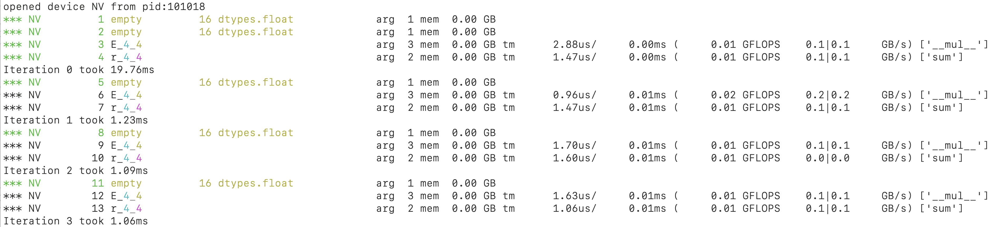
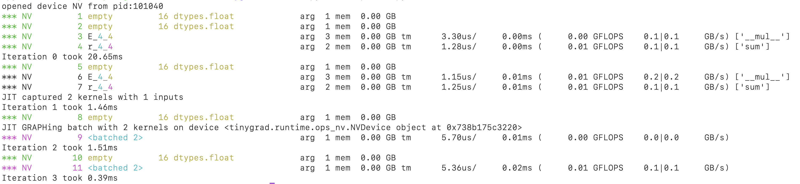
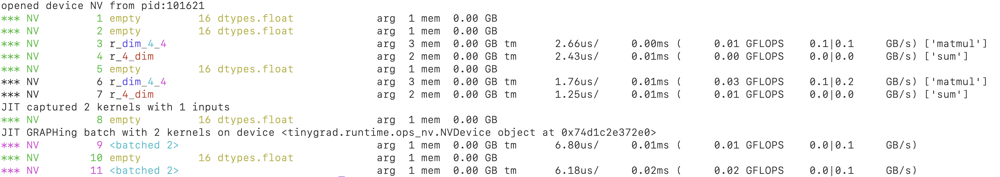
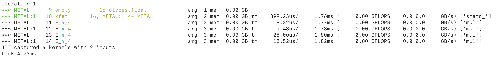
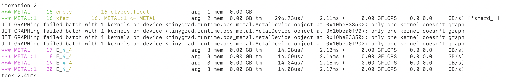
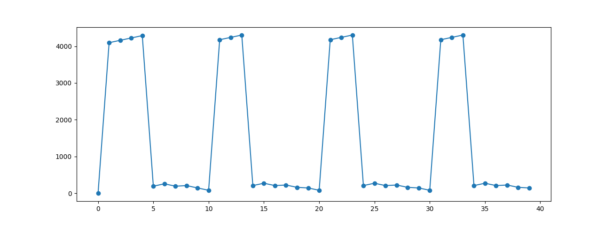
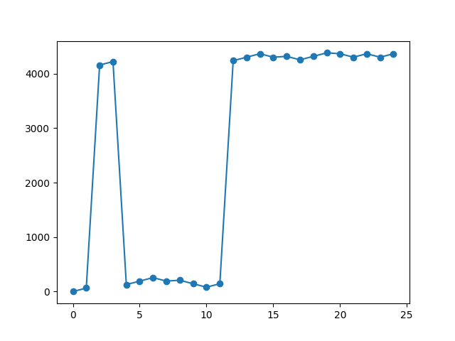

# JIT in tinygrad

> Latest commit id when I wrote this was f2bee341970f718298d020d7b38cb33239c67b73, if you want to follow the examples.

Compiling code for GPU device has two steps, 1. compile the kernel source code into byte code, 2. convert the byte code into
GPU executable. The first step is always cached and reused in Tinygrad. The second step, however,
requires explicit usage of `TinyJit`, which is what we are maining focusing on when talking about JIT.

## Compiling kernel code

When we compute a tensor, some GPU code must be rendered. For example, a 4 by 4 matrix elementwise addition might render this
CUDA code:

```c++
extern "C" __global__ void __launch_bounds__(1) E_16(float* data0, float* data1, float* data2) {
  int gidx0 = blockIdx.x; /* 16 */
  float val0 = *(data1+gidx0);
  float val1 = *(data2+gidx0);
  *(data0+gidx0) = (val0+val1);
}
```

This render process is covered in the [intro](20241231_intro.md.) and [pattern matcher post](20241112_pm.md), and it
comes directly from the UOp. A kernel source code originates from the Tensor whose "realize" methods are being called,
upon which a UOp tree is generated, lowered, and finally rendered into such string. Afterwards, the rendered source
code is compiled into byte code:

```python
class CUDACompiler(Compiler):
  def _compile_program(self, src:str, nvrtc_get_content:Callable, nvrtc_get_size:Callable) -> bytes:
    nvrtc_check(nvrtc.nvrtcCreateProgram(ctypes.byref(prog := nvrtc.nvrtcProgram()), src.encode(), "<null>".encode(), 0, None, None))
    nvrtc_check(nvrtc.nvrtcCompileProgram(prog, len(self.compile_options), to_char_p_p([o.encode() for o in self.compile_options])), prog)
    data = _get_bytes(prog, nvrtc_get_content, nvrtc_get_size, nvrtc_check)
    nvrtc_check(nvrtc.nvrtcDestroyProgram(ctypes.byref(prog)))
    return data
``` 

We do something similar on Metal:

```python
class MetalCompiler(Compiler):
  def compile(self, src:str) -> bytes:
    #...
    src_padded, params_padded = src.encode() + b'\x00'*(round_up(len(src) + 1, 4) - len(src)), params.encode() + b'\x00'
    request = struct.pack('<QQ', len(src_padded), len(params_padded)) + src_padded + params_padded
    #...
    return ret
```

See how we are passing `src: str` which is the rendered source code to `_compile_program` or `compile`, and then calling some deeper
APIs like nvrtc? You can also read up on the [runtime compilation library documentation for CUDA](https://docs.nvidia.com/cuda/nvrtc/),
Apple's runtime compilation is not documented, but you can read up on the
[PR that integrated it](https://github.com/tinygrad/tinygrad/pull/7920/files).

This compilation could take some time. So we want to cache and re-use it. If we see the same UOp on the same GPU device,
we can be sure that compilation will return the same blob, and that's the caching strategy. You can see this in the
implementation of `get_runner`:

```python
method_cache: dict[tuple[str, bytes, int, int, bool], CompiledRunner] = {}
def get_runner(device:str, ast:UOp) -> CompiledRunner:
  ckey = (device, ast.key, BEAM.value, NOOPT.value, False)
  if cret:=method_cache.get(ckey): return cret
  bkey = (device.split(":")[0], ast.key, BEAM.value, NOOPT.value, True)
  if bret:=method_cache.get(bkey):
    method_cache[ckey] = ret = CompiledRunner(replace(bret.p, device=device), bret.lib)
  else:
    prg: ProgramSpec = get_kernel(Device[device].renderer, ast).to_program()
    method_cache[ckey] = method_cache[bkey] = ret = CompiledRunner(replace(prg, device=device))
  return ret
```

This function converts a UOp into runnable program. See `to_program()`? That's where rendering and compilation
takes place. If we come across this UOp a second time, we can skip the compilation and re-use the blob (`.lib`).

However, the byte code isn't something we can execute directly, unlike regular C++ code compiled with CLANG or GCC.
The GPU device requires a second stage of compilation, to make them actually executable.

## Compiling GPU command

When we want to execute things on the GPU, we have to call a set of different API to make the compiled bytecode executable.
On top of that we also specify some other options such as launch dimensions, buffer sizes etc. The GPU executable is
called a compute graph, or compute pipeline.

In fact, this is a somewhat universal conceptual model adopted by all the major GPU platforms. 
On Apple it's called a
[pipeline state object](https://developer.apple.com/documentation/metal/performing_calculations_on_a_gpu?language=objc#3544868).
On WebGPU it's called a [compute pipeline](https://developer.mozilla.org/en-US/docs/Web/API/WebGPU_API#create_a_compute_pipeline).
On CUDA, it's just called a [graph](https://developer.nvidia.com/blog/cuda-graphs/).
Although on cuda it may seem less obvious if you are using the triple angle bracket calling form:
(e.g. `add_vectors<<< blk_in_grid, thr_per_blk >>>(d_A, d_B, d_C);`), but under the hood it just calls the same APIs for you.

Initializing the compute graph is similar to compiling source code, and could take some time, but it is re-useable. Each
GPU platform also provide instructions on how to re-use them.
See [this for CUDA](https://developer.nvidia.com/blog/cuda-graphs/), and the
[actual API we call](https://docs.nvidia.com/cuda/cuda-driver-api/group__CUDA__GRAPH.html#group__CUDA__GRAPH_1g50d871e3bd06c1b835e52f2966ef366b).
On apple, this is referred to as "IndirectCommandEncoding", see
[its usage here](https://developer.apple.com/documentation/metal/indirect_command_encoding?language=objc).
On WebGPU, it is called [GPURenderBundleEncoder](https://developer.mozilla.org/en-US/docs/Web/API/GPURenderBundleEncoder)

Reusing the compute graph is what TinyJit does!

When a tensor is realized, a set of GPU commands are created. A function wrapped with `TinyJit` will record those 
commands, and start capturing them if it sees it more than once. The capture process follows the target platform's
API. The next time this function is run, only the captured graph is being executed. See this simplified code:

```python
class TinyJit():
  def __call__(self, *args, **kwargs) -> ReturnType:
    input_buffers, var_vals, names, st_vars_dtype_device = _prepare_jit_inputs(args, kwargs)
    if not JIT or self.cnt == 0:
      ret = self.fxn(*args, **kwargs)
    elif self.cnt == 1:
      ret = self.fxn(*args, **kwargs)
      self.captured = CapturedJit(ret, jit_cache, input_replace, extra_view_inputs, names, st_vars_dtype_device)
    elif self.cnt >= 2:
      ret = self.captured(input_buffers, var_vals)
    self.cnt += 1
    return ret
```

## Usage

Let's suppose we are running some forward pass in a loop. Each iteration we get a different input, and it's multiplied
elementwise with some weight, and the result is summed:

```python
from tinygrad import Tensor, TinyJit
import time

weight = Tensor.empty(4, 4)

def forward(x: Tensor):
  c = (x * weight).contiguous()
  c.sum(0).realize()

for i in range(4):
  start = time.time()
  x = Tensor.empty(4, 4)
  forward(x)
  end = time.time()
  print(f"Iteration {i} took {(end - start)*1000:.2f}ms")

```

I am using `.empty` here to minimize the DEBUG output we will see, and calling `.contiguous` to prevent the multiply
and sum from being fused into one kernel (TinyJit will only batch when there are more than 1 kernel, to justify
the overhead). I am also recording the time to show the speedup.

If we run this script with `DEBUG=2 python script.py`:



You see that in each iteration, we are executing two kernels. Recall that running code on the GPU is a two step process,
first compile source code to byte code, then create a compute graph/pipeline (i.e. compile bytecode to GPU machine code). Here
we are re-using the first compilation result, but the second step is repeated everytime a kernel runs.
Looking at the speed, the first iteration
takes longest, as expected, because it is compiling source code, and also creating the compute graph/pipeline. Starting
from the second iteration, there's significant speed up already. However, it remains at ~1ms from there on, mostly
because they are repeating the same compute graph/pipeline creation.

Let's apply TinyJit:

```python
@TinyJit
def forward(x: Tensor):
  #...
```



We see that the two kernels, upon the second run and third run are now batched, the number in `<batched 2>` indicate
how many kernels were actually batched together. This batching merged the two kernels into a single, reuseable compute 
graph/pipeline, and significantly improved the speed!

You can verify it by looking at the speed JIT capturing starts on iteration 1, then on iteration 2 the captured items
are converted into re-useable graphs. These all came with some overhead, so we did not see much speed up. But on
iteration 3, the compute graph are executed directly, and it's taking only 0.39 ms! 

## Tricks and caveats

There are some tricks and caveats to using JIT.

### Non GPU statements

For example, any non-GPU statements will be skipped, the print statement here will be gone after 2 iterations:

```python
@TinyJit
def forward(x: Tensor):
  c = (x * weight).contiguous()
  print(f"shape of c {c.shape}")
  c.sum(0).realize()
```

### Shape alignment

Reusing the compute graph (hence TinyJit) requires the buffers to be of the same size. This is more of an API
restriction rather than Tinygrad's limitation. In TinyJit, this is enforced by checking the equality of shapetracker.
In the above example, weight is constant, so it will always be valid. `x` can potentially change, we must be make
sure that its shapetracker has the same shape, strides offset and mask across all the iterations. For example,
you may have an input tensor that's growing over iterations, a common pattern in decoder, but this will fail:

```python
@TinyJit
def forward(x: Tensor):
  return weight.matmul(x).contiguous().sum().realize()

for i in range(4):
  x = Tensor.empty(4, i+1)
  forward(x)
```

The trick is to allocate the largest sized buffer required, and use a subset of it when iterating. To do that, we
use a symbolic variable for the shape, and on each iteration, bind the required value to it:

```python
for i in range(4):
  dim = UOp.variable("dim", 1, 4).bind(i+1)
  x = Tensor.empty(4, dim)
  forward(x)
```

It will then happily batch:



You can see that on each iteration, we are creating a buffer with 16 elements, even though `x` is only of size 16 on
the last iteration. This is just one of those compromises.

### Nested JIT

You may have seen models that already have a forward method wrapped in TinyJit, but then you want to also jit the 
loss function:

```python
@TinyJit
def forward(x: Tensor):
  c = (x * weight).contiguous()
  print(c.shape)
  return c.sum(0).realize()

@TinyJit
def train_step(i):
  print('iteration', i)
  x = Tensor.empty(4, 4)
  logits = forward(x)
  loss = logits.reshape((4, 1)).expand((4, 4)).contiguous().sum(1)
  loss.realize()

for i in range(5):
  train_step(i)

```

This will give you an error because you can't nest JIT:

```
RuntimeError: having TinyJit inside another TinyJit is not supported len(capturing)=1 capturing=[<tinygrad.engine.jit.TinyJit object at 0x7e1fff663df0>]
```

That's why you often see there are two versions of forward, one with Jit and the other without, for example, in the llama
transformer:

```python

class Transformer:
  def __init__(self, dim:int, hidden_dim:int, n_heads:int, n_layers:int, norm_eps:float, vocab_size, linear=nn.Linear, n_kv_heads=None, rope_theta=10000, max_context=1024, jit=True, feed_forward=FeedForward):
    #...
    self.forward_jit = TinyJit(self.forward) if jit else None

  def forward(self, tokens:Tensor, start_pos:Union[Variable,int], temperature:float, top_k:int, top_p:float, alpha_f:float, alpha_p:float):
    #...
    return sample(logits.flatten(), temperature, top_k, top_p, alpha_f, alpha_p).realize()

  def __call__(self, tokens:Tensor, start_pos:int, temperature:float=0.0, top_k:int=0, top_p:float=0.8, alpha_f:float=0.0, alpha_p:float=0.0):
    if tokens.shape[0:2] == (1,1) and self.forward_jit is not None and start_pos != 0:
      return self.forward_jit(tokens, Variable("start_pos", 1, self.max_context).bind(start_pos), temperature, top_k, top_p, alpha_f, alpha_p)
    return self.forward(tokens, start_pos, temperature, top_k, top_p, alpha_f, alpha_p)
```

And in the MNIST example, the model itself isn't decorated with JIT, but rather, the training loop hanldes it:

```python
class Model:
  def __init__(self):
    self.layers: List[Callable[[Tensor], Tensor]] = [
      nn.Conv2d(1, 32, 5), Tensor.relu,
      #...
      lambda x: x.flatten(1), nn.Linear(576, 10)]

  def __call__(self, x:Tensor) -> Tensor: return x.sequential(self.layers)

@TinyJit
@Tensor.train()
def train_step() -> Tensor:
  samples = Tensor.randint(getenv("BS", 512), high=X_train.shape[0])
  loss = model(X_train[samples]).sparse_categorical_crossentropy(Y_train[samples]).backward()
  opt.step()
  return loss
```

### graph vs simple reuse

One detail I glossed over is that JIT can operate in either batched graph mode, or simple re-use mode. Batched graph mode is what I have
been describing so far, but one important note is the fact it is batch multiple kernels into one.
Sometimes the kernels that follow one another may not be able to be batched, and as a result, TinyJit will just
re-use the previously created `CompiledRunner`, not taking advantage of the graph capability.

Here I give a contrieved example, it illustrates the reason why kernels aren't batched/graphed, but in future version of tinygrad,
it might be improved such that they get batched properly. In multi gpu training, we often have two tensors sharded
on two devices doing identical work, this result in the same kernel being dispatched on each device. If the order is
interleaved, then JIT won't be able to batch them:

```python
from tinygrad import Tensor, TinyJit, UOp
import time
import tinygrad.nn as nn
from tinygrad.device import Device

shards = [f"{Device.DEFAULT}", f"{Device.DEFAULT}:1"]
weight = Tensor.empty(4, 4).shard_(shards)

@TinyJit
def forward(x: Tensor):
  return x.mul(weight).contiguous().mul(weight)

for i in range(4):
  print(f"\niteration {i}")
  s = time.time()
  x = Tensor.empty(4, 4).shard_(shards).realize()
  ret = forward(x).realize()
  e = time.time()
  print(f"took {(e-s)*1000:.2f}ms")
```

The regular run shows that we have six compute kernels:



The first two were the initialization for x. 16 elements were allocated on device 0, and we copy them to the second
device with "XFER". Then the same multiplication were done on each device, and we see that JIT captured all four. 
However, in the next run, we see that the batching failed:



The reason is that JIT batching is handled sequentially. One of the criteria is looking at whether the current kernel
is on the same device as the previous one:

```python
# Snippet from jit implementation
  for ji in jit_cache: # Iterate through each kernel
    if isinstance(ji.prg, CompiledRunner): ji_graph_dev = ji.prg.dev
    # Check if this device is the same as previous one
    can_share_graph = (ji_graph_dev == current_device or (isinstance(graph_class, type) and issubclass(graph_class, MultiGraphRunner)) and
                       type(ji_graph_dev) is type(current_device))
    current_device = ji_graph_dev
```

Because the scheduling has interleaved the kernel for two devices, this mechanism failed to recognize the continuity. And
as a result, each time TinyJit tries to batch, it sees just one kernel, and refuse to do that, hence the error message.
Remember that graphing/batching have their own overhead and is only justified when you have many kernels.

TinyJit now will just execute those kernels as is, only re-using the `CompiledRunner` from previous compilation and will
call the GPU API that recompile them into the device. This is indicated by the magenta color for the kernels in the output.

### Memory management

TinyJit holds on to all the buffers throughout its life time, this means the memory usage will remain at the max amount
needed for a function call. This may cause issue if your function requires memory release in the middle.

For example, if you have an intermediate buffer to hold some data, and is later released:

```python
weight = Tensor.empty(4, 4)

def forward(x: Tensor):
  x2 = Tensor.empty(32, 32).contiguous().realize()
  x = (x + x2[:4, :4]).contiguous()
  return x.mul(weight).contiguous().sum(0)

for i in range(4):
  x = Tensor.empty(4, 4)
  ret = forward(x).realize()
```

Note that I have added `.contiguous()` and `realize()` just to prevent certain optimization, in order to show this
contrieved example. It may look weird, but it is one of multi GPU examples, where you have shuffle data between
devices. During the process, an intermediate buffer is allocated to hold the temporary data, and then released. It
is similar to using a temporary variable when swapping two variables: 

```python
temp = a
a = b
b = temp
```

When dealing with large buffers, this temporary variable (`x2`) would ideally be released as soon as it has done the job.
With some custom memory tracking code, we can see that this is the case without JIT applied:



However, if you were to apply jit:

```python
@TinyJit
def forward(x: Tensor):
  x2 = Tensor.empty(32, 32).contiguous().realize()
  x = (x + x2[:4, :4]).contiguous()
  return x.mul(weight).contiguous().sum(0)
```



Now the entire temporary buffer is retained throughout. Just something to be cautious about.