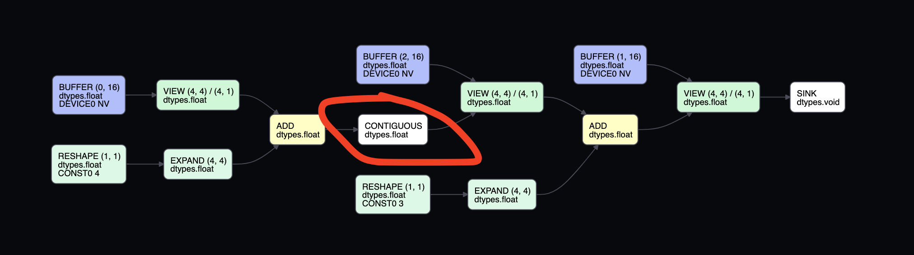

# Short note on operator fusion

Because of laziness, a chain of operations can be fused into just one. For example, if you add something, then 
multiply, there's only one kernel generated:

```python
from tinygrad import Tensor
a = Tensor.empty(4, 4)
b = a + 3
c = b + 3
c.realize()
```

Run it with `DEBUG=4 python script.py`, you see that this is the generated kernel:

```c++
#define INFINITY (__int_as_float(0x7f800000))
#define NAN (__int_as_float(0x7fffffff))
extern "C" __global__ void __launch_bounds__(4) E_4_4(float* data0, float* data1) {
  int lidx0 = threadIdx.x; /* 4 */
  int alu0 = (lidx0<<2);
  float4 val0 = *((float4*)((data1+alu0)));
  *((float4*)((data0+alu0))) = make_float4((val0.x+7.0f),(val0.y+7.0f),(val0.z+7.0f),(val0.w+7.0f));
}
```

Sometimes we may not want this behaviour. There are two options, first is force realizing the intermediate one:

```python
from tinygrad import Tensor
a = Tensor.empty(4, 4)
b = a + 4
b.realize()
c = b + 3
c.realize()
```

Would give you two kernels:

```c++
extern "C" __global__ void __launch_bounds__(4) E_4_4(float* data0, float* data1) {
  int lidx0 = threadIdx.x; /* 4 */
  int alu0 = (lidx0<<2);
  float4 val0 = *((float4*)((data1+alu0)));
  *((float4*)((data0+alu0))) = make_float4((val0.x+4.0f),(val0.y+4.0f),(val0.z+4.0f),(val0.w+4.0f));
}

extern "C" __global__ void __launch_bounds__(4) E_4_4n1(float* data0, float* data1) {
  int lidx0 = threadIdx.x; /* 4 */
  int alu0 = (lidx0<<2);
  float4 val0 = *((float4*)((data1+alu0)));
  *((float4*)((data0+alu0))) = make_float4((val0.x+3.0f),(val0.y+3.0f),(val0.z+3.0f),(val0.w+3.0f));
}
```

This happens when you actually need the intermediate result, for exampling when printing the loss value and then
calling backward on the model. 

Sometimes you may not want the intermediate result, but still want the operation to be done in two kernels (for example,
during development to test JIT, which only batches when you have more than 1 kernel, or to satisfy some shape requirement).
That's when you would call `contiguous`. 

```python
from tinygrad import Tensor
a = Tensor.empty(4, 4)
b = a + 4
b = b.contiguous()
c = b + 3
c.realize()
``` 

If you run it with `DEBUG=4`, you should see the same output as if you had called `.realize()` on `b`.

Contiguous op works similar to that of pytorch, where a new tensor is created and have its content laid out linearly in memory.
Unlike pytorch however, this new memory isn't allocated immediately. It does return a new Tensor instance, but it's done
in the same way like any other operations (addition, multiply, reshape, etc.), where a new UOp is added to the AST tree.

In this case, it adds an `Ops.CONTIGUOUS` on the UOp AST tree. If we run the script with `VIZ=1`, we can see how c is represented:



See the contiguous node? That's all there is to the Op per se. 

When this AST is lowered and turned into executable kernels, `Ops.CONTIGUOUS` acts as a breakpoint, such that the tree
will be split into two. In the scheduler source code, we can see this 
[line](https://github.com/tinygrad/tinygrad/blob/f91ca508cf88b09c616473561f68d2d46fbfcef9/tinygrad/engine/schedule.py#L457)

```python
do_realize = PatternMatcher([
  # always realize sinked ops
  (UPat(Ops.SINK, name="sink"), sink_outputs),
  # always realize meta ops
  (UPatScheduled({Ops.ASSIGN, Ops.CONTIGUOUS, *GroupOp.Meta}), realize),
```

See the last line, where a pattern matcher would match `Ops.CONTIGUOUS`, and call the `realize` function? 

```python
def realize(ctx:ScheduleContext, b:UOp, to_store:UOp, **kwargs) -> None: ctx.realizes[b] = to_store
```

What `realize` does is add the node to a dictionary for later use. 

Then in another [function](https://github.com/tinygrad/tinygrad/blob/f91ca508cf88b09c616473561f68d2d46fbfcef9/tinygrad/engine/schedule.py#L480),
we see that if the node is in the `realizes` dict, it will be splitted into two entries - one
STORE, and one LOAD:

```python
def store_or_fuse(ctx:ScheduleContext, b:UOp, x:UOp, st:UOp):
  if (m:=ctx.tensor_uops[b][0].metadata) is not None: ctx.ops_metadata[x] = m
  if b not in ctx.realizes: return x # collapse BUFFER
  ctx.realizes[b] = UOp.store(b, ShapeTracker.from_shape(st.shape).to_uop(), x)
  return UOp(Ops.LOAD, x.dtype, (b, unwrap(st.st).to_uop()))
```

That's the reason we end up having two kernels!