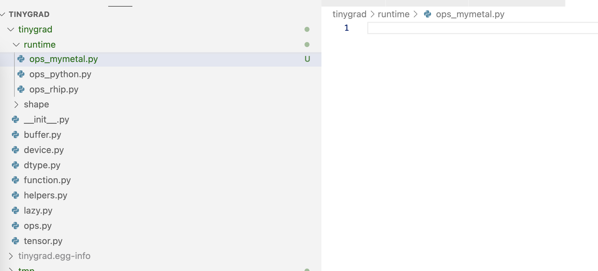

# How to add a custom accelerator?

One of the premise of tinygrad is that it is simple to 
add support for new accelerator. 
So if you want to try out
new hardware, you can implement the support with ease. 

If you have read the official doc on 
[adding accelerator](https://github.com/tinygrad/tinygrad/blob/master/docs/adding_new_accelerators.md)
you may know that are 21 operations to implement. But it doesn't explain how
things fit together in tinygrad and may be too abstract. I will try to fill
in that gap in this post. I also won't dive into too much details on the code
generation part or the details of Metal runtime, but rather give you a good starting
ground if you are looking to add implementation yourself.

Prerequisite reading is the [tinygrad's IR](uops.md) and
[tinygrad backend](backends.md).

I'll pretend to implement a secodn my metal accelerator called "mymetal". To inject it to tinygrad,
we create a file with a specific naming format, that way the `importlibs` will pick it up and parse the string, and also that
you can specify MYMETAL=1 in the env variable to instruct tinygrad
to use it. I will **have to** place it in the `runtime` directory and 
name it "ops_mymetal.py":



Within the file, we are required to define a class with suffix 
"Device" as its name so the upstream
stuff can find it, via this function in `device.py`:

```python
  def __get_canonicalized_item(self, ix:str) -> Compiled:
    if DEBUG >= 1: print(f"opening device {ix} from pid:{os.getpid()}")
    x = ix.split(":")[0].upper()
    return [cls for cname, cls in inspect.getmembers(importlib.import_module(f'tinygrad.runtime.ops_{x.lower()}')) if (cname.lower() == x.lower() + "device") and x in self._devices][0](ix)  # noqa: E501
```

In our ops_mymetal.py, let's define a class to test the integration.

```python
class MyMetalDevice:
    def __init__(self, *args, **kwargs):
        print("Mymetal device is initialized with args:", args, kwargs)
```

Throughout the guide, I will again use the dot product example, save
the following in a script.py anywhere

```python
from tinygrad.tensor import Tensor
from tinygrad.device import Device


a = Tensor([1.0,2.0])
b = Tensor([3.0,4.0])
c = a.dot(b)

d = c.numpy()
print(d)

```

Now if you run the script with `MYMETAL=1 python script.py`, you will
see errors but more importantly, a line printed like so:

```
Mymetal device is initialized with args: ('MYMETAL',)
```

Yay! Our custom class is now integrated into the rest of tinygrad.

Next we need to start implementing methods so it functions properly.

The entrypoint to our device is in `lower_schedule_item` function
in `realize.py`:

```python
def lower_schedule_item(si:ScheduleItem) -> Optional[JITRunner]:
  assert len(set(x.device for x in si.outputs+si.inputs)) == 1 or si.ast[0].op is LoadOps.COPY
  if si.ast[0].op is BufferOps.STORE: return Device[si.outputs[0].device].get_runner(*si.ast)
  assert len(si.ast) == 1 and len(si.outputs) == 1, "only ASTRunner supports multioutput"
  out, ast = si.outputs[0], si.ast[0]
  if ast.op is LoadOps.COPY:
    if hasattr(Device[out.device].allocator, 'transfer') and out.device.split(":")[0] == si.inputs[0].device.split(":")[0]: return BufferXfer()
    return BufferCopy()
  if ast.op is LoadOps.CUSTOM: return CustomOp(ast.arg)
  return None
```

The returned value is utilized as such in `run_schedule`:
```python
def run_schedule(schedule:List[ScheduleItem]):
  while len(schedule):
    si = schedule.pop(0)
    prg = lower_schedule_item(si)
    # run the function (put it in JIT)
    if prg: 
      prg.exec(real_buffers, si.var_vals)
```

You can see that each schedule item is converted into a program that has an `.exec`
method defined, and will be called in order. To generalize this, the returned item must be an instance
of a class that inherits
`JITRunner`, whether it is used as a kernel or a memory allocation. The base
JITRunner is defined as such:

```python
class JITRunner:
  def __init__(self):
    self.op_estimate:sint = 0
    self.mem_estimate:sint = 0
  def exec(self, rawbufs:List[Buffer], var_vals:Optional[Dict[Variable, int]]=None) -> Optional[float]:
    var_vals = var_vals if var_vals is not None else {}
    from tinygrad.engine.jit import CacheCollector
    et = self(rawbufs, var_vals)
    if CACHECOLLECTING: CacheCollector.add(self, rawbufs, var_vals)
    return et
  def __call__(self, rawbufs:List[Buffer], var_vals:Dict[Variable, int], wait=False, jit=False) -> Optional[float]:
    raise NotImplementedError("override this")
```

Since there are shared traits among all the accelerators, we can further abstract two base
classes that inherits `JITRunner`. The first is `CompiledJITRunner` and the second
is `BufferCopy`. Again I pasted only the illustrative part of the implementation:

```python
class CompiledASTRunner(JITRunner):
  def __init__(self, name:str, prg:str, dname:str, global_size:Optional[List[int]]=None, local_size:Optional[List[int]]=None,
               variables:Optional[List[Variable]]=None, op_estimate:sint=0, mem_estimate:sint=0, precompiled:Optional[bytes]=None, outcount:int=1):
    super().__init__()
    self.prg = prg
    lib:bytes = precompiled if precompiled is not None else self.device.compiler.compile_cached(prg)
    self.lib, self.clprg, self.outcount = lib, self.device.runtime(self.name, lib), outcount
    if DEBUG >= 4: print(prg)

  @property
  def device(self): return Device[self.dname]

  def __call__(self, rawbufs:List[Buffer], var_vals:Dict[Variable, int], wait=False, jit=False, do_update_stats=True) -> Optional[float]:
    et = self.clprg(*[x._buf for x in rawbufs], **lra, vals=tuple(var_vals[k] for k in self.vars), wait=wait or DEBUG>=2)
    return et

class BufferCopy(JITRunner):
  def copy(self, dest, src):
    dest.copyin(src.as_buffer(allow_zero_copy=True))  # may allocate a CPU buffer depending on allow_zero_copy
  def __call__(self, rawbufs:List[Buffer], var_vals:Dict[Variable, int], wait=False, jit=False):
    dest, src = rawbufs[0:2]
    self.copy(dest, src)
```

So JITRunner will call the actual implementation of `__call__` method. If it is
a memory allocator, some data copy is done, otherwise, the program, will be executed.

But note that in the program's case, `self.clprg()` is implemented elsewhere, 
and dest.copyin is also implemented elsewhere. Let's look break down the next
abstraction. 

In `lower_schedule_item` for a kernel (program), we see this line:

```python
Device[si.outputs[0].device].get_runner(*si.ast)
```

Remember that `Device[si.outputs[0].device]` dynamically resolve to the `ops___.py`
file and initialize the device class, meaning our MyMetal device must implement
get_runner method that returns a `CompiledASTRunner` instance, passing in the
required program that can be executed. This is a common pattern across
all accelerator so tinygrad already has a base class for such functionality,
it is called `Compiled`, and in reference implementation for cuda, existing metal,
and other accelerator, you can see that the `CudaDevice`, `MetalDevice` and so on
all inherits from it:

```python
class Compiled:
  def __init__(self, device:str, allocator:Allocator, compiler:Optional[Compiler], runtime, graph=None):
    self.dname, self.allocator, self.compiler, self.runtime, self.graph = device, allocator, compiler, runtime, graph
  def synchronize(self): pass  # override this in your device

  def to_program(self, k:Linearizer) -> CompiledASTRunner:
    k.linearize()
    ret = CompiledASTRunner(k.name, self.compiler.render(to_function_name(k.name), k.uops), self.dname, k.global_size, k.local_size,
                            k.uops.vars(), min(info.flops, ops * run_count), min(info.mem_estimate, mem * run_count), outcount=len(k.outbufs))
    return ret

  def get_linearizer(self, *ast:LazyOp) -> Linearizer:
    from tinygrad.codegen.linearizer import Linearizer
    k = Linearizer(*ast, opts=self.compiler.compiler_opts)
    k.required_optimizations()
    return k

  def get_runner(self, *ast:LazyOp) -> CompiledASTRunner: return self.to_program(self.get_linearizer(*ast))
```

The actual implementation must pass the memory allocator, runtime, and compiler
to the abstract class, Let's look at the actual implementation of MetalDevice:

```python
class MetalDevice(Compiled):
  def __init__(self, device:str):
    self.device = Metal.MTLCreateSystemDefaultDevice()
    self.mtl_queue = self.device.newCommandQueueWithMaxCommandBufferCount_(1024)
    self.mtl_buffers_in_flight: List[Any] = []
    self.mv_in_metal: List[memoryview] = []
    self.track_cross_buffer: List[Any] = []
    from tinygrad.runtime.graph.metal import MetalGraph
    super().__init__(device, MetalAllocator(self), MetalCompiler(None if getenv("METAL_XCODE") else self),
                     functools.partial(MetalProgram, self), functools.partial(MetalGraph, self))
```

and that's where the actual connection to the Metal runtime happens! 
Memory allocation is done through `MetalAllocator(self)`, compiling the
metal code to binary happens in `MetalCompiler(None if getenv("METAL_XCODE") else self), functools.partial(MetalProgram, self)`
and the runtime is `functools.partial(MetalGraph, self)`. 

We can see that the `MetalCompiler` must inherits `Compiler`, which looks like below:

```python
class Compiler:
  compiler_opts: ClassVar[CompilerOptions]
  def __init__(self, cachekey:Optional[str]=None): self.cachekey = None if getenv("DISABLE_COMPILER_CACHE") else cachekey
  def render(self, name:str, uops:UOpGraph) -> str: raise NotImplementedError("need a render function")
  def compile(self, src:str) -> bytes: raise NotImplementedError("need a compile function")
  def compile_cached(self, src:str) -> bytes:
    if self.cachekey is None or (lib := diskcache_get(self.cachekey, src)) is None:
      lib = self.compile(src)
      if self.cachekey is not None: diskcache_put(self.cachekey, src, lib)
    return lib
```

That's what executes the `self.compiler.render(to_function_name(k.name), k.uops)`
in the `to_program` method of `CompiledASTRunner`. 

`MetalAllocator` subclasses `Allocator`, which is defined like this:

```python
class Allocator:
  def alloc(self, size:int, options:Optional[BufferOptions]=None):
    assert not isinstance(size, int) or size > 0, f"alloc size must be positve, getting {size}"
    return self._alloc(size, options if options is not None else BufferOptions())
  def _alloc(self, size:int, options:BufferOptions): raise NotImplementedError("need alloc")
  def free(self, opaque, size:int, options:Optional[BufferOptions]=None):
    self._free(opaque, options if options is not None else BufferOptions())
  def _free(self, opaque, options:BufferOptions): pass  # if opaque is a Python object, you don't need a free
  def copyin(self, dest, src:memoryview): raise NotImplementedError("need copyin")
  def copyout(self, dest:memoryview, src): raise NotImplementedError("need copyout")
```

and the `copyin` and `copyout` will handle the methodcall in `BufferCopy` we saw
above (note that there's some intermediate class to optimize things, so between 
Allocator and MetalAllocator there's also the `LRUAllocator`, but for simplicity
I'm just showing the base class).

Now let's start the implementation, and I will mostly just be copying the 
existing code because they pertain more to the Metal runtime rather than
tinygrad. This is where we would start:

```python
class MyMetalDevice:
    def __init__(self, *args):
        print("Mymetal device is initialized with args:", args)
```

We know that we have to subclass `Compiled` and implement the required methods:

```python
import Metal, libdispatch
class MetalAllocator:
  pass

class MetalCompiler:
  pass


class MyMetalDevice:
  def __init__(self, *args):
    print("Mymetal device is initialized with args:", args)
    self.device = Metal.MTLCreateSystemDefaultDevice()
    self.mtl_queue = self.device.newCommandQueueWithMaxCommandBufferCount_(1024)
    self.mtl_buffers_in_flight: List[Any] = []
    self.mv_in_metal: List[memoryview] = []
    self.track_cross_buffer: List[Any] = []
    from tinygrad.runtime.graph.metal import MetalGraph
    super().__init__(
      device, 
      MetalAllocator(self),
      MetalCompiler(self),
      functools.partial(MetalProgram, self),
      functools.partial(MetalGraph, self)
    )
```

Some of the syntax are required by Metal API, you can see we imported
the metal and libdispatch library, which are part of the objective-c and python bridge,
you can refer to the [doc here](https://pyobjc.readthedocs.io/en/latest/apinotes/Metal.html)

Next part is to fill in the memory allocator, we will subclass `LRUAllocator`
which is a more refined version of the base Allocator and implement the required
methods as well:

```python
from tinygrad.device import LRUAllocator

class MetalAllocator(LRUAllocator):
  def __init__(self, device:MetalDevice):
    self.device:MetalDevice = device
    self.track_cross_device: Set[MetalDevice] = set()
    super().__init__()
  def free_cache(self):
    self.device.synchronize()
    for x in self.track_cross_device: x.synchronize()
    self.track_cross_device.clear()
    return super().free_cache()
  def _alloc(self, size:int, options) -> Any:
    ret = self.device.device.newBufferWithLength_options_(size, Metal.MTLResourceStorageModeShared)
    if ret is None: raise MemoryError(f"Metal OOM while allocating {size=}")
    return ret
  def transfer(self, dest:Any, src:Any, sz:int, src_dev: MetalDevice, **kwargs):
    src_dev.synchronize()
    command_buffer = self.device.mtl_queue.commandBuffer()
    encoder = command_buffer.blitCommandEncoder()
    encoder.copyFromBuffer_sourceOffset_toBuffer_destinationOffset_size_(src, 0, dest, 0, sz)
    encoder.endEncoding()
    command_buffer.commit()
    self.device.mtl_buffers_in_flight.append(command_buffer)
  def from_buffer(self, src:memoryview) -> Optional[Any]:
    ret = self.device.device.newBufferWithBytesNoCopy_length_options_deallocator_(src, len(src), Metal.MTLResourceStorageModeShared, None)
    if ret: self.device.mv_in_metal.append(src)
    return ret
  def _free(self, opaque:Any, options): opaque.release()
  def as_buffer(self, src:Any) -> memoryview:
    self.device.synchronize()
    return src.contents().as_buffer(src.length())
  def copyin(self, dest:Any, src:memoryview): self.as_buffer(dest)[:] = src
  def copyout(self, dest:memoryview, src:Any): dest[:] = self.as_buffer(src)
```

Next part is the compiler, let's look at the render part first:
```python
from tinygrad.device import Compiler
class MetalCompiler(Compiler):
  compiler_opts = CompilerOptions("METAL", has_tensor_cores=os.uname().machine == "arm64", shared_max=32768)
  def __init__(self, device:Optional[MetalDevice]):
    self.device = device
    super().__init__("compile_metal")
  def render(self, name:str, uops) -> str: return MetalRenderer(name, uops)
```

What's MetalRenderer? I won't go into the details, but it is the code generation.
It takes a series of uops, and convert them to the Metal flavoured C++ code,
this is the definition:

```python

class MetalLanguage(CStyleLanguage):
  kernel_prefix = "kernel "
  buffer_prefix = "device "
  smem_prefix = "threadgroup "
  arg_int_prefix = "constant int&"
  barrier = "threadgroup_barrier(mem_flags::mem_threadgroup);"
  float4 = "float4"
  uses_ptr_arithmetic = True
  code_for_workitem = {"g": lambda x: f"gid.{chr(120+x)}", "l": lambda x: f"lid.{chr(120+x)}"}
  extra_args = ['uint3 gid [[threadgroup_position_in_grid]]', 'uint3 lid [[thread_position_in_threadgroup]]']
  type_map = {dtypes.bfloat16: "bfloat"}
  code_for_op = {**CStyleLanguage().code_for_op,
    BinaryOps.MAX: lambda a,b,dtype: f"(bfloat)max((float){a},(float){b})" if dtype == dtypes.bfloat16 else f"max({a},{b})",
    UnaryOps.SQRT: lambda x,dtype: f"(bfloat)sqrt({x})" if dtype == dtypes.bfloat16 else f"sqrt({x})",
    UnaryOps.EXP2: lambda x,dtype: f"(bfloat)exp2({x})" if dtype == dtypes.bfloat16 else f"exp2({x})",
    UnaryOps.LOG2: lambda x,dtype: f"(bfloat)log2({x})" if dtype == dtypes.bfloat16 else f"log2({x})",
    UnaryOps.SIN: lambda x,dtype: f"(bfloat)sin({x})" if dtype == dtypes.bfloat16 else f"sin({x})",}

  def render_cast(self, x: List[str], var_dtype: DType, bitcast=False) -> str:
    return f"as_type<{self.render_dtype(var_dtype)}>({x[0]})" if bitcast else super().render_cast(x, var_dtype)

  def render_kernel(self, function_name, kernel, bufs, uops, prefix=None):
    prefix, wmma_args = ["#include <metal_stdlib>","using namespace metal;"], set([uop.arg for uop in uops if uop.uop is UOps.WMMA])
    for arg in wmma_args: prefix.append(f"""{arg[3].name}2 __{arg[0]}({arg[2].name}2 m, {arg[2].name}2 n, {arg[3].name}2 o) {{
  simdgroup_{arg[3].name}8x8 a,b,c; a.thread_elements()[0] = m.x; a.thread_elements()[1] = m.y; b.thread_elements()[0] = n.x;
  b.thread_elements()[1] = n.y; c.thread_elements()[0] = o.x; c.thread_elements()[1] = o.y; simdgroup_multiply_accumulate(c, a, b, c);
  return {arg[3].name}2(c.thread_elements()[0], c.thread_elements()[1]);\n}}""")
    return super().render_kernel(function_name, kernel, bufs, uops, prefix)
MetalRenderer = functools.partial(uops_to_cstyle, MetalLanguage())

```

Remember the [official guide](https://github.com/tinygrad/tinygrad/blob/master/docs/adding_new_accelerators.md) 
on adding acclerator says you have to implement 21 required operations? This is where
you would do it. Because metal is C++ code, the implementation is look at the 
UOPS and convert it to C++ strings. 

After we have the rendered C++ code, we need to compile it into actual binary
via the `compile` method:

```python
class MetalCompiler(Compiler):
  def compile(self, src:str) -> bytes:
    options = Metal.MTLCompileOptions.new()
    options.setFastMathEnabled_(getenv("METAL_FAST_MATH"))
    library = unwrap2(self.device.device.newLibraryWithSource_options_error_(src, options, None))
    return library.libraryDataContents().bytes().tobytes()
```

And last, is the program runtime. It receives the compiled bytecode
and do the actual execution, again this is mostly Metal API specific stuff:

```python
class MetalProgram:
  def __init__(self, device:MetalDevice, name:str, lib:bytes):
    self.device, self.name, self.lib = device, name, lib
    data = libdispatch.dispatch_data_create(lib, len(lib), None, None)
    self.library = unwrap2(self.device.device.newLibraryWithData_error_(data, None))
    self.fxn = self.library.newFunctionWithName_(name)
    self.pipeline_state = unwrap2(self.device.device.newComputePipelineStateWithFunction_error_(self.fxn, None))

  def __call__(self, *bufs, global_size:Tuple[int,int,int]=(1,1,1), local_size:Tuple[int,int,int]=(1,1,1), vals:Tuple[int, ...]=(), wait=False):
    if prod(local_size) > self.pipeline_state.maxTotalThreadsPerThreadgroup(): raise RuntimeError(f"local size {local_size} bigger than {self.pipeline_state.maxTotalThreadsPerThreadgroup()} with exec width {self.pipeline_state.threadExecutionWidth()} memory length {self.pipeline_state.staticThreadgroupMemoryLength()}")  # noqa: E501
    command_buffer = self.device.mtl_queue.commandBuffer()
    encoder = command_buffer.computeCommandEncoder()
    encoder.setComputePipelineState_(self.pipeline_state)
    for i,a in enumerate(bufs): encoder.setBuffer_offset_atIndex_(a, 0, i)
    for i,a in enumerate(vals,start=len(bufs)): encoder.setBytes_length_atIndex_(ctypes.c_int32(a), 4, i)
    encoder.dispatchThreadgroups_threadsPerThreadgroup_(Metal.MTLSize(*global_size), Metal.MTLSize(*local_size))
    encoder.endEncoding()
    command_buffer.commit()
    if wait:
      wait_check(command_buffer)
      return command_buffer.GPUEndTime() - command_buffer.GPUStartTime()
    self.device.mtl_buffers_in_flight.append(command_buffer)
```

putting them all together is what you see in [ops_metal.py](https://github.com/tinygrad/tinygrad/blob/master/tinygrad/runtime/ops_metal.py)! If you browse other files like ops_cuda.py, you should see that
they follow a similar pattern.