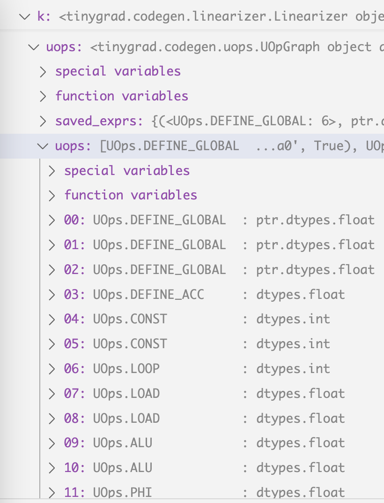
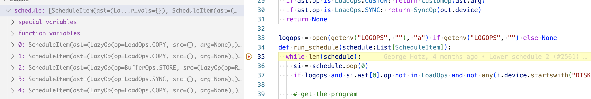
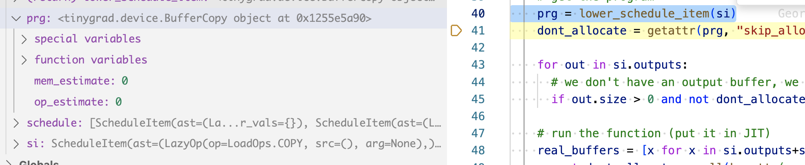

# Kernel Fusion: the backends

If you have followed my posts on the [tinygrad overview](dotproduct.md),
[AST tutorial](scheduleitem.md) and [linear IR](uops.md), you may start
to wonder how the kernel code is generated, aka how the backend works. I will 
try to answer that in this post.

Again, using the same simple dot product example:

```python
from tinygrad.tensor import Tensor
a = Tensor([1,2])
b = Tensor([3,4])
res = a.dot(b).numpy()
print(res) # 11
```
we start with these uops
by running this script with `DEBUG=5 NOOPT=1 python script.py`:

```
step  Op_name               type                      input                           arg
   0 UOps.DEFINE_GLOBAL  : ptr.dtypes.int            []                               (0, 'data0', True)
   1 UOps.DEFINE_GLOBAL  : ptr.dtypes.int            []                               (1, 'data1', False)
   2 UOps.DEFINE_GLOBAL  : ptr.dtypes.int            []                               (2, 'data2', False)
   3 UOps.DEFINE_ACC     : dtypes.int                []                               0
   4 UOps.CONST          : dtypes.int                []                               0
   5 UOps.CONST          : dtypes.int                []                               2
   6 UOps.LOOP           : dtypes.int                [4, 5]                           None
   7 UOps.LOAD           : dtypes.int                [1, 6]                           None
   8 UOps.LOAD           : dtypes.int                [2, 6]                           None
   9 UOps.ALU            : dtypes.int                [7, 8]                           BinaryOps.MUL
  10 UOps.ALU            : dtypes.int                [9, 3]                           BinaryOps.ADD
  11 UOps.PHI            : dtypes.int                [3, 10, 6]                       None
  12 UOps.ENDLOOP        :                           [6]                              None
  13 UOps.STORE          :                           [0, 4, 11]                       None
```

The uops are stored as k.uops attribute and that's where the backend code
generation process starts in `self.compiler.render`:

```python
  def to_program(self, k:Linearizer) -> CompiledASTRunner:
    assert self.compiler is not None, "compiler is required to run AST"
    k.linearize()
    info = get_lazyop_info(k.ast[0])
    ops, mem = k.uops.flops_mem()
    run_count = prod((k.global_size if k.global_size else []) + (k.local_size if k.local_size else []))
    # NOTE: we use min here to ignore the indexing FLOPS
    ret = CompiledASTRunner(k.name, self.compiler.render(to_function_name(k.name), k.uops), self.dname, k.global_size, k.local_size,
                            k.uops.vars(), min(info.flops, ops * run_count), min(info.mem_estimate, mem * run_count), outcount=len(k.outbufs))
    return ret
```



Depending on which "device" you are using (I'm on macbook), a Compiler's render
method will be called:

```python
class MetalCompiler(Compiler):
  compiler_opts = CompilerOptions("METAL", has_tensor_cores=os.uname().machine == "arm64", shared_max=32768)
  def __init__(self, device:Optional[MetalDevice]):
    self.device = device
    super().__init__("compile_metal")
  def render(self, name:str, uops) -> str: return MetalRenderer(name, uops)
```

After some interaction between different device specific instances, the end up
converging in this function:
```python
def uops_to_cstyle(lang:CStyleLanguage, function_name:str, uops:UOpGraph) -> str:
```

In our case, the uops is what we end up with in [my earlier post](uops.md), and
`lang` is the MetalRenderer constructed like this:

```python
MetalRenderer = functools.partial(uops_to_cstyle, MetalLanguage())
```

And MetalLanguage looks like this:

```python
class MetalLanguage(CStyleLanguage):
  kernel_prefix = "kernel "
  buffer_prefix = "device "
  smem_prefix = "threadgroup "
  arg_int_prefix = "constant int&"
  barrier = "threadgroup_barrier(mem_flags::mem_threadgroup);"
  float4 = "float4"
  uses_ptr_arithmetic = True
```

Similarly, you can see what CUDA language looks like, what HIP (AMD) looks like:

```python
class CUDALanguage(CStyleLanguage):
  kernel_prefix = "extern \"C\" __global__ "
  smem_prefix = "__shared__ "
  smem_prefix_for_cast = False
  barrier = "__syncthreads();"
  float4 = "make_float4"

class HIPLanguage(CStyleLanguage):
  kernel_prefix = """extern "C" __attribute__((device)) __attribute__((const)) size_t __ockl_get_local_id(unsigned int);
extern "C" __attribute__((device)) __attribute__((const)) size_t __ockl_get_group_id(unsigned int);
extern "C" __attribute__((device)) __attribute__((const)) size_t __ockl_get_local_size(unsigned int);
extern "C" {\n""" + "".join([
f"""  __attribute__((device)) __attribute__((const)) {dt} __ocml_fmax_f{n}({dt}, {dt});
  __attribute__((device)) __attribute__((pure)) {dt} __ocml_exp2_f{n}({dt});
  __attribute__((device)) __attribute__((pure)) {dt} __ocml_log2_f{n}({dt});
  __attribute__((device)) __attribute__((const)) {dt} __ocml_sqrt_f{n}({dt});
  __attribute__((device)) {dt} __ocml_sin_f{n}({dt});\n""" for dt,n in [("float",32), ("double",64), ("_Float16",16)]]) +\
'}\nextern "C" __attribute__((global))'
  code_for_workitem = {"g": lambda x: f"__ockl_get_group_id({x})", "l": lambda x: f"__ockl_get_local_id({x})",
                       "i": lambda x: f"(__ockl_get_group_id({x})*__ockl_get_local_size({x})+__ockl_get_local_id({x}))"}
  code_for_op = _make_hip_code_for_op()
```

For now I will focus on Metal to simplify things a bit. 

There are two categories of things that happen when supporting a new device: 
1. scheduling 2. code generation

## Code generation

Scheduling refers to you calling the manufacturer's API to initialize the device,
loading data back and forth, setting up threads and memory and requesting a block
of code to run. Code generation is unwrapping the UOps we have and turn them 
into actual code (in the case of CUDA, METAL, we generate C++ looking code). 
Let me cover code gen first as it's simpler.

The codegen process starts from here
```python
def uops_to_cstyle(lang:CStyleLanguage, function_name:str, uops:UOpGraph) -> str:
```

Let's use some example to dissect what it does.

### 1. If you don't pass anything to it:

```python
from tinygrad.renderer import uops_to_cstyle, MetalLanguage
output = uops_to_cstyle(MetalLanguage(), 'test', [])
```

This is the output:

```C++
#include <metal_stdlib>
using namespace metal;
kernel void test(uint3 gid [[threadgroup_position_in_grid]], uint3 lid [[thread_position_in_threadgroup]]) {

}
```

As you can see, that's just a standard Metal kernel function. The value of gid and lid can be
controlled upon scheduling the kernel, which will be covered later. For now, I will
discuss code gen only.

What if we want to be able to pass some data into it?

```python
from tinygrad.renderer.cstyle import uops_to_cstyle, MetalLanguage
from tinygrad.codegen.uops import UOps, UOpGraph
import tinygrad.dtype as dtype
from tinygrad.dtype import dtypes
uops = UOpGraph()
uops.add(UOps.DEFINE_GLOBAL, dtype.PtrDType(dtypes.float16), (), (0, 'data0', True))
output = uops_to_cstyle(MetalLanguage(), 'test', uops)
```

The output is:
```c++
#include <metal_stdlib>
using namespace metal;
kernel void test(device int* data0, uint3 gid [[threadgroup_position_in_grid]], uint3 lid [[thread_position_in_threadgroup]]) {

}
```

I have covered the process on how uops are generated [before](uops.md), but just
a brief recap. We set up the uops as an abstract object, then call the `add` 
method to add specific operation we want to it. In our case, we add a DEFINE_GLOBAL
op. This op requires some argument, the first is the op name. Second argument is 
the data type, it's a data residing on GPU, so it's a pointer (PtrDType),
the pointer points to a float16 data. Third argument is the input to this op,
it doesn't have any because it's just a plain declaration of an empty pointer of 
size 16 (float16) for now. And it does have some arguments, which will be handled
in the specific branch that deal with DEFINE_GLOBAL upon rendering. Let me show
you what that looks like inside `uops_to_cstyle`:

```python
      elif uop is UOps.DEFINE_GLOBAL:
        assert len(bufs) == args[0], f"missed a global buffer {len(bufs)} {args}"
        bufs.append((args[1], (dtype,args[2])))
        r[u] = args[1]
```

So bufs is added with some stuff, bufs now look like this:
```
bufs = [('data0', (ptr.dtypes.int, True))]
```

So we can guess that the first element argument is the name of the buffer, but don't know
what the other two are for. So we continue stepping into the code and saw
the the actual rendering that utilizes the `bufs` variable:

```python
  def render_kernel(self, function_name:str, kernel:List[str], bufs:List[Tuple[str,Tuple[DType,bool]]], uops:UOpGraph, prefix=None) -> str:
    tmp = "const sampler_t smp = CLK_NORMALIZED_COORDS_FALSE | CLK_ADDRESS_CLAMP | CLK_FILTER_NEAREST;\n" if any(isinstance(dtype, ImageDType) for _,(dtype,_) in bufs) else ""  # noqa: E501
    buftypes = [(name,f"{'write_only' if mutable else 'read_only'} image2d_t" if dtype.name.startswith('image') else
                ("" if mutable else "const ")+self.buffer_prefix+self.render_dtype(dtype)+"*"+self.buffer_suffix if isinstance(dtype, PtrDType) else
                self.arg_int_prefix if dtype == dtypes.int else None) for name,(dtype,mutable) in bufs]
    prg = ''.join([f"{self.kernel_prefix}void {self.get_kernel_modifier(uops)}{function_name}(",] +
    [', '.join([f'{t} {name}' for name,t in buftypes] + self.extra_args)] +
    [") {\n" + tmp] + ['\n'.join(kernel), "\n}"])
    return prg if prefix is None else "\n".join(prefix)+f"\n{prg}"
```

It's a bit messy, so I refactored it for readability:
```python
 def render_kernel(self, function_name:str, kernel:List[str], bufs:List[Tuple[str,Tuple[DType,bool]]], uops:UOpGraph, prefix=None) -> str:
    tmp = "const sampler_t smp = CLK_NORMALIZED_COORDS_FALSE | CLK_ADDRESS_CLAMP | CLK_FILTER_NEAREST;\n" if any(isinstance(dtype, ImageDType) for _,(dtype,_) in bufs) else ""  # noqa: E501

    buftypes = []
    for name, (dtype, mutable) in bufs:
      if dtype.name.startswith('image'):
        qualifier = "write_only" if mutable else "read_only"
      elif isinstance(dtype, PtrDType):
        qualifier = ("" if mutable else "const ")
        dtype_rendered = self.render_dtype(dtype)
        qualifier = qualifier + self.buffer_prefix + dtype_rendered + "*" + self.buffer_suffix
      elif dtype == dtypes.int:
        qualifier = self.arg_int_prefix
      else:
        qualifier = None
      
      bufdtype = (
        name,
        qualifier
      )
      buftypes.append(bufdtype)
    kernel_modifier = self.get_kernel_modifier(uops)
    prg = ''.join(
      [
        f"{self.kernel_prefix}void {kernel_modifier}{function_name}(",

        ', '.join(
          [
            f'{t} {name}' for name,t in buftypes
          ] + self.extra_args
        ),

        ") {\n" + tmp,
        
        '\n'.join(kernel), "\n}"
      ])
    return prg if prefix is None else "\n".join(prefix)+f"\n{prg}"
```

qualifier will have the value `device int*`, buftypes will be
```
[(data0, "device int*")]
```

In fact, this line gives out the answer: `    for name, (dtype, mutable) in bufs:`
and that's how we are able to declare a new variable as input.

You might wonder how we can actually pass data to it? That's on the scheduling part,
so I will save for later. 

### 2. Return some value

How do we have the value returned? Let's say we want to assign value 199 to
the output pointer:
```python
from tinygrad.renderer.cstyle import uops_to_cstyle, MetalLanguage
from tinygrad.codegen.uops import UOps, UOpGraph
import tinygrad.ops as ops
import tinygrad.dtype as dtype
from tinygrad.dtype import dtypes
uops = UOpGraph()
_global = uops.add(UOps.DEFINE_GLOBAL, dtype.PtrDType(dtypes.int), (), (0, 'data0', True))
_value = uops.add(UOps.CONST, dtypes.int, (), 199)
_zero = uops.add(UOps.CONST, dtypes.int, (), 0)
uops.add(UOps.STORE, dtypes.float, (_global, _zero, _value), None)
output = uops_to_cstyle(MetalLanguage(), 'test', uops)
print(output)
```

Let me break that down for you as it seems complicated. The uops are initialized
the same way, but now, in order to express `output = 199`, we need four steps:

First, declare the return data pointer by setting up DEFINE_GLOBAL, same as before.

Next, declare the value of our choice, we use the CONST op to indicate to the renderer
we want to hard code a value into the kernel code, such that the code generator will
literally write 199 into the code.

Next one may be confusing. Remember, our data0 is a pointer, so you can perform
pointer arithmetic on it. If you are not familiar with C++, think of it as a python
list. That's how the kernel access data, by reading or 
setting "the zeroth element", "first element" etc. Our output data is just a single
scalar, so we are setting the zeroth element. In order to have this "0" being written
in the code, we declare another CONST of value 0 (if you find this annoying, just keep
in mind that having such granularity is a tradeoff to make when you want to have a compiler
that's vendor neutral and also flexible. It's life, the entropy will always increase).

The last part, the actual STORE op, we have to pass in three inputs. The first one
is the pointer to the data, second one is the index we are storing the data on,
and the last one is the actual value to store.

If you run the code, you get this:
```c++
#include <metal_stdlib>
using namespace metal;
kernel void test(device int* data0, uint3 gid [[threadgroup_position_in_grid]], uint3 lid [[thread_position_in_threadgroup]]) {
  *(data0+0) = 199;
}
```


### 3. Render an ALU

How do we render a, say a ADD operation? Let's say we want to add 199 and 200 and
store it as output. I hope the following by now is self explanatory:

```python
from tinygrad.renderer.cstyle import uops_to_cstyle, MetalLanguage
from tinygrad.codegen.uops import UOps, UOpGraph
import tinygrad.ops as ops
import tinygrad.dtype as dtype
from tinygrad.dtype import dtypes
uops = UOpGraph()
_global = uops.add(UOps.DEFINE_GLOBAL, dtype.PtrDType(dtypes.int), (), (0, 'data0', True))
_value = uops.add(UOps.CONST, dtypes.int, (), 199)
_value_2 = uops.add(UOps.CONST, dtypes.int, (), 200)
_added = uops.add(UOps.ALU, dtypes.int, (_value, _value_2), ops.BinaryOps.ADD)
_zero = uops.add(UOps.CONST, dtypes.int, (), 0)
uops.add(UOps.STORE, dtypes.float, (_global, _zero, _added), None)
output = uops_to_cstyle(MetalLanguage(), 'test', uops)
print(output)
```

```
#include <metal_stdlib>
using namespace metal;
kernel void test(device int* data0, uint3 gid [[threadgroup_position_in_grid]], uint3 lid [[thread_position_in_threadgroup]]) {
  *(data0+0) = 399;
}
```

You may wonder why we see 399 instead of 199 + 200. That's actually an optimization
that happen at the render step when it encounters ALU of known value. But that's for
a separate post.

## Scheduling

Let's rewind back to the dot product example, we have two lists as input (data1 and data2)
```
kernel void r_2(device int* data0, const device int* data1, const device int* data2, uint3 gid [[threadgroup_position_in_grid]], uint3 lid [[thread_position_in_threadgroup]])
```

We already figured out how to have them show up in the kernel code, but if you just
run this kernel, they will not contain any data. We need to have a way of first
setting up the data, and run the kernel code with those data made available. If we 
end up having more than one kernel, we also make sure they can pass data along. That's
what scheduling is for.

Let's rewind further, back to this block of code in the `run_schedule` function
```python
while len(schedule):
  si = schedule.pop(0)
  prg = lower_schedule_item(si)
  if prg: prg.exec(real_buffers, si.var_vals)
```

I removed some code so we focus on the relevant part that's suitable for learning stuff for 
the time being. Recall that lower_schedule_item will either return you a kernel
object (our code above), or a buffer object:
```python
  if si.ast[0].op is BufferOps.STORE:
    return Device[si.outputs[0].device].get_runner(*si.ast)
  out, ast = si.outputs[0], si.ast[0]
  if ast.op is LoadOps.COPY:
    return BufferCopy()
```

So our dot product will have two BufferCopy instances, and they are `.exec()` first
and then our kernel. The three .exec may seem independent, but the data pointer
are tied together. Let's see what I mean:

When our breakpoint first hit `while len(schedule)`, we have three ScheduleItem (you see
five, but the last two are outside of the scope of this tutorial)



The first one is our tensor [1, 2]. We turn it into a program that has an .exec
method



Running the exec on it will eventually execute something like this, in the metal's 
case, the metal allocator for copying data using the Objective-C Metal API:
```python
  def copyin(self, dest:Any, src:memoryview): self.as_buffer(dest)[:] = src
  def copyout(self, dest:memoryview, src:Any): dest[:] = self.as_buffer(src)
```

It signals to us that the `.exec` method must take two input, one as input and
the other as output. We know that input is just a python list, already available.
But we want a pointer to its underlying memory. 

```python
import numpy as np
a = np.array([1,2])
mem_ptr_a = memoryview(a)
print(mem_ptr_a) #<memory at 0x109555f00>
```

There are many ways to do things like this, so I won't dwell on the detail, but
the important part is that now you can pass the data to GPU by calling Metal's API
on the memoryaddress.

The output part is in fact created inside the run_schedule function
```
    for out in si.outputs:
      # we don't have an output buffer, we have to create it, and create to max size if it has symbolic shape
      if out.size > 0 and not dont_allocate and not hasattr(out, "_buf"): out.allocate()
```

And we concat them together:
```
    real_buffers = [x for x in si.outputs+si.inputs if x.size != 0]
```

and pass to the exec function `prg.exec(real_buffers, si.var_vals)`. This concludes
the processing step for [1.0,2.0]. We repeat the same thing but for [3.0, 4.0]. And
now the output object that the two scheduleitem refers to are actually pointing to
the GPU memory which has the four numbers copied!

Remember that the scheduleItems' input and output are reference of each other.
So our kernel's input is the same instance as the buffer's output. When the code
finally call `.exec()` on our kernel code, it's `real_buffers` will be pointing
to the GPU memory that has data populated, and that's how it's able to access the
two lists.

Let's do an example, if we have a numpy list of [1.0, 2.0], how do we copy that
to the GPU?

```python
from tinygrad.device import BufferCopy
from tinygrad.buffer import Buffer
from tinygrad.dtype import dtypes
import numpy as np
from tinygrad.helpers import flat_mv

cpu_data = np.array([1,2], dtype=np.int32)
cpu_data_memory = flat_mv(np.require(cpu_data, requirements='C').data)
cpu_buffer = Buffer('EXT', 2, dtypes.int)
cpu_buffer.allocate((cpu_data_memory, cpu_data))

gpu_buffer = Buffer('METAL', 2, dtypes.int)
gpu_buffer.allocate()

buffer_op = BufferCopy()
buffer_op.exec([gpu_buffer, cpu_buffer])

print(np.frombuffer(gpu_buffer.as_buffer(), dtype=np.int32)) # [1,2]
```

Let me break down the above, we first construct a list of numbers, like what
we would do when doing a dot product operation. We have to turn this
into a memory construct that's compatible with different APIs on the GPU and hence the odd
looking thing (though there may be way to write it cleaner). Afterwards, we want to wrap it inside our custom Buffer object, which exposes
some methods that our final copy operation will call in order to get the data. These four lines are what happens under the hood when you construct the ScheduleItem
for your input data.

Next we construct the GPU buffer, since it's empty, we only need two simple lines to do it.

Afterwards, we construct a BufferCopy operation, which means we are moving data from one
place to elsewhere. We call the `.exec` methods that I mentioned a million times before
and does the actual data movement. 

Now the data is in GPU! Unfortunately you can't see it because GPU doesn't expose some
methods for you to view stuff, it's entirely opaque. But there's a method called `.as_buffer`
which literally does the everything we did backwards, and extracted the data out of
the GPU, and see the content: [1,2]. To prove the point that things actually happened, 
comment out the `.exec` method, and you will see the output as [0,0], indicating empty
data.
