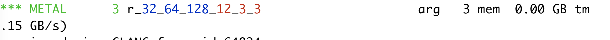

# How to interpret color and numbers in the kernel name

You may have seen colors and numbers describing the kernel function name, 
for example, when running a matrix multiplication as such

```python
## --> run this script with `DEBUG=2 python script.py`
from tinygrad import Tensor
a = Tensor.rand(4,4)
b = Tensor.rand(4,4)
c = a.matmul(b)
c.numpy()
```

and the output will be:


What does r_4_4_4 mean with the cyan, purple color? 

We could also do a convolution:

```python
## --> run this script with `DEBUG=2 python script.py`
from tinygrad import Tensor
a = Tensor.rand(1,12,128,256)
b = Tensor.rand(32,12,3,3)
c = a.conv2d(b, stride=(2,2), padding=(1,1))
c.numpy()
```

and the output is now:


The name is formed inside the `linearize` method of the Linearizer class, which
I have covered a bit in my other posts.

```python
    self.name = ("r" if self.reduceop else ("C" if all(x.op in BufferOps for x in self.lazyops) else "E")) + \
                 (f"{len(self.outbufs)}_" if len(self.outbufs) > 1 else "_") + \
                 colored('_', 'BLACK').join([colored(str(x), c) for x,c in zip(self.full_shape, self.colors())])
```

We first see that if it is a reduce op, for example, we are summing over a bunch
of values, then the name will start with `r`.

Next we look inside what the `self.colors()` method does:

```python
  # there's eight chunks of the shape
  # blue   -- global dims
  # cyan   -- local dims (warp ones first)
  #  *** self.first_reduce
  # green  -- reduce-local dims
  # white  -- reduce-late upcasted dim (self.upcast_in_mid_reduce_axes)
  # red    -- reduce loops
  #  *** self.upcasted
  # purple -- reduce upcasted
  # yellow -- normal upcasted dimensions
  def colors(self) -> List[str]:
    # first non local non reduce dims are global (blue)
    colors = ["blue"] * self.global_dims if not self.dont_use_locals else ["BLUE"] * self.global_dims
    # after global are local_dims; warp ones used in tensor cores must be closest to first_reduce (cyan)
    colors += ["cyan"] * self.local_dims
    # between first_reduce and first_reduce + group_for_reduces, they are either upcast mid reduce (white), or late upcasted (green)
    colors += ["white" if i in self.upcast_in_mid_reduce_axes else "green" for i in range(self.first_reduce, self.first_reduce + self.group_for_reduces)]  # noqa: E501
    # between first_reduce + group_for_reduces and upcasted, they are reduce (red)
    colors += ["red"] * ((self.shape_len-self.upcasted) - (self.first_reduce + self.group_for_reduces))
    # upcasted dimensions are reduce (magenta) or normal (yellow)
    colors += ["magenta" if self.full_shape[i] != self.sts[0].shape[i] else "yellow" for i in range(self.shape_len-self.upcasted, self.shape_len)]
    assert len(colors) == self.shape_len, "colors size mismatch"
    return colors
```

The comments are actually self documenting, in our r_4_4_4 the color means we
are launching a single block (absence of blue), and within this block, we have
a grid of threads organized in 4 by 4 layout (the two "4"s are both cyan), and
hence a total of 16 threads. We have the last number 4 colored in purple/magenta,
meaning that it was [upcasted](upcast.md). This matches our conceptual understanding
of how a matrix multiplication works. Given two 4 by 4 matrix, we can launch 16 threads,
each holding a single element in the output matrix (also 4 by 4). For each
thread, we would perform the dot product of the its matching row and column.
This would normally be a loop doing the accumulation, but as we have seen
in the upcast/loop-unroll post, we could inline it and hence perform the accumulation
in one go. We use the number 4 to indicate that this loop was unrolled 4 times across
the zeroth dimension (loading 4 elements).

Let's see the convolution example. I want to first run the script without
any optimization and also show the generated kernel code for better
understanding: `DEBUG=5 NOOPT=1 python script.py`.

```c++
kernel void r_32_64_128_12_3_3(device float* data0, const device float* data1, const device float* data2, uint3 gid [[threadgroup_position_in_grid]], uint3 lid [[thread_position_in_threadgroup]]) {
  int gidx0 = gid.z; /* 32 */
  int gidx1 = gid.y; /* 64 */
  int gidx2 = gid.x; /* 128 */
  float acc0 = 0.0f;
  for (int ridx0 = 0; ridx0 < 12; ridx0++) {
    for (int ridx1 = 0; ridx1 < 3; ridx1++) {
      for (int ridx2 = 0; ridx2 < 3; ridx2++) {
        float val0 = (((((gidx1*(-2))+(ridx1*(-1)))<0)*(((gidx2*(-2))+(ridx2*(-1)))<0))?*(data1+(ridx0*32768)+(gidx1*512)+(ridx1*256)+(gidx2*2)+ridx2+(-257)):0.0f);
        float val1 = *(data2+(gidx0*108)+(ridx0*9)+(ridx1*3)+ridx2);
        acc0 = ((val0*val1)+acc0);
      }
    }
  }
  *(data0+(gidx0*8192)+(gidx1*128)+gidx2) = acc0;
}
```

and the color is:



We are launching a bunch of blocks in 3D layout, 128 on the X axis, 64 on the
Y axis, and 32 on the Z axis (the blue colored numbers). Each block has
a single thread (absence of cyan). And there are three nested loop, shown by 
the consecutive red colored numbers 12, 3, 3. The first loop goes from 0 
to 12, second goes from 0 to 3, and the last goes from 0 to 3. You can
see that this matches the generated kernel code.

Now, if you look back, compare this one with the version we saw
earlier (r_8_8_2_16_8_12_4_4_3_3, check the colors in my screenshot), 
you see that the optimization changed a few things differently:

First, instead of launching a layout of 128 * 64 * 32 blocks, we now launch
2 * 8 * 8 blocks. Instead of having just one thread inside the block, we now luanch
128 threads laid out as a 8 * 16 grid. We still have the same loop that goes from
0 to 12 (exclusive), as indicated by the red number. However, inside this loop,
we aren't doing two extra loop. Instead we see that we have 4 unroll numbers.
Having four number means the data is organized as a 4 dimensional structure
(i.e. to access a single element you would have to do `x[0][0][0][0]`), and 
each dimension's access is directly unrolled, with `4, 4, 3, 3` it means
the zeroth's dimension has 4 elements, first has 4, second has 3, and the last
has 3 elements, all of which are fetched directly. The distinction between
yellow and purple is whether this is an accumulation (reduce). 