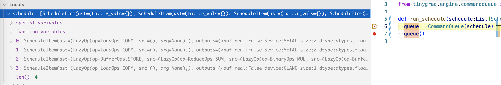
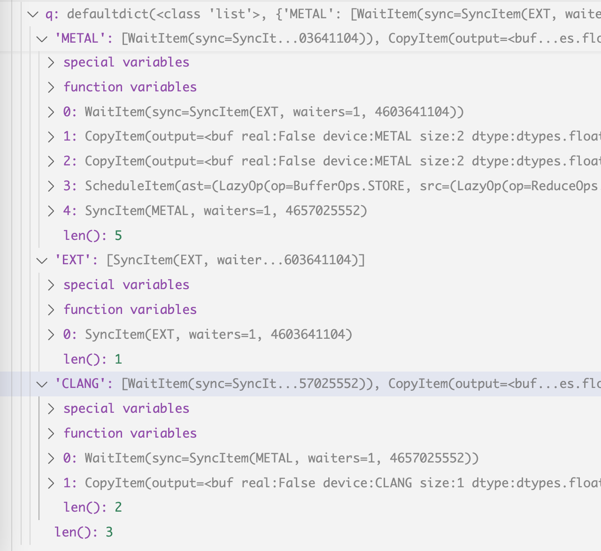
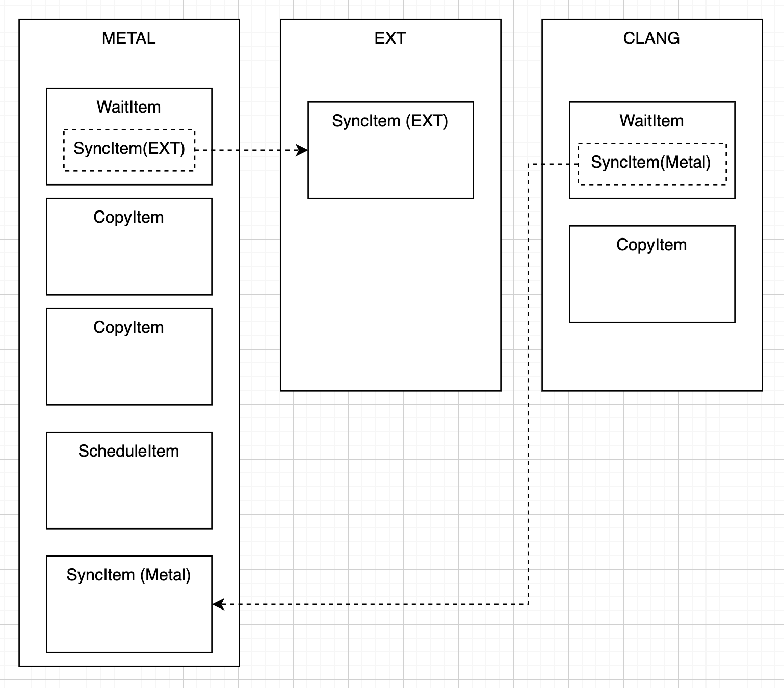
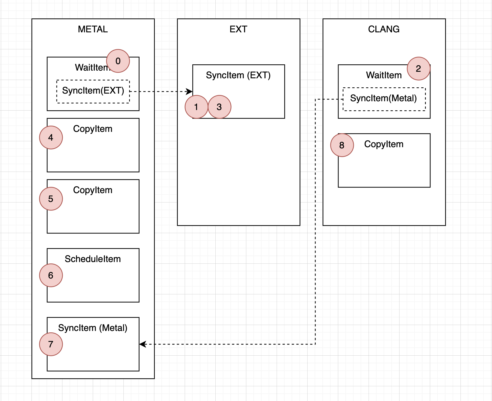

# How Command Queue works

A good chunk of the materials I covered in my [scheduleitme](scheduleitem.md)
and [backend](backends.md) posts are now replaced by Command Queue, and it's a much
cleaner looking utility. I recommend checking out those posts first because I will assume some familiarity
with how existing stuff works. In the code snippets below, I also turned some
one liner into multiple lines with intermediate variables so it's easier to explain.

The behaviour hasn't changed, and I use the same old dot product example:
```python
from tinygrad.tensor import Tensor
a = Tensor([1,2])
b = Tensor([3,4])
res = a.dot(b).numpy()
print(res) # 11
```

Lazydata and ScheduleItem construction remains the same, we land at the
`corealize` method, with the identical `schedules` as discussed in earlier posts.
```python
  @staticmethod
  def corealize(lst:Iterable[Tensor]):
    schedules = create_schedule(flatten([x.lazydata.lbs if isinstance(x.lazydata, MultiLazyBuffer) else [x.lazydata] for x in lst]))
    run_schedule(schedules)
```

Inside `run_schedule` is where things diverged:
```python
def run_schedule(schedule:List[ScheduleItem]): 
  queue = CommandQueue(schedule)
  queue()
```

We pass the schedule to the CommandQueue constructor, and then invoke it (via __call__).
On a high level, the constructor keep a list of information on what operations
are required to run, in which order, and the links between schedule items (input and
output). When you invoke the instance, it will follow those information and 
actually call the `.exec()` method on the memory buffer and constructed program.
There are other operations like WAIT and SYNC that need to run. It become a lot more
obvious how they are handled with now with CommandQueue instead of appearing so
confusing that i didn't know how to explain in my earlier posts.

Here's the full implementation of the CommandQueue constructor:
```python
  def __init__(self, schedule:List[ScheduleItem]):
    self.q: DefaultDict[str, List[Union[ScheduleItem, CopyItem, SyncItem, WaitItem]]] = defaultdict(list)

    def add_sync_item(device:str):
      if not len(self.q[device]) or not isinstance(sync_item:=self.q[device][-1], SyncItem):
        sync_item = SyncItem(device)
        self.q[device].append(sync_item)
      return sync_item

    def add_wait_item(device:str, syncitem:SyncItem):
      # if you are adding this right after a first sync, delete this one
      if len(self.q[device]) and isinstance(wi:=self.q[device][-1], WaitItem) and wi.sync.device == syncitem.device:
        self.q[device] = self.q[device][:-1]
        wi.sync.waiters -= 1
        if wi.sync.waiters == 0: self.q[wi.sync.device].remove(wi.sync)
      if (wi:=WaitItem(syncitem)) not in self.q[device]:
        syncitem.waiters += 1
        self.q[device].append(wi)

    while len(schedule):
      si = schedule.pop(0)
      assert len(set(x.device for x in si.outputs+si.inputs)) == 1 or (si.ast[0].op is LoadOps.COPY and len(si.outputs) == 1)
      queue = self.q[si.outputs[0].device]

      if si.ast[0].op is LoadOps.COPY:
        # TODO: add back copy device
        copy_device = si.outputs[0].device #+"-copy"
        add_wait_item(copy_device, add_sync_item(si.inputs[0].device))
        self.q[copy_device].append(CopyItem(si.outputs[0], si.inputs[0]))
        #add_wait_item(si.outputs[0].device, add_sync_item(copy_device))
        continue

      # NOTE: LoadOps.EMPTY and LoadOps.CUSTOM are making it here
      queue.append(si)
```

We iterate through each scheduleitem, check what device it is on. Recall what
our scheduleItem looks like.



and then put it in a dedicated list. We have scheduleitem that exist
on external device ("EXT", for numpy data), on Metal, and for the return
value, on cpu ("CLANG"). If the item is a regular kernel for some computation,
we just add it to the queue for that device. But if it's a memory operation, 
for example, our two list of arrays to be dot-product'ed on, we do something
special. Entering the if branch, we first figure out where the destination
of this buffer is copied to. And then we add "Sync" and "Wait" item to the 
destination devic queue, and also add a "Copy" to the source device queue.
Put simply, if we want to copy a number from numpy to GPU, we set up
a structure like this

```
CPU queue:
[COPY]
GPU queue:
[WAIT]
```
and the execution will start on CPU, and end on GPU, that way if the kernel op
requires some data, it will know when to call the GPU's API to synchronize data.

Next is how the invocation actually works, this one is longer.

```python
  def __call__(self):
    active_queues = list(self.q.keys())
    waiting_queues: DefaultDict[SyncItem, List[str]] = defaultdict(list)
    seen_sids = set()
    while len(active_queues):
```

active_queues is a list of key values we have for the `.q` attributes we 
set up before, this is what the .q looks like:



and if you visualize it:


Looking at the screenshot, we recognize familiar operations, the two COPY
op that loads data from CPU to GPU, the ScheduleItem op that perform the
multiplication and summation on the GPU (these three are
inside the "METAL" box), and finally the COPY op that move the computed
value from GPU to CPU (the "COPY" inside "CLANG" box). EXT represent the
memory in numpy, which holds the two input data. CLANG represent the CPU
that's running the code, which is where our result would be (to print it out).
We see that the wait and sync operation are now made more explicit. For 
GPU to execute anything, it has to "wait" for an operation. This wait op
requires an acknowledgement (SYNC) from the numpy data (EXT). Similarly, before our host/cpu (CLANG) can copy the result back, it must "wait" for
an acknowledgement (SYNC) from the GPU (METAL).

Let's look at how it's implemented. The general idea is cycle through each
device, and try to execute as many op as possible until you encounter a wait
op. Doesn't matter which one you start off though:

```python
active_queues = list(self.q.keys()) # ['METAL', 'EXT', 'CLANG']
waiting_queues = defaultdict(list) 
```

active_queues is how we do the cycling, and waiting_queues is what holds the
wait information. Remember in the graph there are `WAIT` boxes that point to a
`SYNC` box? that's what this is for. The key is the SYNC box, and the list
is a list of device name whose first element is waiting for it:
```
{
  SyncItem(metal): ["metal"]
}
```

and this is how its being populated
```python
elif isinstance(si, WaitItem):
  if si.sync not in seen_sids:
    waiting_queues[si.sync].append(device)
    continue
```

It says if I encounter a wait item, I need to append it to the wait_queue and
just continue to the next cycle (becuase I'm waiting for stuff).

And this is how the `waiting_queue` gets resolved once stuff becomes available:
```python
      if isinstance(si, SyncItem):
        # don't sync if there's other options
        if all(isinstance(self.q[x][0], SyncItem) for x in active_queues if len(self.q[x])):
          et = cpu_time_execution(Device[device].synchronize, enable=DEBUG>=2)
          update_stats(colored("synchronize", "RED"), 0, 0, {}, et, 1, device=device)
          if si in waiting_queues:
            active_queues += waiting_queues[si]
            waiting_queues[si].clear()
          seen_sids.add(si)
        else:
          # put it back
          self.q[device] = [si] + self.q[device]
```

It says if now we encounter a sync item, we would then add the device that was
waiting on it back to the active queue. But before we do that, we must check whether
other device on the active_queue can perform some actions. Note that although we represent the 
dependency as if the wait item depends on the sync item per se, really what we
want to imply is "whatever comes after the wait item depend on the stuff that comes
before the sync item". So in order to make sure we have realized all the dependencies,
we check if sync are the only next item we can execute. A counter example is, look at the 
picture, if we encounter sync item on the EXT, and CLANG has something that depend on
it but CLANG hasn't run, we shouldn't process the sync item on EXT. 
It's all about making sure you don't run ahead of your dependency.

That's a lot for setting things up. Let's look at the main loop operation with
some simplified code:

```python
seen_sids = set()
while len(active_queues): # ["METAL", "EXT", "CLANG"]
  device = active_queues.pop(0)
  si = self.q[device].pop(0)
  if isinstance(si, SyncItem):
    if si in waiting_queues:
      active_queues += waiting_queues[si]
      waiting_queues[si].clear()
    seen_sids.add(si)
  elif isinstance(si, WaitItem):
    if si.sync not in seen_sids:
      waiting_queues[si.sync].append(device)
      continue

  active_queues.append(device)
```

This pop(0) and append is how we cycle through the three devices. Let me show you an example.

Suppose active_queue is ["METAL", "EXT", "CLANG"].
We then start with the METAL device (the order of the initial 
active_queue is somewhat random), we would first
encounter a WAIT op, we add it to the waiting_queues and skip to the next
iteration, without doing the append. 

Now active_queues become `["EXT", "CLANG"]`, and waiting_queues become a dictionary
with the key value pair: `SYNC(EXT): ["METAL"]`. 

In the next iteration, we encounter the SYNC item in EXT, we first check if all of the
active_queue's first element is a SYNC item. There are two devices active, EXT and CLANG.
EXT has itself (first item is SYNC), but CLANG isn't, it has a WAIT. What if this
wait depends on the SYNC we are looking at right now? Better skip the SYNC for now
and process CLANG first. 

Now the active_queue is `["CLANG", "EXT"]`, and we will process the CLANG items.
Same as the WAIT in metal, we add it to the wait_queue.

Now wait_queue is 
```
SyncItem(EXT): ["METAL"]
SyncItem(METAL): ["CLANG"]
```

and active_queue is just `["EXT"]`

We now process the sync item in the EXT. we see that this is
one of the key in waiting_queues, so we add the Metal back to active_queues.
Now active_queues become `["METAL"]`. We complete the loop iteration, and 
append the device back to active_queue, which become `["METAL", "EXT"]`. 

Next we process the next element in METAL, which is a COPY. Note that it is 
not WAIT because it was popped and stored in the wait_queue. We finish iteration
and append METAL to queue: ["EXT", "METAL"].

We see EXT is empty now, so we skip it. Queue is now ["METAL"].

Next we process the METAL again, and process the COPY. You can see where this is
going, the next loop will again be METAL, and the second COPY is processed and
run. And then the ScheduleItem. The COPY and ScheduleItem part will look familiar:
```python
      elif isinstance(si, CopyItem):
        si.output.allocate()
        fxn.exec([si.output, si.input])
      elif isinstance(si, ScheduleItem):
        for out in si.outputs:
          if not hasattr(out, "_buf") and not (out.device.startswith("DISK") and si.ast[0].op is BufferOps.STORE): out.allocate()
        if si.ast[0].op is not LoadOps.EMPTY:
          if si.ast[0].op is LoadOps.CUSTOM:
            runner:JITRunner = CustomOp(si.ast[0].arg)
          elif si.ast[0].op is BufferOps.STORE:
            runner = Device[si.outputs[0].device].get_runner(*si.ast)
          else: raise RuntimeError(f"unknown type {si}")
          runner.exec(list(si.outputs+si.inputs), si.var_vals)
```

Finally we get to the SyncItem under Metal, recall that the active_queue 
at this moment is empty becuase the only "Metal" is popped. So SyncItem is the only
one we can process. So we look at what device has stuff that depends on it. Ah
it's CLANG, we add CLANG back to the loop. Complete the iteration with the append.

active_queue is now ["CLANG", "METAL"].

We go into CLANG and see that it has the COPY op, we process it. We complete
the iteration. And you can see everything is popped, so two more iterations will
just exhaust the active_queue and we have the whole thing completed.

Let me mark the relevant order (starting from 0) of execution on each cell. Try to run the loop on a paper a few times, starting from any of the device, you will note that
you always end up executing stuff in the same order:

