# How Tinygrad supports Tensor Core

After [adding support for your accelerator of choice](addingaccelerator.md),
you may notice that beyond the basic operations, GPU manufacturers offer
additional optimization techniques. Some take in the form of hardware
specific features, such as the Tensor Core in CUDA in Nvidia GPUs. Similarly
Intel offers AMX and apple, though not officially public about it, has their own 
matrix acceleration support. I will look at how Tinygrad implements tensor
core for Nvidia GPU and hopefully that gives you some ideas on how to add 
support for other vendors like Intel and Apple.

Tensor Core in CUDA allows faster computation of General Matrix Multiplication
(GEMM), feel free to take a look at the following resources to understand how it works:

1. https://www.cse.ust.hk/~weiwa/papers/yan-ipdps20.pdf

1. https://developer.nvidia.com/blog/programming-tensor-cores-cuda-9/

1. https://developer.nvidia.com/blog/cutlass-linear-algebra-cuda/

In brief, it uses special hardware to compute matrix multiplication faster and
present new APIs to access this functionality.

## Warped matrix multiplication in CUDA

It's a good idea to understand how things work in plain C++ and see how it's
sped up. This example is taken from [this CUDA doc](https://developer.nvidia.com/blog/cutlass-linear-algebra-cuda/), 
but I added more illustrative example. 

Suppose we want to perform matrix multiplication on two 8 by 2 matrices:
A (8 by 2), and B (2 by 8) and C (8 by 8).
I will use letters to represent numbers so we can see the algebra:

```
A = [
  a b
  c d
  e f
  g h 
  i j
  k l
  m n
  o p
]

B = [
  A C E G I K M O
  B D F H J L N P
]
```

C = A @ B would take the following form:


```
      A     C     E     G     I     K     M     O
      B     D     F     H     J     L     N     P
    +--------------------------------------------
a b | aA+bB aC+bD aE+bF aG+bH aI+bJ aK+bK aM+bM aO+bO
c d | cA+dB cC+dD cE+dF cG+dH cI+dJ cK+dK cM+dM cO+dO
e f | eA+fB eC+fD eE+fF eG+fH eI+fJ eK+fK eM+fM eO+fO
g h | gA+hB gC+hD gE+hF gG+hH gI+hJ gK+hK gM+hM gO+hO
i j | iA+jB iC+jD iE+jF iG+jH iI+jJ iK+jK iM+jM iO+jO
k l | kA+lB kC+lD kE+lF kG+lH kI+lJ kK+lK kM+lM kO+lO
m n | mA+nB mC+nD mE+nF mG+nH mI+nJ mK+nK mM+nM mO+nO
o p | oA+pB oC+pD oE+pF oG+pH oI+pJ oK+pK oM+pM oO+pO

```

A simple implementation is just iterating through them:

```c++
for (int i = 0; i < M; ++i)
    for (int j = 0; j < N; ++j)
       for (int k = 0; k < K; ++k) 
            C[i][j] += A[i][k] * B[k][j];
```

The most obvious problem with this solution isn't actually speed, but rather
memory because it requires you to hold all of elements of A, B and C in 
fast access memory. The compute order is how you would read the result table
seen above, from left to right, top to bottom: 
`aA = bB, aC+bD, aE+bF,... cA+dB, cC+dD, cE+dF...`

As you can see, if you want this to be fast, you want to make sure every single
element can be accessed quickly. There's also some waste, for example, you would
read the value of A at the beginning, forget about it for a while, and then read it again
when you get to the second row. 

One way to improve this, such that we don't have to load entire A and B in 
fast access memory is just moving the k loop to the outermost:

```c++
for (int k = 0; k < K; ++k)     // K dimension now outer-most loop
    for (int i = 0; i < M; ++i)
        for (int j = 0; j < N; ++j)
            C[i][j] += A[i][k] * B[k][j];
```

This way, we only need to keep a single column of A and a single row of B in memory.
If the size of K is 100, that means we reduced 99% of input memory usage! 

The way you would compute the result now would read in the following order:

when k = 0, we compute the result by doing: `aA, aC, aE, aG, aI, aK, aM, aO, cA, cC, cE,...cO`
this is just the first two rows, you would continue until you get all 8 rows with
values. Then k becomes 1, you would do the same thing but adding the value you
get from the previous iteration (only showing first two rows):

```
aA + bB, aC + bD, ..., cA + dB, cC + dD, ...
```

You can see that if memory is limited, we can still achieve fast result because
for the 64 multiplication (8 * 8) for a single value of k to compute, we will 
do fine as long as we have a single row of B and a single column of A in memory.
You can validate this thinking by putting the some values of A and B far away and
others close to you (physically) and try to grab them for this computation table 
with the two approaches.

The next problem is now the output C, in either cases, we need the entire output
in fast memory. The solution is split the output into smaller chunks, let's say
split the output 8 by 8 into 4 chunks of 2 by 2:

```c++
for (int m = 0; m < M; m += 2)                // iterate over M dimension
    for (int n = 0; n < N; n += 2)            // iterate over N dimension
        for (int k = 0; k < K; ++k)
            for (int i = 0; i < 2; ++i)       // compute one tile 
                for (int j = 0; j < Ntile; ++j) {
                    int row = m + i;
                    int col = n + j;
                    C[row][col] += A[row][k] * B[k][col];
                }
```

Now instead of depositing value to the output C one row at a time, we are
doing it one smaller grid at a time.

First we do the first chunk's first pass:
```
aA, aC, cA, cC
```

First chunk's second pass:
```
aA+bB aC+bD, cA+dB cC+dD
```

There, we finish the first chunk, now we do the next chunk's first pass:
```
aE, aG, cE, cG,
```

Second's chunk's second pass:
```
aE+bF aG+bH cE+dF cG+dH
```

In fact, you see how this can be optimized. On the top level, we can process 
the two chunks at the same time. Then within each chunk, take the first chunk 
for example, we can do the two passes at the same time and add them up after they 
are both done. Within each pass, we can do the four elements at the same time.
In fact, within each pass we term the input as a tile. So [A, C] is a tile of 
input B (the other one being [B, D]), and [a, c] is a tile of input A (the other
one being [b, d]). 


Tensor core programming comes in to enhance this even further and propose a 
way to name and organize our chunks of data such that the hardware will deliver
the result faster. Because of the depths of hierarchy, I will expand our example to
be input of 8 by 4 matrix:

```
        |  A                  E             H             L     .     .     .     .
        |  B                  F             I             M     .     .     .     .
        |  C                  G             J             N     .     .     .     .
        |  D                  H             K             O     .     .     .     .
    +-------------------------------------------------------
a b c d | ...                 ...           ...           ...
e f g h | ...                 += Ff+Gg      += If+Jg         ...
i j k l | ...                 += Fg+Ih      += Ij+Jk         ...
m n o p | ...                 ...           ...           ...
. . . . | 
. . . . | 
. . . . |
. . . .
```

The tensor core requires us to split data in a certain way. As an example, we split the output 8 by 8 into 16 chunks of 2 by 2, which has the result shown above. We look at the one of the 
2 by 2 chunks explicitly labeled out with the calculation. 

This 2 by 2 is called a threadblock. The input data are split into tiles. We can set
the tile size to be 2 (just for illustration, you can set it to other values).

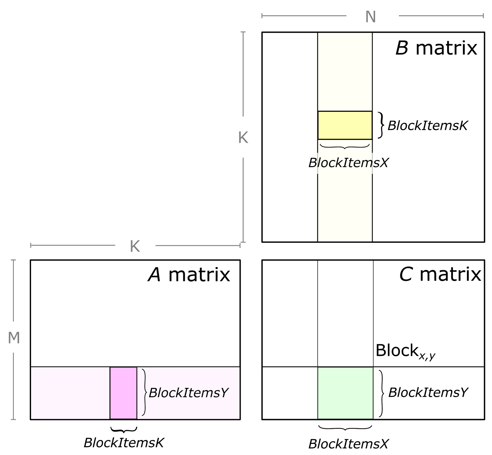

Mapping this figure to our matrix, the BLOCKx,y is our 2 by 2 chunk labeled out.
The light yellow input is:
```
E H
F I
G J
H K
```

The light pink input is 
```
e f g h
i j k l
```

The tile is more arbitrary, we assume a size of 2 and assume that we are exactly
in the middle iteration that's processing this chunk, then the 
dark yellow (a tile) would be
```
F I
G J
```

and dark pink (a tile) would be
```
f g
j k
```

Note that the deposited value I have illustrated in the output is accumulative (i.e. the +=),
meaning that the four values which came from the current two tiles would have to
add to the previous values coming from previous tiles (). And the four
output value. And the final accumulated value would map to the light green in the
image (the intermediate value from the tile's matrix multiplication is not shown in the image)

The tile will further be split into warps:

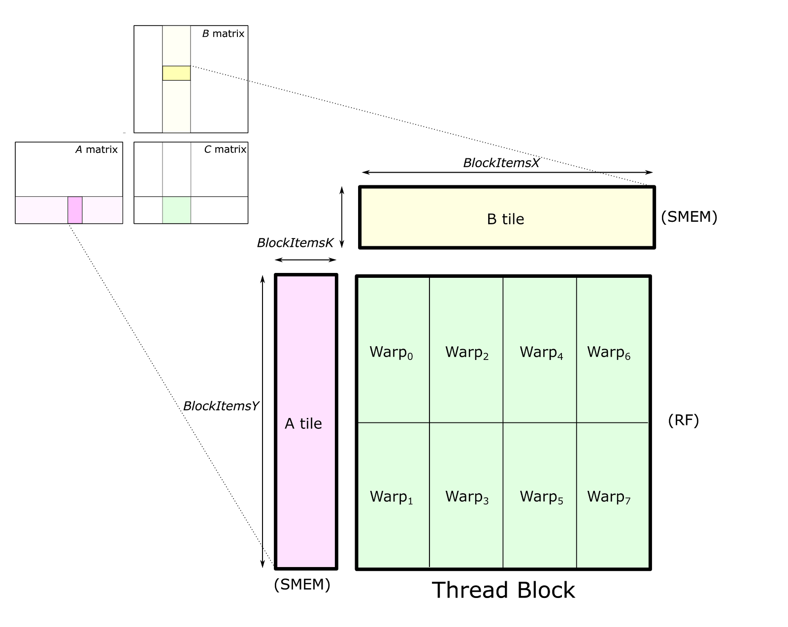

warp0 would be `Ff + Gg`, warp1 would be `Fg + Ih`, and so on. 

Warp are further organized into Warp tile:

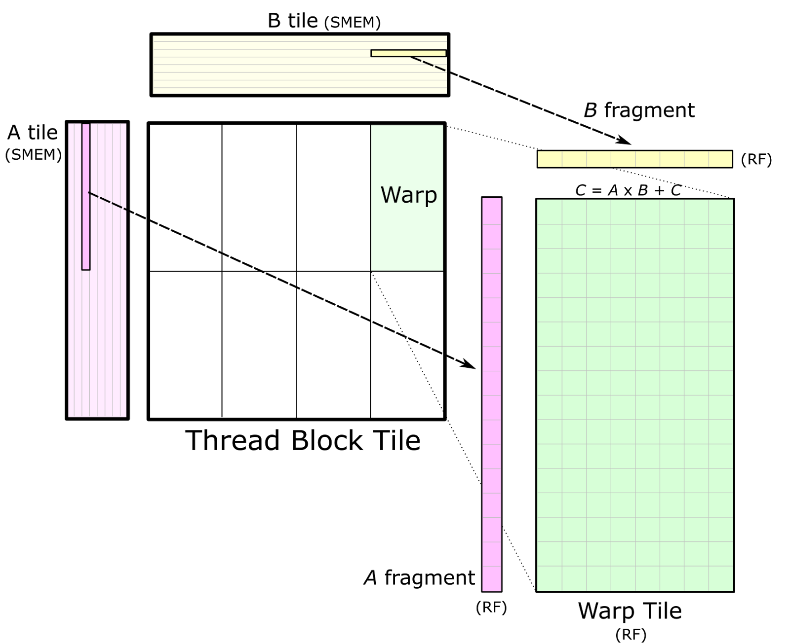

Take warp0 for example, fragment A would be [f] (single element because our input
is small, but in a bigger example this would be more than 1 element), fragment
B would be [F]. Then you do a matrix multiplication between fragment A and fragment
B, resulting in a 1 by 1 matrix called Warp Tile. In CUDA, fragment A and B is 
in fact further split into smaller unit for parallel matrix multiplication. But
I'll stop here, feel free to refer to the referenced CUDA doc for more details.

Now, fragment A and B is called `wmma::fragment<matrix>`, warp0 is formed by
calling `wmma::mma_sync()` on the two fragments and the return type is
`wmma::fragment<accumulator>`.

In the above, I have mixed together two approaches of organizing threads and
warps and the data and things may seem confusing. Let me clarify:

In CUDA, computation is organized into threads. We group a bunch of threads
together and call them a block. We could repeat this block
multiple times and call them a grid. A grid represent the total computation being
launched for a kernel. For example, we could have
a kernel with 16 blocks, organized as 4 by 4. Each block then can have 32 threads,
organized as 4 rows and 8 columns:

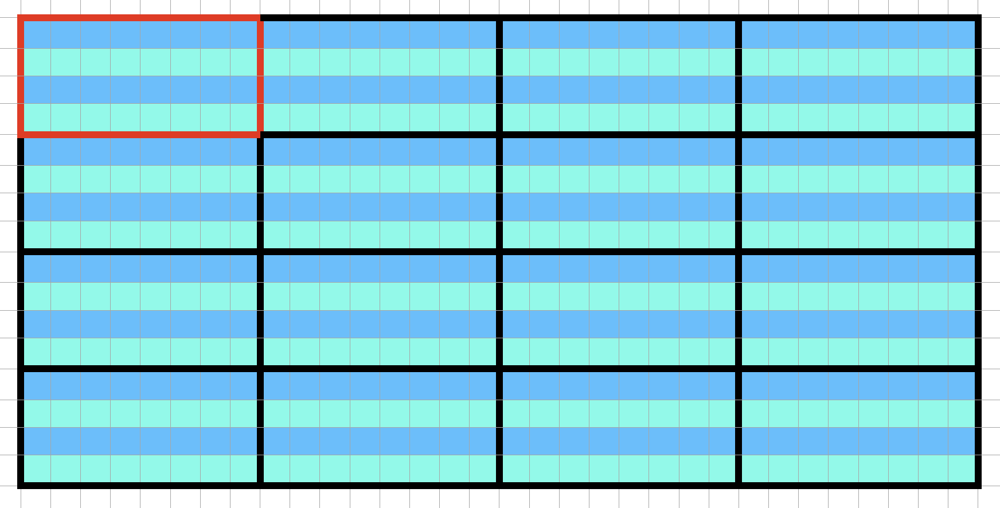

The red bordered grid is the top left block, we see there are total 16 blocks.
Each block has 32 threads, as indicated by the colored cells. These cells are
organized as 4 rows and 8 columns. In CUDA, this is written as:

```
dim3 gridDim(4, 4);
dim3 blockDim(8, 4);
```

Then, within each kernel function, we can access its location with (for example,
the red bordered block in the image):

```
gridDim.x --> 4
gridDim.y --> 4
blockIdx.x --> 0
blockIdx.y --> 0

blockDim.x --> 8
blockDim.y --> 4
threadIdx.x --> 0
threadIdx.y --> 0
```

note the pairing between gridDim and blockIdx, vs blockDim and threadIdx.

Within a block, we have 32 threads, and these 32 threads are capable of processing
C = A @ B where A is of size 16 by 16, B is of size 16 by 16. In other words,
32 is the warp size (in fact this value is set by the hardware, I happened to pick
32). And a warp size of 32 can process general matrix multiplication with 
M = 16, N = 16 and K = 16:

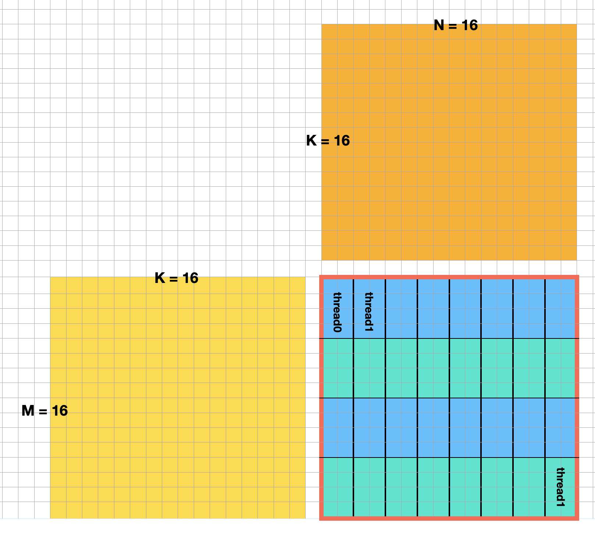

Note that each small cell in the orange box represent a value in the input
matrix. The red bordered block is the top left block taken from the earlier
image but with the thread being labeled out explicitly. In other words,
in our kernel, we have 16 blocks, each block has 1 warp with warp size being 32.

We could further expand this, such that a kernel consists of 16 blocks, and
each block contains 16 warps, totaling 512 threads. 

Let's now look at a real example, and see how tensor core is being applied.
We will do matrix multiplication on two matrices of size 256 * 256.

```c++
#define MATRIX_M 16 * 16
#define MATRIX_N 16 * 16
#define MATRIX_K 16 * 16
```

and then initialize the variables `a_fp16`, `b_fp16`, `c_wmma`:
```c++
   float *a_fp32;
   float *b_fp32;
   half *a_fp16;
   half *b_fp16;

   float *c_wmma;

   
   curandGenerator_t gen;   
   // Use tensor cores   
   cudaMalloc((void**)&a_fp32, MATRIX_M * MATRIX_K * sizeof(float));
   cudaMalloc((void**)&b_fp32, MATRIX_K * MATRIX_N * sizeof(float));
   cudaMalloc((void**)&a_fp16, MATRIX_M * MATRIX_K * sizeof(half));
   cudaMalloc((void**)&b_fp16, MATRIX_K * MATRIX_N * sizeof(half));

   curandCreateGenerator(&gen, CURAND_RNG_PSEUDO_DEFAULT);
   curandSetPseudoRandomGeneratorSeed(gen, 1337ULL);
   curandGenerateUniform(gen, a_fp32, MATRIX_M * MATRIX_K);
   curandGenerateUniform(gen, b_fp32, MATRIX_K * MATRIX_N);
   convertFp32ToFp16 <<< (MATRIX_M * MATRIX_K + 255) / 256, 256 >>> (a_fp16, a_fp32, MATRIX_M * MATRIX_K);
   convertFp32ToFp16 <<< (MATRIX_K * MATRIX_N + 255) / 256, 256 >>> (b_fp16, b_fp32, MATRIX_K * MATRIX_N);

   cudaMalloc((void**)&c_wmma, MATRIX_M * MATRIX_N * sizeof(float));
   cudaMemset(c_wmma, 0, MATRIX_M * MATRIX_N * sizeof(float));
```

Note that the random number generator doesn't support floating point 16, but the
matrix multiplication requires floating point 16, so the odd code above is doing a
casting and then copy the data the GPU.


We know that the input constraint is 16, and warp size is 32. Meaning that
32 threads can process a 16 * 16 * 16 GEMM, just like what I have drawn above,
we need to organize 32 threads into a unit, and this unit will process 16 by 16 (64)
of the output matrix. This unit is also called a warp. Given that the total
output is 256 * 256, we need to have 16 * 16 = 256 warps to compute the output.
We need to then divide the threads (32 * 256 = 8192) into grids and blocks.
Previously we had just 1 warp within 1 block, we now can put more warps into
the block. The actual organization is arbitrary, so I'll use the example's configuration.

We divide the 8192 threads into 16 blocks, as 4 columns and 4 rows. Each block
has 512 threads. These threads are laid out as 128 columns and 4 rows. Every 32
threads of them form a warp, and we have 16 warps in total. Each warp will process
16 by 16 of the output matrix and hence each block will output 64 by 64 of the output
matrix. 


```c
int main() {
  // define the a matrix, b matrix and output matrix
  // a_fp16: 256 * 256
  // b_fp16: 256 * 256
  dim3 gridDim;
  gridDim.x = 4;
  gridDim.y = 4;

  dim3 blockDim;
  blockDim.x = 128;
  blockDim.y = 4;
  
  wmma_example <<< gridDim, blockDim >>> (a_fp16, b_fp16, c_wmma, 256, 256, 256);
}
```

We launched 16 blocks, each block with 512 threads. To visualize it, the cyan
colored square is a single block, which holds 512 threads, there are 16 blocks
in total, the blue colored portion represent other 15 blocks. Note that each block
can process 64 * 64 of the output matrix, and the size of outmatrix is 256 * 256,
as labeled in the image below. Note that
the thread number is not the product of the block dimension! Refer to the previous
two paragraphs for how thread number is calculated. The number in 

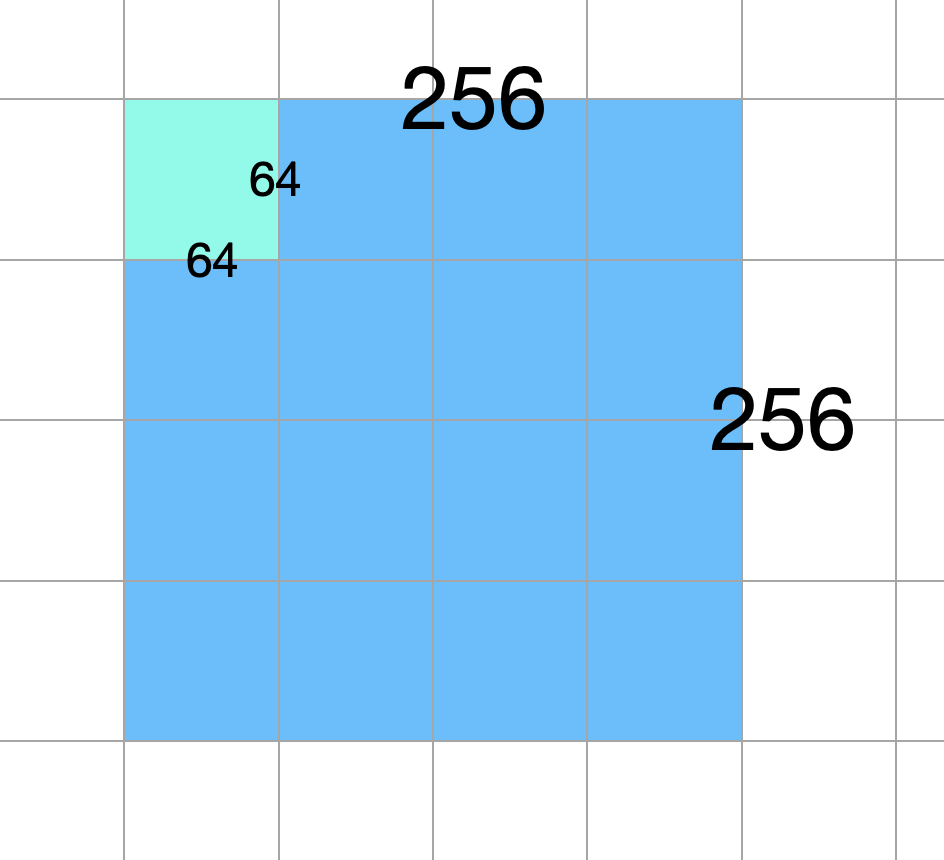

Looking inside the cyan block, the two labels with number 64 represent the size
of output matrix that will get processed by this block. The actual thread numbers
are labeled by the small red text. I labeled the first and last 32 threads so you
can see how they are being organized. Remember that within a block, the threads
are laid out as 128 columns and 4 rows, totaling a 512 threads. Recall this number 512 came
from the tensor core constraint where 32 threads form a warp that can process
matrix multiplication of size 16 * 16 * 16. See earlier paragraphs on how this
spec is converted to 512 given input size of 256 * 256. Every 32 threads
are grouped into a unit (which I drew borders, and labeled the top left unit) which
is called warp. We have a total of 16 warps, laid out as 4 rows and 4 columns.

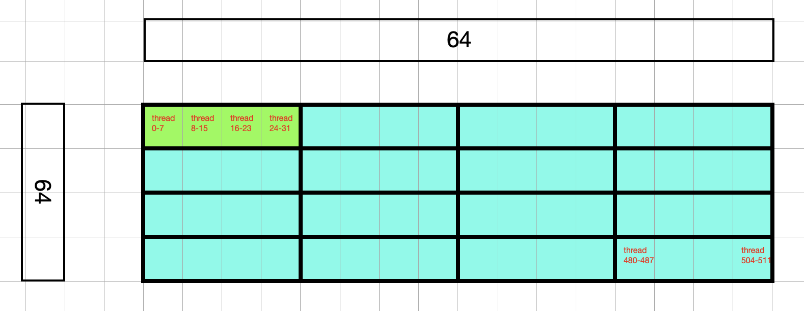

Let me now map this to the tile figure from above, and you can see that the number
64 is actually referring to the size of a tile:

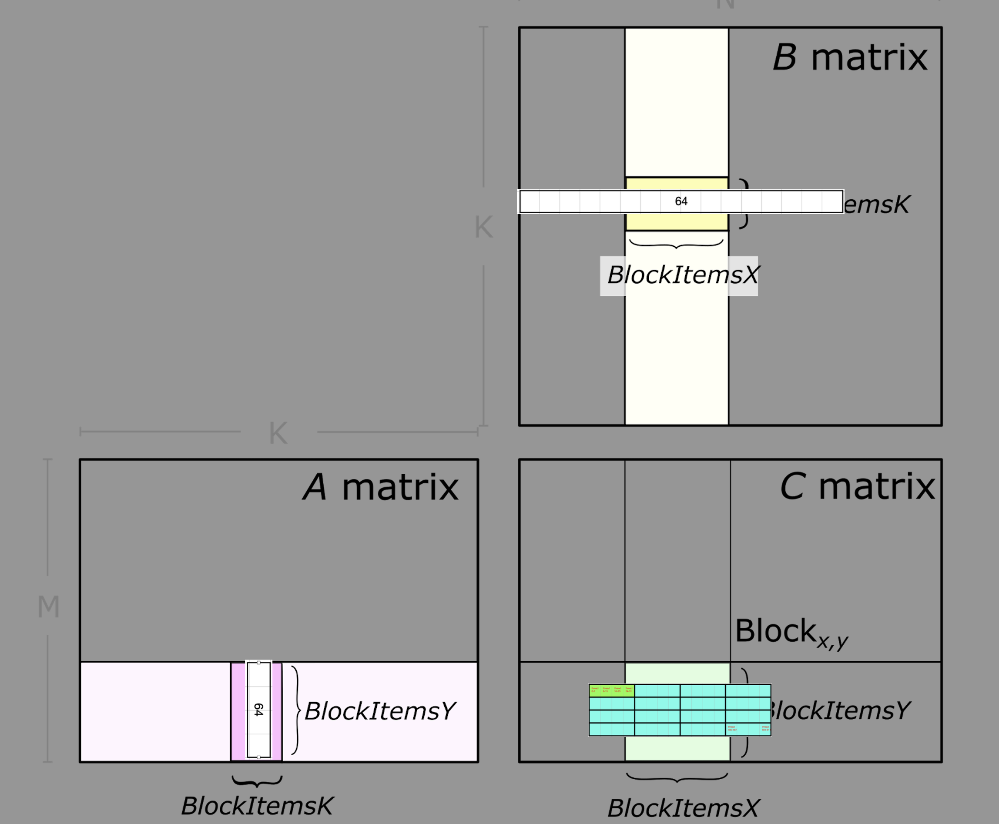

We can also visualize the 64 by 64 input matrix, although the size seem confusing:

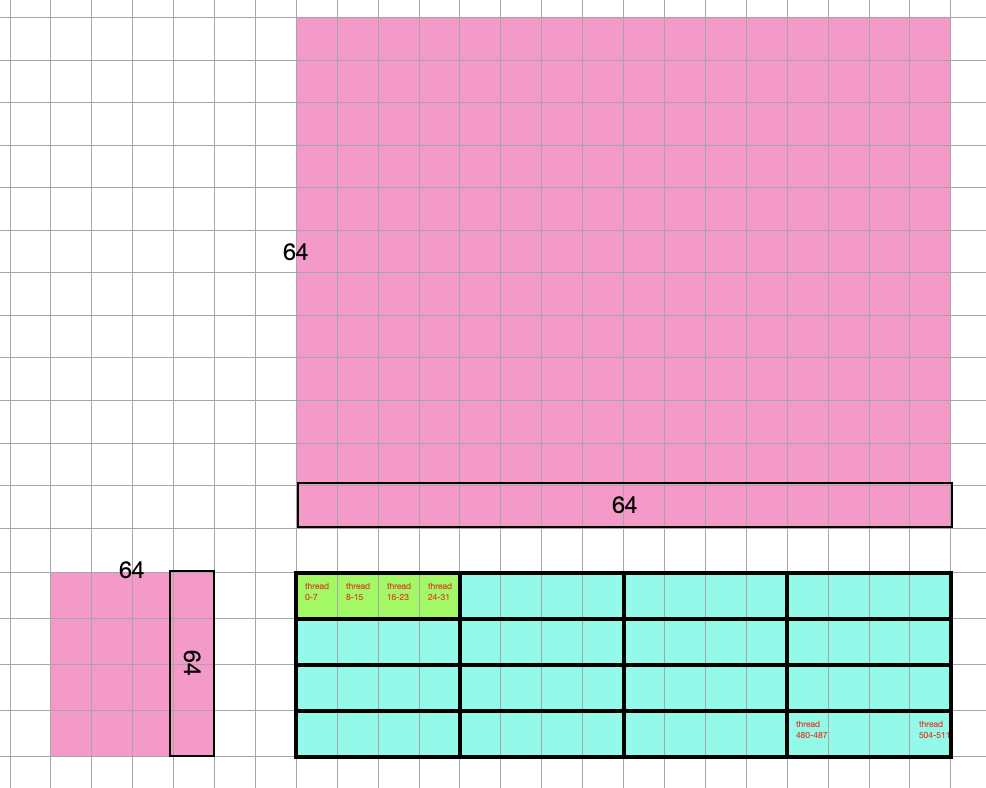

Now, the green warp will process the multiplication of two 16 by 16 matrices, 
which are slices from the original 256 * 256 matrices, we call this slice (16 by 16) 
a fragment. There are two fragments, as colored (The rectangle green warp is 
actually processing the two square inputs btw).


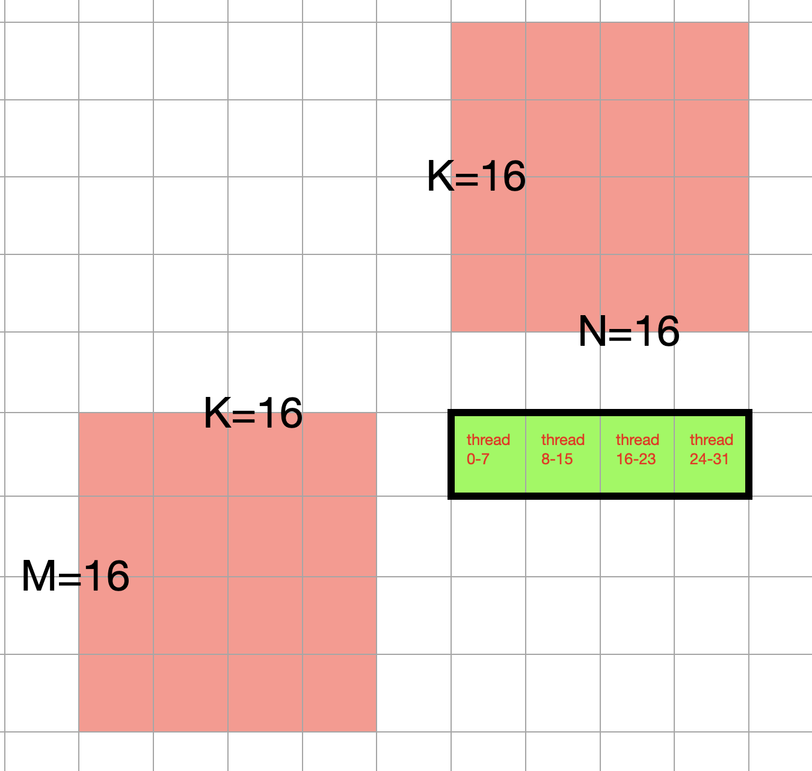

If we were to map the slice back to the original input (pay attention to 
where the red overlays on the pink):

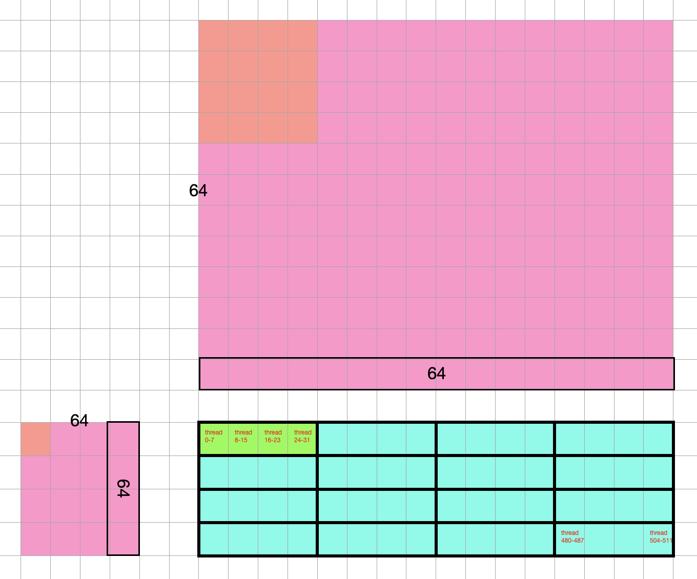


Let's see how it works inside
the kernel function:

```c++
__global__ void wmma_example(half *a, half *b, float *c, int M, int N, int K) {

}
```

We see that it receives the input and output matrices: a, b, and c. Size is
256 by 256. Upon execution of each kernel, we need to figure out which warp
it is located in.

If we are looking at the 32th thread, it's in the zeroth block, 32th column
within the block. Its warp assignment is the warp at 1st column (warpPositionX) 
and zeroth row (warpPositionY). Note that when you calculate the column position,
you need to divide the threadId by 32 (warpSize) and round down.

So the slice it needs is row 0 to row 16 of matrix A, and column 32 to column 63
of matrix B. To calculate its value, we have to iterate through columns of 
these matrix A's 16 rows and rows of these matrix B's 16 columns, at a K = 16
interval. To put that in code:

```c++
for (int i = 0; i < 256; i += 16) {
  int warpPositionX = blockIdx.x * blockDim.x + threadIdx.x / warpSize;  // = 1
  int warpPositionY = blockIdx.y * blockDim.y + threadIdx.y; // = 0
  int startingPositionOfSliceA = warpPositionY * 16 + i * 16;
  int startingPositionOfSliceB = warpPositionX * 16 + i * 16;
}
```

Note that the startingPositionOfSlice{A,B} refers to the top left corner memory
address. When you pass this address to the Tensor Core API, it will correctly
figure out the 16 by 16 matrix to extract:

```c++
wmma::fragment<wmma::matrix_a, WMMA_M, WMMA_N, WMMA_K, half, wmma::col_major> a_frag;
wmma::fragment<wmma::matrix_b, WMMA_M, WMMA_N, WMMA_K, half, wmma::col_major> b_frag;
wmma::load_matrix_sync(a_frag, a + startingPositionOfSliceA, 16);
wmma::load_matrix_sync(b_frag, b + startingPositionOfSliceB, 16);
```

Then we just ask wmma to perform the calculation:
```c++
  wmma::mma_sync(acc_frag, a_frag, b_frag, acc_frag);
```

Putting them together:

```c++
__global__ void wmma_example(half *a, half *b, float *c, int M, int N, int K) {
    wmma::fragment<wmma::accumulator, WMMA_M, WMMA_N, WMMA_K, float> acc_frag;
    wmma::fragment<wmma::matrix_a, WMMA_M, WMMA_N, WMMA_K, half, wmma::col_major> a_frag;
    wmma::fragment<wmma::matrix_b, WMMA_M, WMMA_N, WMMA_K, half, wmma::col_major> b_frag;
    wmma::fill_fragment(acc_frag, 0.0f);
    int warpPositionX = blockIdx.x * blockDim.x + threadIdx.x / warpSize;  // = 1
    int warpPositionY = blockIdx.y * blockDim.y + threadIdx.y; // = 0
    for (int i = 0; i < 256; i += 16) {

      int startingPositionOfSliceA = warpPositionY * 16 + i * 16;
      int startingPositionOfSliceB = warpPositionX * 16 + i * 16;
      wmma::load_matrix_sync(a_frag, a + startingPositionOfSliceA, 16);
      wmma::load_matrix_sync(b_frag, b + startingPositionOfSliceB, 16);
      wmma::mma_sync(acc_frag, a_frag, b_frag, acc_frag);
    }

    // acc_frag holds the computed result, copy it to output C:
   int cRow = warpM * WMMA_M;
   int cCol = warpN * WMMA_N;

   if (cRow < M && cCol < N) {
      wmma::load_matrix_sync(c_frag, c + cRow + cCol * ldc, ldc, wmma::mem_col_major);
      for(int i=0; i < c_frag.num_elements; i++) {
         c_frag.x[i] = acc_frag.x[i]
      }
      // Store the output
      wmma::store_matrix_sync(c + cRow + cCol * ldc, c_frag, ldc, wmma::mem_col_major);
   }
}

int main() {
  // define the a matrix, b matrix and output matrix
  // a_fp16: 256 * 256
  // b_fp16: 256 * 256
  dim3 gridDim;
  gridDim.x = 4;
  gridDim.y = 4;

  dim3 blockDim;
  blockDim.x = 128;
  blockDim.y = 4;
     float *a_fp32;
   float *b_fp32;
   half *a_fp16;
   half *b_fp16;

   float *c_wmma;

   
   curandGenerator_t gen;   
   // Use tensor cores   
   cudaMalloc((void**)&a_fp32, MATRIX_M * MATRIX_K * sizeof(float));
   cudaMalloc((void**)&b_fp32, MATRIX_K * MATRIX_N * sizeof(float));
   cudaMalloc((void**)&a_fp16, MATRIX_M * MATRIX_K * sizeof(half));
   cudaMalloc((void**)&b_fp16, MATRIX_K * MATRIX_N * sizeof(half));

   curandCreateGenerator(&gen, CURAND_RNG_PSEUDO_DEFAULT);
   curandSetPseudoRandomGeneratorSeed(gen, 1337ULL);
   curandGenerateUniform(gen, a_fp32, MATRIX_M * MATRIX_K);
   curandGenerateUniform(gen, b_fp32, MATRIX_K * MATRIX_N);
   convertFp32ToFp16 <<< (MATRIX_M * MATRIX_K + 255) / 256, 256 >>> (a_fp16, a_fp32, MATRIX_M * MATRIX_K);
   convertFp32ToFp16 <<< (MATRIX_K * MATRIX_N + 255) / 256, 256 >>> (b_fp16, b_fp32, MATRIX_K * MATRIX_N);

   cudaMalloc((void**)&c_wmma, MATRIX_M * MATRIX_N * sizeof(float));
   cudaMemset(c_wmma, 0, MATRIX_M * MATRIX_N * sizeof(float));

  wmma_example <<< gridDim, blockDim >>> (a_fp16, b_fp16, c_wmma, 256, 256, 256);
}
```

The more complete, runnable full code listing is here: https://github.com/NVIDIA-developer-blog/code-samples/blob/master/posts/tensor-cores/simpleTensorCoreGEMM.cu

We see that tensor cores offers speedy computation only for 16 * 16 * 16 matrix
and requires 32 threads. The complexity in the implementation is mostly about
how to generalize this to an arbitrarily big matrix (256 * 256) whereas the
actual WMMA call remains trivial.


## PTX blitz

Now we have a good understanding of the WMMA in CUDA, we shall look at how it's
supported in the PTX layer. One of the goals of tinygrad is bypass all the user space
bloat and get as close to metal as possible. PTX is the intermediate layer between
high level CUDA API and the machine code and let me go through a quick introduction.

For a deeper dive you can read the official
[Parallel Thread Execution](https://docs.nvidia.com/cuda/parallel-thread-execution)
guide.

Recall that day to day development using Nvidia GPUs require us to write CUDA code,
something like this:

```c++
#include <stdio.h>

__global__ void dotProduct(int *a, int *b, int *c) {
    // Assuming blockDim.x is 1 and we are using only one thread for simplicity
    int sum = 0;
    for (int i = 0; i < 4; ++i) {
        sum += a[i] * b[i];
    }
    *c += sum; // Plain add operation
}

int main() {
    int *a, *b;
    int *c;
    int a_host[4] = {1, 2, 3, 4};
    int b_host[4] = {5, 6, 7, 8};
    int c_host = 0; // Initialize c_host

    cudaMalloc((void**)&a, 4*sizeof(int));
    cudaMalloc((void**)&b, 4*sizeof(int));
    cudaMalloc((void**)&c, sizeof(int));

    cudaMemcpy(a, a_host, 4*sizeof(int), cudaMemcpyHostToDevice);
    cudaMemcpy(b, b_host, 4*sizeof(int), cudaMemcpyHostToDevice);
    cudaMemcpy(c, &c_host, sizeof(int), cudaMemcpyHostToDevice); // Initialize c on device

    dotProduct<<<1, 1>>>(a, b, c);

    cudaMemcpy(&c_host, c, sizeof(int), cudaMemcpyDeviceToHost);

    printf("Dot Product: %u\n", c_host);

    cudaFree(a);
    cudaFree(b);
    cudaFree(c);

    return 0;
}
```

This calculates a dot product by having the computation run on the GPU (note that
there's no parallelism here, just demonstrating how to run code on the GPU).

The CUDA code is compiled to PTX, an intermediate form (or intemediate representation, IR)
before actually being compiled to machine code. This IR allows Nvidia to
occassionally re-write the CUDA library without affecting running code, and
vice versa, when GPU hardware upgrades, the high level C++ can remain unchanged,
a common thing done for compilers, like LLVM, GCC, etc.

PTX resembles an assembly language and has a rich set of instructions, compared
to assembly like ARM. It also has lots of high level construct, so it's not as
bare metal as real assembly like ARM. the PTX code you write out explicitly is 
simultaneously executed on multiple units, which makes the programming model
different from the one used in normal assembly languages for CPU.

To load a value 10 into a register, so you can do something with later:

```
.reg .u32 %r0;
mov.u32 %r0, 10;
```

This declares a 32 bit unsigned integer that lives on the register and we then
assign the integer value 10 to it.

The built-in names are the followings:

- `.reg`: this represent the register
- `.u32` (on first line): this is the built-in name for the data type unsigned integer 32
- `mov.u32`: this is the instruction for moving u32 data. Most instruction in PTX
will have a type specifiers, so you can also have `mov.uint8`, `mov.float`, etc.
Together they form the instruction name.
- `%r0`: this is the name for the variable. You can name it anything, just like
how you do in C, with certain exceptions. The percent sign doesn't have any meaning,
but just a common practice. You can name this "r0" as well.
- `10`: this is the value we hard code so it will be loaded into the register.

We can now do some operation on the value, for example, double it:

```
.reg .u32 %r0;
mov.u32 %r0, 10;

mul.lo.u32 %r0, %r0, 2;
```

And this is the syntax for the mul instruction:
```
mul.mode.type  d, a, b;

.mode = { .hi, .lo, .wide };
.type = { .u16, .u32, .u64,
          .s16, .s32, .s64 };
```

The instruction is `mul.lo.u32`. The base portion is `mul`, specifying a 
multiplication operation. It is followed by a mode specifier, it specifies
the course of action when an overflow occurs and is not of much importance
in our context. It is then followed by a type specifier, where we put `.u32`.
`d` is the destination, `a` and `b` are the source registers, which we put
as `%r0`, `%r0` and `%r1`, respectively.

Now that we completed the computation, we want to store the value somewhere
so the host code can access it later

```
.reg .u32 %r0;
mov.u32 %r0, 10;

mul.lo.u32 %r0, %r0, 2;

.reg .u32 %p;
ld.param.u32 %p, [host_ptr];
st.global.u32 [%p], %r0;
```

`.reg .u32 %p` declares a variable, we have seen that already.

`ld.param.u32` is a load instruction, with mode specifier `.param`, meaning
that the data is is loading from is parameter. In CUDA parlance, this refers
to the parameters a kernel is passed with (the a, b, c in the kernel function
parameter list). The `host_ptr` is something set up by the surrounding code,
normally in the form like this:

```
.param .u64 host_ptr
```

So the actual computation code knows it refers to the host's parameter. 

The square bracket around it is the PTX syntax for dereferencing a pointer or
accessing the memory address. And then we use `st.global.u32` to save the value
to the memory address pointed by the host.

Recall that one of the advantage of GPU is that it provides instruction for
special computation, one evidence is that PTX provides built-in instruction for
dot product operation. For example, we have a four-way byte dot product accumulate
instruction `dp4a`:

```
dp4a.atype.btype  d, a, b, c;

.atype = .btype = { .u32, .s32 };
```

The instruction operates on two inputs a and b and calculate the dot
product, then accumulate the result on c, and store the result on d.
a and b each occupies 32 bits, and is a packed form of four 8-bit integers 
(.u32 for unsigned, .s32 for signed). 

Example:
```
.reg .u32 %d, %a, %b, %c;

// Initialize the registers with some values
mov.u32 %a, 0x01020304; // Example packed 8-bit integers for 'a'
mov.u32 %b, 0x05060708; // Example packed 8-bit integers for 'b'
mov.u32 %c, 0; // Initialize 'c' to zero

// Perform the dot product and accumulate operation
dp4a.u32.u32 %d, %a, %b, %c;
```

You can see how this can lead to a substantial boost to the matrix multiplication
performance. In fact, there's another set of instruction that allows us to 
operates on larger matrices, and that's the warped matrix multiplication
accumulate we have seen before, but now in PTX form.

Let's say we want to perform matrix multiplication on two 16 by 16 matrices,
here's how you do it in PTX.

```
```

The next part is how to compile and run a PTX program. We still write a regular
CUDA function, but the actual computation will be written using inline PTX
assembly via `asm`. It works somewhat like the printf, where you put PTX
instruction as the first argument, with placeholders, then place the output
and input variable afterwards and refer to them using placeholders. For example,
to add two numbers:

```
asm("add.s32 %0, %1, %2;" : "=r"(i) : "r"(j), "r"(k));
```

The instruction, input, and output are separated by colons. Multiple inputs
or outputs are separated by comma. You notice that input and output are surrounded
by parenthese, prefixed by a string. The string is called a "constraint". "=" means
writable, "+" means read & write. "r" means "unsigned 32-bit integer", you can
also have "f" which is for "32 bit floating point number". More details
can be found on the [official guide](https://docs.nvidia.com/cuda/inline-ptx-assembly/index.html).

Let's see how to write a runnable example, we will look at how things are done in
plain CUDA for a cube operation.

```c++
#include <stdio.h>

__global__ void cubeCuda(int *y, int *x) {
    int index = threadIdx.x + blockIdx.x * blockDim.x;
    if (index == 0) { // Ensure only one thread performs the operation
        int val = *x;
        *y = val * val * val;
    }
}

int main() {
    int inputHost = 5; // Example input
    int outputHost; // Result from device

    int *inputDevice, *outputDevice;

    // Allocate memory on the device
    cudaMalloc((void**)&inputDevice, sizeof(int));
    cudaMalloc((void**)&outputDevice, sizeof(int));

    // Copy input data from host to device
    cudaMemcpy(inputDevice, &inputHost, sizeof(int), cudaMemcpyHostToDevice);

    // Launch the kernel
    cubeCuda<<<1, 1>>>(outputDevice, inputDevice);
    cudaDeviceSynchronize();

    // Copy result back to host
    cudaMemcpy(&outputHost, outputDevice, sizeof(int), cudaMemcpyDeviceToHost);

    printf("Cube of %d is %d\n", inputHost, outputHost);

    // Free device memory
    cudaFree(inputDevice);
    cudaFree(outputDevice);

    return 0;
}

```

Save it as `asm.cu` and You can compile and run this as `nvcc -o asm asm.cu && ./asm`,
the result would be 125. Now we can write a different version of the kernel function
with inline PTX:
```c++
__global__ void cubeAsm (int *y, int *x)
{
  asm(".reg .s32 t1;\n\t"              // temp reg t1
      " mul.lo.s32 t1, %1, %1;\n\t"    // t1 = x * x
      " mul.lo.s32 %0, t1, %1;"        // y = t1 * x
      : "=r"(*y) : "r" (*x));
}
```

In PTX, we first declare a variable in the register of type signed 32 integer,
name it "t1", we then call a multiplication instruction (mul) with mode as "lo"
and type as "s32" (`mul.lo.s32`), the result of the operation is placed on `%0`,
which is the zeroth parameter, which we pass in as `"=r"(*y)`, a writable input.
The input to the operation is `%1`, which is `"r"(*x)`, the first parameter.
Then in the main function, we can invoke it as a regular CUDA kernel, replacing
the CUDA version:

```c++
    // cubeCuda<<<1, 1>>>(outputDevice, inputDevice);
    cubeAsm<<<1, 1>>>(outputDevice, inputDevice);
```

As a spoiler, the asm instruction we will see later for the matrix multiplication
looks like this:

```c++
asm(
  "
  mma.sync.aligned.m16n8k16.row.col.f32.f16.f16.f32
  { %0, %1, %2, %3 }, { %4, %5, %6, %7 }, { %8, %9 }, { %0, %1, %2, %3 };
  "
  : "+f"(c.x), "+f"(c.y), "+f"(c.z), "+f"(c.w) 
  : "r"(a_pk[0]), "r"(a_pk[1]), "r"(a_pk[2]),  "r"(a_pk[3]), "r"(b_pk[0]), "r"(b_pk[1]) 
);
```

The instruction is `mma`, short for matrix multiply accumulate. `.sync`
is a qualifier that follows many instructions, it means that the operation
is synchronized across all threads in the warp. `.aligned` is yet another
qualifier, meaning all threads in the warp must execute the same mma
instruction. I'll omit the explanation for the rest of the qualifier
and specifier. You can find more information [here](https://docs.nvidia.com/cuda/parallel-thread-execution/#warp-level-matrix-multiply-and-accumulate-instruction-wmma-mma).

Similar to the simple cube kernel we defined earlier, when using `asm`, we don't
have to define the load and store instruction before and after the actual computation.


## Tinygrad support for tensor core

We will use a matrix multiplication example, make sure you are running CUDA btw.

```python
from tinygrad.tensor import Tensor, dtypes

Tensor.manual_seed(0)

a = Tensor.rand(16,16).cast(dtypes.float16)
b = Tensor.rand(16,16).cast(dtypes.float16)
c = a.matmul(b)

d = c.numpy()
print(d)
```

Save this as `script.py`, we will see what happens if we don't apply any
optimizations. Run it as `NOOPT=1 DEBUG=4 python test/learn_tc.py` and I 
will copy the generated CUDA code below:

```c++
#define INFINITY (__int_as_float(0x7f800000))
#define NAN (__int_as_float(0x7fffffff))
#include <cuda_fp16.h>
struct half4 { half x, y, z, w; }; __device__ half4 make_half4(half x, half y, half z, half w) { half4 r={x, y, z, w}; return r; }
struct half8 { half x, y, z, w, a, b, c, d; }; __device__ half8 make_half8(half x, half y, half z, half w, half a, half b, half c, half d) { half8 r={x, y, z, w, a, b, c, d}; return r; }
extern "C" __global__ void E_256(half* data0, const float* data1) {
  int gidx0 = blockIdx.x; /* 256 */
  float val0 = data1[gidx0];
  data0[gidx0] = (half)(val0);
}

#define INFINITY (__int_as_float(0x7f800000))
#define NAN (__int_as_float(0x7fffffff))
#include <cuda_fp16.h>
struct half4 { half x, y, z, w; }; __device__ half4 make_half4(half x, half y, half z, half w) { half4 r={x, y, z, w}; return r; }
struct half8 { half x, y, z, w, a, b, c, d; }; __device__ half8 make_half8(half x, half y, half z, half w, half a, half b, half c, half d) { half8 r={x, y, z, w, a, b, c, d}; return r; }
extern "C" __global__ void r_16_16_16(half* data0, const half* data1, const half* data2) {
  int gidx0 = blockIdx.y; /* 16 */
  int gidx1 = blockIdx.x; /* 16 */
  float acc0 = 0.0f;
  int alu0 = (gidx0*16);
  for (int ridx0 = 0; ridx0 < 16; ridx0++) {
    half val0 = data1[alu0+ridx0];
    half val1 = data2[gidx1+(ridx0*16)];
    acc0 = ((float)((val0*val1))+acc0);
  }
  data0[alu0+gidx1] = (half)(acc0);
}
```

We have two kernels, the first one just does the casting, from float32 to float16. Second
kernel does the actual matrix multiplication by running a for loop.

Now we apply optimization. There are broadly speaking two categories of optimization,
one is some hand coded heuristics and the other is the accelerated framework.
Let's see the heuristics version without tensor core (TC=1 explicitly turn off
tensor core fyi), `DEBUG=4 TC=2 python script.py`:

```c++
#define INFINITY (__int_as_float(0x7f800000))
#define NAN (__int_as_float(0x7fffffff))
#include <cuda_fp16.h>
struct half4 { half x, y, z, w; }; 

__device__ half4 make_half4(half x, half y, half z, half w) { 
  half4 r={x, y, z, w}; 
  return r; 
}

struct half8 { half x, y, z, w, a, b, c, d; };
__device__ half8 make_half8(half x, half y, half z, half w, half a, half b, half c, half d) { 
  half8 r={x, y, z, w, a, b, c, d}; 
  return r; 
}

extern "C" __global__ void E_2_32_4(half* data0, const float* data1) {
  int gidx0 = blockIdx.x; /* 2 */
  int lidx1 = threadIdx.x; /* 32 */
  int alu0 = ((gidx0*128)+(lidx1*4));
  float4 val0 = (float4)(*((float4*)(data1+alu0)));
  *((half4*)(data0+alu0)) = make_half4((half)(val0.x),(half)(val0.y),(half)(val0.z),(half)(val0.w));
}

extern "C" __global__ void r_2_2_2_2_2_16_4_2(half* data0, const half* data1, const half* data2) {
  int lidx0 = threadIdx.z; /* 2 */
  int lidx1 = threadIdx.y; /* 2 */
  int lidx2 = threadIdx.x; /* 8 */
  float acc0 = 0.0f;
  float acc1 = 0.0f;
  float acc2 = 0.0f;
  float acc3 = 0.0f;
  float acc4 = 0.0f;
  float acc5 = 0.0f;
  float acc6 = 0.0f;
  float acc7 = 0.0f;
  int alu0 = (lidx1*128);
  int alu1 = ((lidx2/4)*64);
  int alu2 = (alu0+alu1);
  half val0 = data1[alu2];
  half val1 = data1[alu2+1];
  half val2 = data1[alu2+2];
  half val3 = data1[alu2+3];
  half val4 = data1[alu2+4];
  half val5 = data1[alu2+5];
  half val6 = data1[alu2+6];
  half val7 = data1[alu2+7];
  half val8 = data1[alu2+8];
  half val9 = data1[alu2+9];
  half val10 = data1[alu2+10];
  half val11 = data1[alu2+11];
  half val12 = data1[alu2+12];
  half val13 = data1[alu2+13];
  half val14 = data1[alu2+14];
  half val15 = data1[alu2+15];
  half val16 = data1[alu2+16];
  half val17 = data1[alu2+17];
  half val18 = data1[alu2+18];
  half val19 = data1[alu2+19];
  half val20 = data1[alu2+20];
  half val21 = data1[alu2+21];
  half val22 = data1[alu2+22];
  half val23 = data1[alu2+23];
  half val24 = data1[alu2+24];
  half val25 = data1[alu2+25];
  half val26 = data1[alu2+26];
  half val27 = data1[alu2+27];
  half val28 = data1[alu2+28];
  half val29 = data1[alu2+29];
  half val30 = data1[alu2+30];
  half val31 = data1[alu2+31];
  half val32 = data1[alu2+32];
  half val33 = data1[alu2+33];
  half val34 = data1[alu2+34];
  half val35 = data1[alu2+35];
  half val36 = data1[alu2+36];
  half val37 = data1[alu2+37];
  half val38 = data1[alu2+38];
  half val39 = data1[alu2+39];
  half val40 = data1[alu2+40];
  half val41 = data1[alu2+41];
  half val42 = data1[alu2+42];
  half val43 = data1[alu2+43];
  half val44 = data1[alu2+44];
  half val45 = data1[alu2+45];
  half val46 = data1[alu2+46];
  half val47 = data1[alu2+47];
  half val48 = data1[alu2+48];
  half val49 = data1[alu2+49];
  half val50 = data1[alu2+50];
  half val51 = data1[alu2+51];
  half val52 = data1[alu2+52];
  half val53 = data1[alu2+53];
  half val54 = data1[alu2+54];
  half val55 = data1[alu2+55];
  half val56 = data1[alu2+56];
  half val57 = data1[alu2+57];
  half val58 = data1[alu2+58];
  half val59 = data1[alu2+59];
  half val60 = data1[alu2+60];
  half val61 = data1[alu2+61];
  half val62 = data1[alu2+62];
  half val63 = data1[alu2+63];
  int alu3 = (lidx0*4);
  int alu4 = (((lidx2/2)%2)*2);
  int alu5 = (lidx2%2);
  int alu6 = (alu3+alu4+alu5);
  half val64 = data2[alu6];
  half val65 = data2[alu6+16];
  half val66 = data2[alu6+32];
  half val67 = data2[alu6+48];
  half val68 = data2[alu6+64];
  half val69 = data2[alu6+80];
  half val70 = data2[alu6+96];
  half val71 = data2[alu6+112];
  half val72 = data2[alu6+128];
  half val73 = data2[alu6+144];
  half val74 = data2[alu6+160];
  half val75 = data2[alu6+176];
  half val76 = data2[alu6+192];
  half val77 = data2[alu6+208];
  half val78 = data2[alu6+224];
  half val79 = data2[alu6+240];
  half val80 = data2[alu6+8];
  half val81 = data2[alu6+24];
  half val82 = data2[alu6+40];
  half val83 = data2[alu6+56];
  half val84 = data2[alu6+72];
  half val85 = data2[alu6+88];
  half val86 = data2[alu6+104];
  half val87 = data2[alu6+120];
  half val88 = data2[alu6+136];
  half val89 = data2[alu6+152];
  half val90 = data2[alu6+168];
  half val91 = data2[alu6+184];
  half val92 = data2[alu6+200];
  half val93 = data2[alu6+216];
  half val94 = data2[alu6+232];
  half val95 = data2[alu6+248];
  int alu7 = (alu3+alu0+alu1+alu4+alu5);
  data0[alu7] = (half)(((float)((val15*val79))+(float)((val14*val78))+(float)((val13*val77))+(float)((val12*val76))+(float)((val11*val75))+(float)((val10*val74))+(float)((val9*val73))+(float)((val8*val72))+(float)((val7*val71))+(float)((val6*val70))+(float)((val5*val69))+(float)((val4*val68))+(float)((val3*val67))+(float)((val2*val66))+(float)((val1*val65))+(float)((val0*val64))+acc0));
  data0[alu7+16] = (half)(((float)((val31*val79))+(float)((val30*val78))+(float)((val29*val77))+(float)((val28*val76))+(float)((val27*val75))+(float)((val26*val74))+(float)((val25*val73))+(float)((val24*val72))+(float)((val23*val71))+(float)((val22*val70))+(float)((val21*val69))+(float)((val20*val68))+(float)((val19*val67))+(float)((val18*val66))+(float)((val17*val65))+(float)((val16*val64))+acc1));
  data0[alu7+32] = (half)(((float)((val47*val79))+(float)((val46*val78))+(float)((val45*val77))+(float)((val44*val76))+(float)((val43*val75))+(float)((val42*val74))+(float)((val41*val73))+(float)((val40*val72))+(float)((val39*val71))+(float)((val38*val70))+(float)((val37*val69))+(float)((val36*val68))+(float)((val35*val67))+(float)((val34*val66))+(float)((val33*val65))+(float)((val32*val64))+acc2));
  data0[alu7+48] = (half)(((float)((val63*val79))+(float)((val62*val78))+(float)((val61*val77))+(float)((val60*val76))+(float)((val59*val75))+(float)((val58*val74))+(float)((val57*val73))+(float)((val56*val72))+(float)((val55*val71))+(float)((val54*val70))+(float)((val53*val69))+(float)((val52*val68))+(float)((val51*val67))+(float)((val50*val66))+(float)((val49*val65))+(float)((val48*val64))+acc3));
  data0[alu7+8] = (half)(((float)((val15*val95))+(float)((val14*val94))+(float)((val13*val93))+(float)((val12*val92))+(float)((val11*val91))+(float)((val10*val90))+(float)((val9*val89))+(float)((val8*val88))+(float)((val7*val87))+(float)((val6*val86))+(float)((val5*val85))+(float)((val4*val84))+(float)((val3*val83))+(float)((val2*val82))+(float)((val1*val81))+(float)((val0*val80))+acc4));
  data0[alu7+24] = (half)(((float)((val31*val95))+(float)((val30*val94))+(float)((val29*val93))+(float)((val28*val92))+(float)((val27*val91))+(float)((val26*val90))+(float)((val25*val89))+(float)((val24*val88))+(float)((val23*val87))+(float)((val22*val86))+(float)((val21*val85))+(float)((val20*val84))+(float)((val19*val83))+(float)((val18*val82))+(float)((val17*val81))+(float)((val16*val80))+acc5));
  data0[alu7+40] = (half)(((float)((val47*val95))+(float)((val46*val94))+(float)((val45*val93))+(float)((val44*val92))+(float)((val43*val91))+(float)((val42*val90))+(float)((val41*val89))+(float)((val40*val88))+(float)((val39*val87))+(float)((val38*val86))+(float)((val37*val85))+(float)((val36*val84))+(float)((val35*val83))+(float)((val34*val82))+(float)((val33*val81))+(float)((val32*val80))+acc6));
  data0[alu7+56] = (half)(((float)((val63*val95))+(float)((val62*val94))+(float)((val61*val93))+(float)((val60*val92))+(float)((val59*val91))+(float)((val58*val90))+(float)((val57*val89))+(float)((val56*val88))+(float)((val55*val87))+(float)((val54*val86))+(float)((val53*val85))+(float)((val52*val84))+(float)((val51*val83))+(float)((val50*val82))+(float)((val49*val81))+(float)((val48*val80))+acc7));
}
```

It's kind of a crazy kernel being generated, and you can already see why a
dedicated framework for such computation would be nice to have. So let's
see what it looks like with Tensor core applied, `DEBUG=4 CUDA=1 TC=1 python script.py`:

```c++
#define NAN (__int_as_float(0x7fffffff))
#include <cuda_fp16.h>
struct half4 { half x, y, z, w; }; __device__ half4 make_half4(half x, half y, half z, half w) { half4 r={x, y, z, w}; return r; }
struct half8 { half x, y, z, w, a, b, c, d; }; __device__ half8 make_half8(half x, half y, half z, half w, half a, half b, half c, half d) { half8 r={x, y, z, w, a, b, c, d}; return r; }
extern "C" __global__ void E_8_32_4(half* data0, const float* data1) {
  // We spawn 8 blocks, each block with 32 threads, each thread represent 4 numbers
  int gidx0 = blockIdx.x; /* 8 */
  int lidx1 = threadIdx.x; /* 32 */ // each thread represent 4 numbers, 
                                    // each number occupies 4 bytes for float32 

  int alu0 = ((gidx0*128)+(lidx1*4)); // alu0 is the index for the 32 * 32 input matrix, 
                                      // so for any given thread, the memory position is 
                                      //grid id * 32 threads + thread id * 4 

  float4 val0 = (float4)(*((float4*)(data1+alu0))); // for each thread, we access 4
                                                    // numbers by specifying the start 
                                                    // index, and the compiler figure
                                                    // out the correct memory offset 
                                                    // for the starting number

  *((half4*)(data0+alu0)) = make_half4((half)(val0.x),(half)(val0.y),(half)(val0.z),(half)(val0.w));
}


__device__ float4 __WMMA_8_16_16_half_float(half8 a, half4 b, float4 c) { 
  int *a_pk = (int *) (&a), *b_pk = (int *) (&b);
asm( "mma.sync.aligned.m16n8k16.row.col.f32.f16.f16.f32 { %0, %1, %2, %3 }, { %4, %5, %6, %7 }, { %8, %9 }, { %0, %1, %2, %3 };"
  : "+f"(c.x), "+f"(c.y), "+f"(c.z), "+f"(c.w) : "r"(a_pk[0]), "r"(a_pk[1]), "r"(a_pk[2]),  "r"(a_pk[3]), "r"(b_pk[0]), "r"(b_pk[1]) );
return c;
}
extern "C" __global__ void r_2_2_2_2_2_2_16_4_2_4(half* data0, const half* data1, const half* data2) {
  int lidx0 = threadIdx.z; /* 2 */
  int lidx1 = threadIdx.y; /* 2 */
  int lidx2 = threadIdx.x; /* 8 */
  float acc0 = 0.0f;
  float acc1 = 0.0f;
  float acc2 = 0.0f;
  float acc3 = 0.0f;
  float acc4 = 0.0f;
  float acc5 = 0.0f;
  float acc6 = 0.0f;
  float acc7 = 0.0f;
  float acc8 = 0.0f;
  float acc9 = 0.0f;
  float acc10 = 0.0f;
  float acc11 = 0.0f;
  float acc12 = 0.0f;
  float acc13 = 0.0f;
  float acc14 = 0.0f;
  float acc15 = 0.0f;
  float acc16 = 0.0f;
  float acc17 = 0.0f;
  float acc18 = 0.0f;
  float acc19 = 0.0f;
  float acc20 = 0.0f;
  float acc21 = 0.0f;
  float acc22 = 0.0f;
  float acc23 = 0.0f;
  float acc24 = 0.0f;
  float acc25 = 0.0f;
  float acc26 = 0.0f;
  float acc27 = 0.0f;
  float acc28 = 0.0f;
  float acc29 = 0.0f;
  float acc30 = 0.0f;
  float acc31 = 0.0f;
  int alu0 = (lidx0*128);
  int alu1 = (lidx2%2);
  int alu2 = (alu1*2);
  int alu3 = ((lidx2/2)%2);
  int alu4 = (alu3*4);
  int alu5 = (lidx2/4);
  int alu6 = (alu5*32);
  int alu7 = (lidx1*64);
  int alu8 = (alu4+alu0+alu2+alu6+alu7);
  for (int ridx0 = 0; ridx0 < 2; ridx0++) {
    int alu9 = (alu0+(ridx0*16)+alu2+alu4+alu6+alu7);
    half val0 = data1[alu9];
    half val1 = data1[alu9+1];
    half val2 = data1[alu9+256];
    half val3 = data1[alu9+257];
    half val4 = data1[alu9+8];
    half val5 = data1[alu9+9];
    half val6 = data1[alu9+264];
    half val7 = data1[alu9+265];
    half val8 = data1[alu9+512];
    half val9 = data1[alu9+513];
    half val10 = data1[alu9+768];
    half val11 = data1[alu9+769];
    half val12 = data1[alu9+520];
    half val13 = data1[alu9+521];
    half val14 = data1[alu9+776];
    half val15 = data1[alu9+777];
    int alu10 = ((lidx0*4)+(lidx1*2)+alu5+(ridx0*512)+(alu1*64)+(alu3*128));
    half val16 = data2[alu10];
    half val17 = data2[alu10+32];
    half val18 = data2[alu10+256];
    half val19 = data2[alu10+288];
    half val20 = data2[alu10+8];
    half val21 = data2[alu10+40];
    half val22 = data2[alu10+264];
    half val23 = data2[alu10+296];
    half val24 = data2[alu10+16];
    half val25 = data2[alu10+48];
    half val26 = data2[alu10+272];
    half val27 = data2[alu10+304];
    half val28 = data2[alu10+24];
    half val29 = data2[alu10+56];
    half val30 = data2[alu10+280];
    half val31 = data2[alu10+312];
    half8 cast0 = make_half8(val0,val1,val2,val3,val4,val5,val6,val7);
    half4 cast1 = make_half4(val16,val17,val18,val19);
    float4 wmma0 = __WMMA_8_16_16_half_float(cast0, cast1, make_float4(acc0,acc1,acc2,acc3));
    acc0 = wmma0.x;
    acc1 = wmma0.y;
    acc2 = wmma0.z;
    acc3 = wmma0.w;
    half8 cast2 = make_half8(val8,val9,val10,val11,val12,val13,val14,val15);
    float4 wmma1 = __WMMA_8_16_16_half_float(cast2, cast1, make_float4(acc4,acc5,acc6,acc7));
    acc4 = wmma1.x;
    acc5 = wmma1.y;
    acc6 = wmma1.z;
    acc7 = wmma1.w;
    half4 cast3 = make_half4(val20,val21,val22,val23);
    float4 wmma2 = __WMMA_8_16_16_half_float(cast0, cast3, make_float4(acc8,acc9,acc10,acc11));
    acc8 = wmma2.x;
    acc9 = wmma2.y;
    acc10 = wmma2.z;
    acc11 = wmma2.w;
    float4 wmma3 = __WMMA_8_16_16_half_float(cast2, cast3, make_float4(acc12,acc13,acc14,acc15));
    acc12 = wmma3.x;
    acc13 = wmma3.y;
    acc14 = wmma3.z;
    acc15 = wmma3.w;
    half4 cast4 = make_half4(val24,val25,val26,val27);
    float4 wmma4 = __WMMA_8_16_16_half_float(cast0, cast4, make_float4(acc16,acc17,acc18,acc19));
    acc16 = wmma4.x;
    acc17 = wmma4.y;
    acc18 = wmma4.z;
    acc19 = wmma4.w;
    float4 wmma5 = __WMMA_8_16_16_half_float(cast2, cast4, make_float4(acc20,acc21,acc22,acc23));
    acc20 = wmma5.x;
    acc21 = wmma5.y;
    acc22 = wmma5.z;
    acc23 = wmma5.w;
    half4 cast5 = make_half4(val28,val29,val30,val31);
    float4 wmma6 = __WMMA_8_16_16_half_float(cast0, cast5, make_float4(acc24,acc25,acc26,acc27));
    acc24 = wmma6.x;
    acc25 = wmma6.y;
    acc26 = wmma6.z;
    acc27 = wmma6.w;
    float4 wmma7 = __WMMA_8_16_16_half_float(cast2, cast5, make_float4(acc28,acc29,acc30,acc31));
    acc28 = wmma7.x;
    acc29 = wmma7.y;
    acc30 = wmma7.z;
    acc31 = wmma7.w;
  }
  data0[alu8] = (half)(acc0);
  data0[alu8+1] = (half)(acc1);
  data0[alu8+256] = (half)(acc2);
  data0[alu8+257] = (half)(acc3);
  data0[alu8+512] = (half)(acc4);
  data0[alu8+513] = (half)(acc5);
  data0[alu8+768] = (half)(acc6);
  data0[alu8+769] = (half)(acc7);
  data0[alu8+8] = (half)(acc8);
  data0[alu8+9] = (half)(acc9);
  data0[alu8+264] = (half)(acc10);
  data0[alu8+265] = (half)(acc11);
  data0[alu8+520] = (half)(acc12);
  data0[alu8+521] = (half)(acc13);
  data0[alu8+776] = (half)(acc14);
  data0[alu8+777] = (half)(acc15);
  data0[alu8+16] = (half)(acc16);
  data0[alu8+17] = (half)(acc17);
  data0[alu8+272] = (half)(acc18);
  data0[alu8+273] = (half)(acc19);
  data0[alu8+528] = (half)(acc20);
  data0[alu8+529] = (half)(acc21);
  data0[alu8+784] = (half)(acc22);
  data0[alu8+785] = (half)(acc23);
  data0[alu8+24] = (half)(acc24);
  data0[alu8+25] = (half)(acc25);
  data0[alu8+280] = (half)(acc26);
  data0[alu8+281] = (half)(acc27);
  data0[alu8+536] = (half)(acc28);
  data0[alu8+537] = (half)(acc29);
  data0[alu8+792] = (half)(acc30);
  data0[alu8+793] = (half)(acc31);
}
```

It's a lot cleaner, and just take it for granted that this version is a lot
faster than the initial for loop we had. The general pattern is the same as
what we had done in plain CUDA, we arrange the input matrix into 16 by 16
blocks each with 32 threads launched such that the tensor core framework can 
do their work. The difference here is how the tensor core framework is
invoked, we are not using the CUDA functions, but rather calling via
inline assembly for an even more optimized version. 

Before looking into how this code is generated, I like to first understand them.
In the first kernel, we are converting float32 number (float) to float16 (half).
We spawn 8 blocks, each block with 32 threads. Each thread shall represent
four numbers. Recall that our input array is 32 * 32, and in memory they are
laid out linearly (1024 numbers). If we have each thread represent 4 numbers,
then the memory address of the first number a thread point to would be calculated
as blockId * 32 + threadId * 4, which is the value of `alu0`. We can use this
`alu0` index to access the value via CUDA syntax, by writing out the desired
type, and the compiler will figure out the correct memory offset required to
access the value. We turn the 4 numbers into a vector type, a common operation
in CUDA to make accessing them faster, and use the built in cast syntax to
convert them to float16 and store in the output `data0` matrix, which is also
linear in memory, so we can reuse the `alu0` to write to it. 

The explanation of the second kernel and how the IR is arranged to generate it is
still work in progress ...