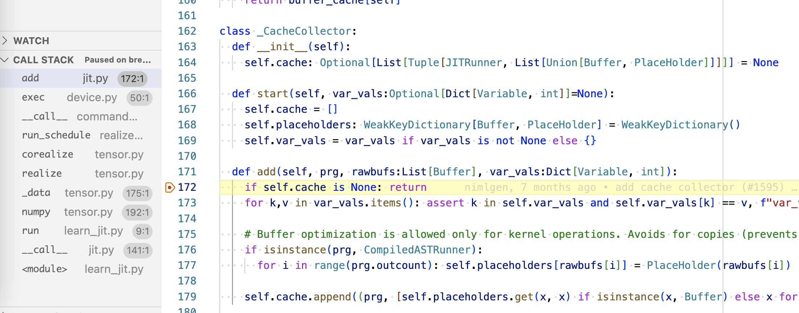
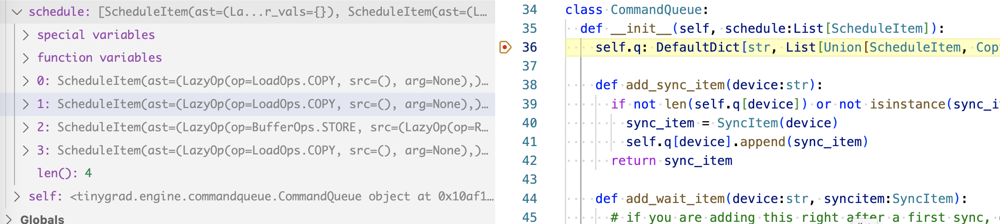
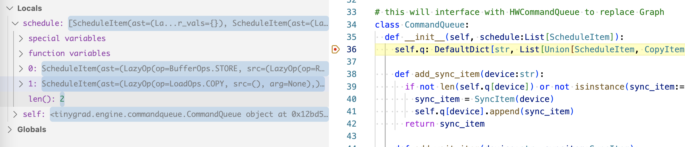
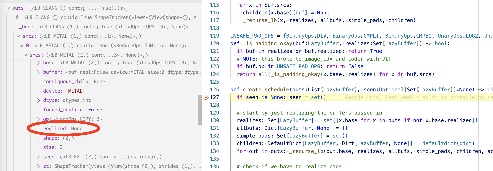
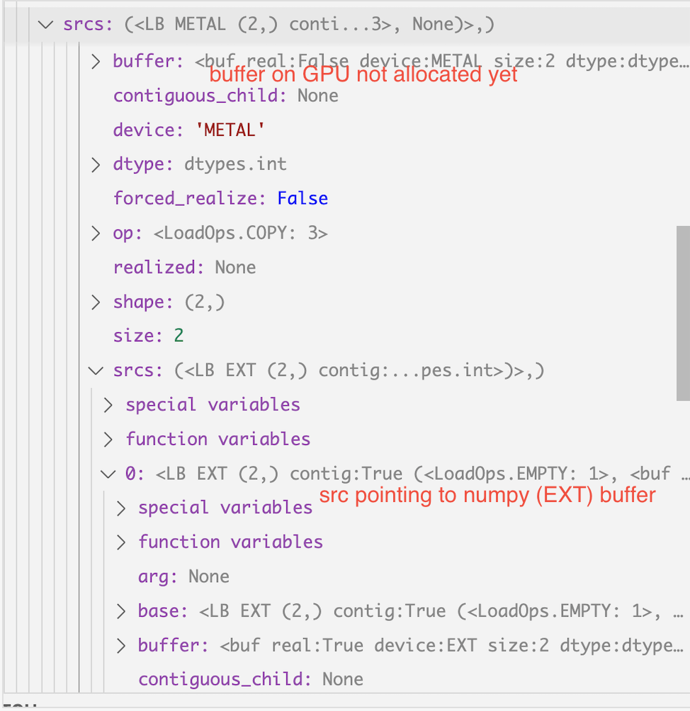
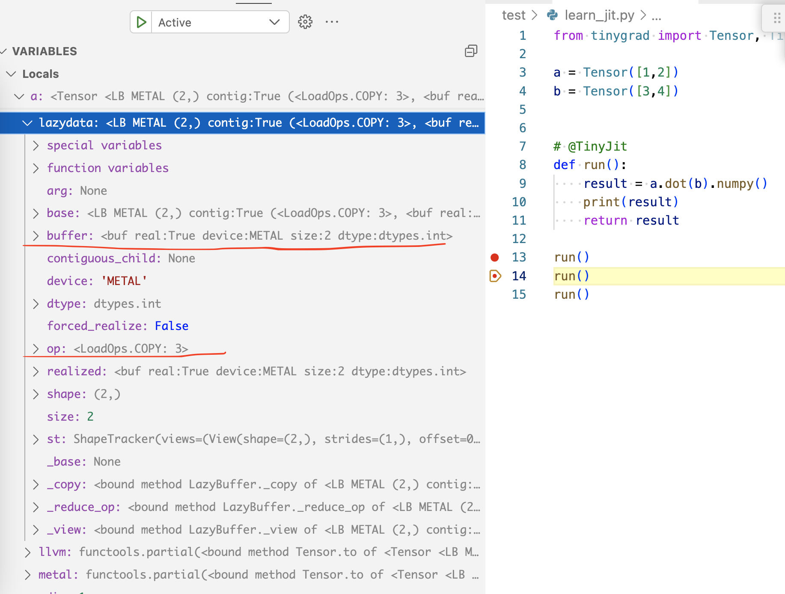
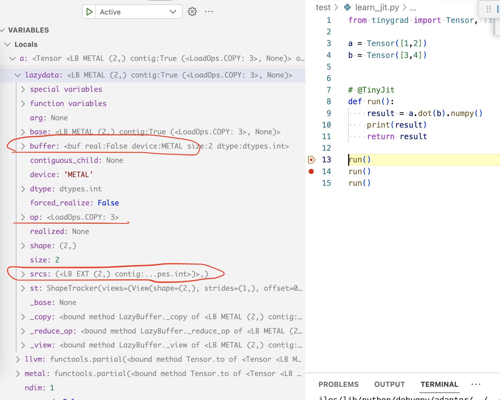
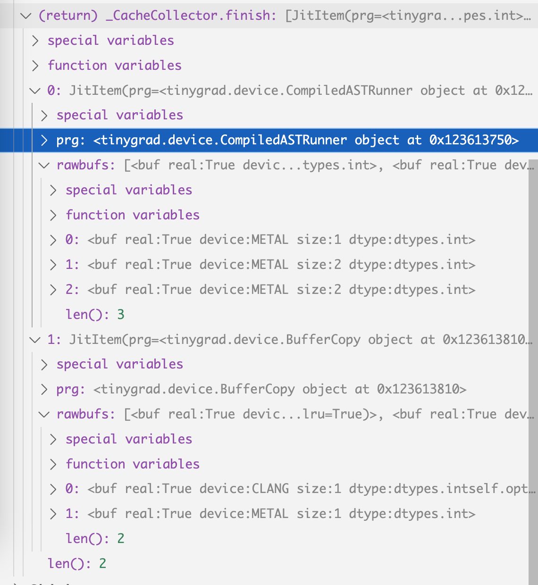

# How TinyJit works

If you look at the `example/beautiful_mnist.py` file, you will notice that
it has the @tinyjit decorator. This is what enables JIT mode.

The core part of the JIT class roughly looks like this:
```python
class TinyJit:
  def __call__(self, *args):
    if self.cnt >= 2:
      # jit exec
      for ji in self.jit_cache:
        ji.prg(cast(List[Buffer], ji.rawbufs), var_vals, wait=DEBUG>=2, jit=True)
    elif self.cnt == 1:
      # jit capture
      CacheCollector.start(var_vals)
      with Context(GRAPH=getenv("JITGRAPH", GRAPH.value)):
        self.ret = self.fxn(*args, **kwargs)
        Tensor.corealize(get_parameters(self.ret))
      self.jit_cache = apply_graph_to_jit(self.jit_cache, input_rawbuffers, var_vals)
    elif self.cnt == 0:
      # jit ignore
      self.ret = self.fxn(*args, **kwargs)
      Tensor.corealize(get_parameters(self.ret))
    self.cnt += 1
```

I removed some code for clarity and the above won't run properly, but the idea
should be clear. The first time your model is run, it acts as normal, but it
increments the counter. The second time your model is run, it recognizes this was
run before and might be a good idea to add it to the cache. The third time the
function is loaded from the cache. The cache stores the compiled program, so 
when serving from JIT, we won't have to do the IR optimization and
code generation again ([if you recall](backends.md)).

Recall that our code is already JIT compiled. The compilation (and subsequent dispatch
to GPU) happens when you call `realize()`. So this extra JIT layer is caching
the compilation process rather than doing the compilation. 

There are a lot of things going on for this caching to work though.

This part of the jit __call__ is what allows you to add the program to cache:
```python
      CacheCollector.start(var_vals)
      with Context(GRAPH=getenv("JITGRAPH", GRAPH.value)):
        self.ret = self.fxn(*args, **kwargs)
        Tensor.corealize(get_parameters(self.ret))
      self.jit_cache = CacheCollector.finish()
```

CacheCollector is a global object, defined as such:
```python
class _CacheCollector:
  def __init__(self):

  def start(self, var_vals:Optional[Dict[Variable, int]]=None):

  def add(self, prg, rawbufs:List[Buffer], var_vals:Dict[Variable, int]):

  def finish(self) -> List[JitItem]:

CacheCollector = _CacheCollector()
```

When we call `.start()`, it will take a note via some state variable, and then
we continue to execute our program (`self.fxn()`), within the function call,
there will be code that calls the CacheCollector's add method, for example, 
this line of JITRunner:

```python
    if CACHECOLLECTING:
      CacheCollector.add(self, rawbufs, var_vals)
```

If you followed my other posts and are now wondering where JITRunner came from,
it is a super class of BufferCopy:

```python
class BufferCopy(JITRunner):
```

it is also a super class of CompiledASTRunner which was used to run the compiled 
Metal GPU code:

```python
class CompiledASTRunner(JITRunner):
```

In fact, the .exec method on JITRunner is what's responsible for calling the specific
`__call__` implementation of BufferCopy and CompiledASTRunner, and our Tensor's realize
method just invoke the .exec method on the super class.

So we have a global cache object, and based on when .start and .finish are marked, it 
will know the owner of any `.add`ed item. (This means the compilation and scheduling part of
 things has to be single threaded btw).

Let's see it in action with a concrete example:

```python
from tinygrad import Tensor, TinyJit

a = Tensor([1,2])
b = Tensor([3,4])

@TinyJit
def run():
    result = a.dot(b).numpy()
    print(result)
    return result

run()
run()
run()
```

This time things are a bit different. First I wrap the operation in a function, such
that I can apply the TinyJit decorator. In beautiful_mnist.py, you can see that
what goes inside a `run` would be the model's forward and backward pass and it
returns the loss as the value. Then, I would call the `run` three times. The
first time it runs only the dot product operation; the second time it runs it
as usual, but add some cache related information to our global Cache object.
The third time the program will be run directly from TinyJit, skipping the normal
program flow.

I will add a debugger breakpoint on the second `run()`, and if you trace it down,
you will see that the `.add` method on cache collector is invoked:



Look into the callstack on the left, you notice near the bottom is the `numpy()`
call, that's the `numpy()` call have inside the `run` function. So `numpy()`
calls `_data()`, `_data()` then calls `realize()`, so on and so on until it reaches
the `.exec()` on JITRunner, which is the superclass of a buffer copy operation.

```python
  def exec(self, rawbufs:List[Buffer], var_vals:Optional[Dict[Variable, int]]=None) -> Optional[float]:
    var_vals = var_vals if var_vals is not None else {}
    from tinygrad.engine.jit import CacheCollector
    et = self(rawbufs, var_vals)
    if CACHECOLLECTING:
      CacheCollector.add(self, rawbufs, var_vals)
    return et
```

so that's how a program is added to a cache. 

With the core mechanism understood, we can look at what effects it actually has. 
But before showing that, we should also understand the existing optimization even
before we add JIT, otherwise some output will appear confusing.

Let's use the same example but without JIT:

```python
from tinygrad import Tensor, TinyJit

a = Tensor([1,2])
b = Tensor([3,4])

# @TinyJit --> not using JIT
def run():
    result = a.dot(b).numpy()
    print(result)
    return result

run()
run()
run()
```

The first run will behave exactly like you expect, specifically, I look 
at the ScheduleItem being generated:



We have four schedule item, 2 copies plus 1 compute plus the last copy. They are
dispatched to run, and upon the second `run` being called, we look at the item
being scheduled:



We now have just last two scheduleitem from before! Intuitively, this is because
the data are already in GPU, so we can skip the first two copies. How is that
implemented? Inside create_schedule, specifically, inside `_recurse_lb` (
  you may want to refer back to [scheduleitem](scheduleitem.md)
):

Our two copy op lazybuffer in the **first** run, has `realized` set to None:



This is how `realized` is computed in the LazyBuffer:
```python
  @property
  def realized(self) -> Optional[Buffer]:
    # NOTE: we check for a lack of srcs instead of an allocated buffer to make unrealized assigns return None here
    return self.buffer if self._base is None and not hasattr(self, 'srcs') else None
```

The condition is checking whether this is a concrete lazybuffer (which means its _base set
to None) and that it doesn't have any `srcs`, which gets removed when it is turned
into the schedule item's input or output. So if you look at the current COPY op,
it has a buffer that's not yet allocated (meaning it doesn't exist on GPU yet), and
it has `srcs` pointing to the data located on numpy (EXT):



As a result, the `realized` is set to None. You will see how this is set to something
else soon.

So the `realized` is what `_recurse_lb` checks to decide if it wants an early return. The
check failed, so we continue down, until we see that it is a COPY op, so we add
it to the `realizes` list. Recall that each element `realizes` list is the entrypoint to a schedule
item. Check out the implementation of _recurse_lb:

```python
def _recurse_lb(buf:LazyBuffer, realizes:Set[LazyBuffer], allbufs:Dict[LazyBuffer, None],
                simple_pads:Set[LazyBuffer], children:DefaultDict[LazyBuffer, Dict[LazyBuffer, None]], scheduled=False):
  if buf in allbufs or buf.base.realized: return
  #...
  if buf.op is LoadOps.COPY:
    assert buf.srcs[0].st.contiguous and buf.srcs[0].size == buf.srcs[0].base.size, "can only copy contig"
    realizes.add(buf.srcs[0].base)
  #...
```

When we call the `.exec` function on the lazybuffer, the `realized` will be set to
the actual buffer instance. Recall the `realized` is a computed property, 
all that has changed is that our COPY lazybuffer now no longer has the `srcs` pointing
to anything, and also that its buffer is now allocated. The actual details span
several files, but the key point is that the lazybuffer **is a reference** coming all
the way from the `a = Tensor([1,2])` assignment. After finishing the first `run`
invocation, the `a` variable's lazydata tree's final leaf will look like this:



Notice that it no longer has the the `srcs` anymore. In comparison, the `a` 
originally looked like this:



As a result, the second time we call `create_schedule` on the tensor,
it will see that the lazydata already has an allocated buffer, meaning the COPY
op already finishes. This is some far mutation to keep in mind. And ultimately
that's why the second run we end up having only 2 schedule item.

The JIT's optimization builds on top of this, it aims to get rid of those last 
two schedule item as well! 

Now let me turn the JIT back on:

```python
from tinygrad import Tensor, TinyJit, nn, GlobalCounters

a = Tensor([1,2])
b = Tensor([3,4])


@TinyJit
def run():
    result = a.dot(b).numpy()
    print(result)
    return result

run()
run() # --> setting breakpoint
run()
```

And I will break on the "second time" `run` is called, and we land on the
cnt = 2 branch of the TinyJit:
```python
    elif self.cnt == 1:
      # jit capture
      self.expected_vals, self.expected_name_sts_dtype_device = expected_vals, expected_name_sts_dtype_device
      CacheCollector.start(var_vals)
      with Context(GRAPH=getenv("JITGRAPH", GRAPH.value)):
        self.ret = self.fxn(*args, **kwargs)
        Tensor.corealize(get_parameters(self.ret))
      self.jit_cache = CacheCollector.finish()
      assert len(self.jit_cache) != 0, "didn't JIT anything!"
      # TODO: reset doesn't work if we delete this
      #del self.fxn
      if DEBUG >= 1 and len(set(get_input_replace(self.jit_cache, input_rawbuffers).values())) != len(input_rawbuffers):
        print("WARNING: some input tensors not found")
      if DEBUG >= 1: print(f"JIT captured {len(self.jit_cache)} kernels with {len(input_rawbuffers)} inputs")

      # Condense the items into a graph executor.
      if getenv("JIT") != 2:
        self.jit_cache = apply_graph_to_jit(self.jit_cache, input_rawbuffers, var_vals)

      self.input_replace = get_input_replace(self.jit_cache, input_rawbuffers)
```

`self.ret = self.fxn(*args, **kwargs)` will execute the same way we described earlier,
with only 2 schedule items to dispatch. The return data is now stored on `self.ret`. 
We notice there's another call, `Tensor.corealize(get_parameters(self.ret))`, this
is relevant when we construct an actual model with gradient, but it's just empty for now.

After calling `CacheCollector.finish()`, we can look at what has actually been
added. The items are stored in `self.jit_cache`:



The content should mostly make sense to you, we captured the program (kernel), its
two input and one output buffer, and then the buffer copy operation.

Let's look at what happens when we invoke `run` the third
time. Now the cnt is 2, we enter this branch inside the `__call__` of TinyJit:

```python
  if self.cnt >= 2:
      # jit exec
      assert self.expected_vals == expected_vals and self.expected_name_sts_dtype_device is not None, "missing/mismatch of var_vals"
      assert all(x[0] == y[0] and x[1].views == y[1].views and x[2] == y[2] and x[3] == y[3]
                 for x,y in zip(self.expected_name_sts_dtype_device, expected_name_sts_dtype_device)), \
        f"mismatch of input tensors, expected {self.expected_name_sts_dtype_device} got {expected_name_sts_dtype_device}"
      for (j,i),input_idx in self.input_replace.items():
        self.jit_cache[j].rawbufs[i] = input_rawbuffers[input_idx]
      for ji in self.jit_cache:
        ji.prg(cast(List[Buffer], ji.rawbufs), var_vals, wait=DEBUG>=2, jit=True)
```
You can see that we just use the same reference to the constructed program by iterating over
self.jit_cache, and calling them without going through the whole scheduleitem creation process.


# Likely mistaken content below

Below is what I wrote when studying what apply_graph_to_jit does, but likely 
contain some incorrect stuff. It is probably not horribly wrong but there's some catch I missed,
it should still offer some good guidance when studying the relevant code though:

There's a function call to `apply_graph_to_jit` passing the captured
info. input_raw_buffers and var_vals are empty in our simple scenario. Inside
the function we iterate through each element that we added to our cache, and check
for the .graph property:

```python
  for ji in jit_cache:
    ji_graph_dev: Optional[Compiled] = None # device on which the ji will be graphed. Not graphed if None.
    if isinstance(ji.prg, CompiledASTRunner): ji_graph_dev = ji.prg.device
    elif isinstance(ji.prg, BufferXfer) and ji.rawbufs[0] and ji.rawbufs[0].device.split(":", 1)[0] in {"HSA", "CUDA"}:
      ji_graph_dev = Device[ji.rawbufs[0].device]

    can_be_graphed = ji_graph_dev and ji_graph_dev.graph
```

Where did .prg.device.graph come from? Remember in our CommandQueue `__call__` method,
we handle the kernel this way:

```python
          elif si.ast[0].op is BufferOps.STORE:
            runner = Device[si.outputs[0].device].get_runner(*si.ast)
```

and if you trace down get_runner,

```python
    ret = CompiledASTRunner(k.name, self.compiler.render(to_function_name(k.name), k.uops), self.dname, k.global_size, k.local_size,
                            k.uops.vars(), min(info.flops, ops * run_count), min(info.mem_estimate, mem * run_count), outcount=len(k.outbufs))
```

`device` is a property of CompiledASTRunner:

```python
  @property
  def device(self): return Device[self.dname]
```

So the .graph property are defined by the device themselves. We look into the
constructor of ops_metal.py:

```python
class MetalDevice(Compiled):
  def __init__(self, device:str):
    self.device = Metal.MTLCreateSystemDefaultDevice()
    self.mtl_queue = self.device.newCommandQueueWithMaxCommandBufferCount_(1024)
    self.mtl_buffers_in_flight: List[Any] = []
    self.mv_in_metal: List[memoryview] = []
    self.track_cross_buffer: List[Any] = []
    from tinygrad.runtime.graph.metal import MetalGraph
    super().__init__(device, MetalAllocator(self), MetalCompiler(None if getenv("METAL_XCODE") else self),
                     functools.partial(MetalProgram, self), functools.partial(MetalGraph, self))
```

and saw the MetalGraph being imported and invoked partially, then passed into the super class.
You can find a similar mechanism inside HSA and CUDA. The three implementation files
are actually placed under `runtime/graph` folder, so that's a hints for parity.

You can think of MetalGraph as a container that holds the cached program, and 
when input are passed to it, it will call the GPU to execute them. This becomes
clear when you look into its implementation:

```python
  def __init__(self):
    for j,ji in enumerate(self.jit_cache):
      prg: CompiledASTRunner = cast(CompiledASTRunner, ji.prg)
      descriptor = Metal.MTLComputePipelineDescriptor.new()
      descriptor.setComputeFunction_(prg.clprg.fxn)
      descriptor.setSupportIndirectCommandBuffers_(True)
```

So it upon initialization, which happens when we call the apply_jit_to_graph,
it enuemrates each item in cache and sets up some GPU specific container for it.

and when you actually invoke it:

```python
    command_buffer = self.device.mtl_queue.commandBuffer()
    encoder = command_buffer.computeCommandEncoder()
    encoder.useResources_count_usage_(all_resources, len(all_resources), Metal.MTLResourceUsageRead | Metal.MTLResourceUsageWrite)
    encoder.executeCommandsInBuffer_withRange_(self.icb, Metal.MTLIndirectCommandBufferExecutionRangeMake(0,len(self.jit_cache)))
    encoder.endEncoding()
    command_buffer.commit()
```

It will utilize the set up before and have the GPU execute stuff. 

