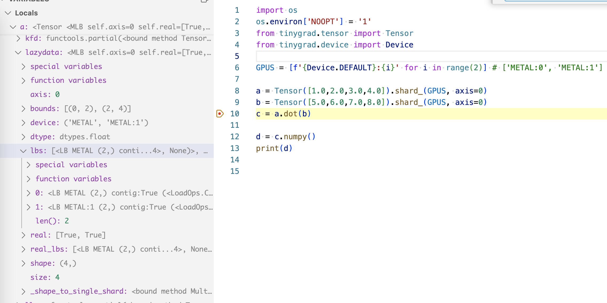
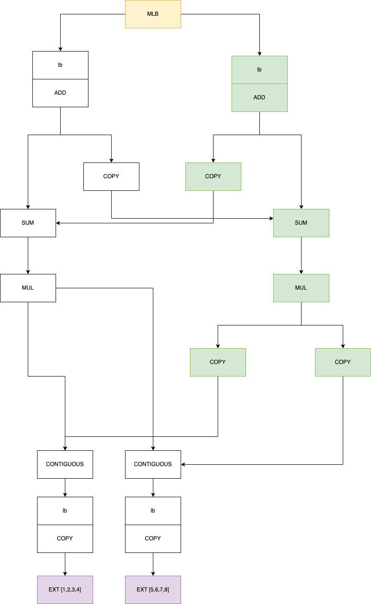
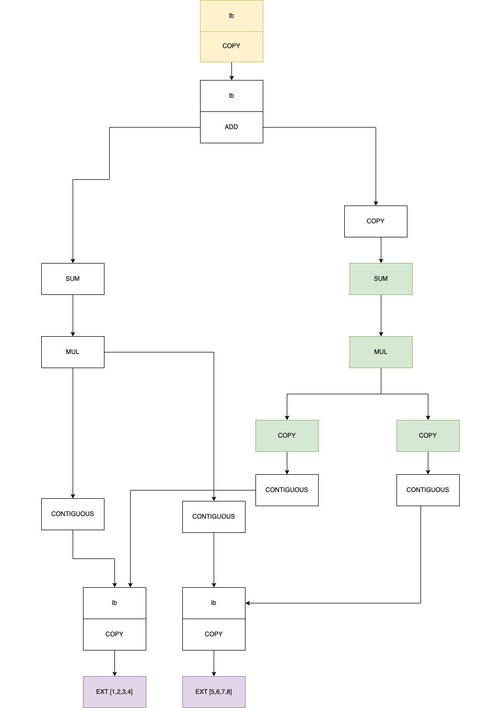
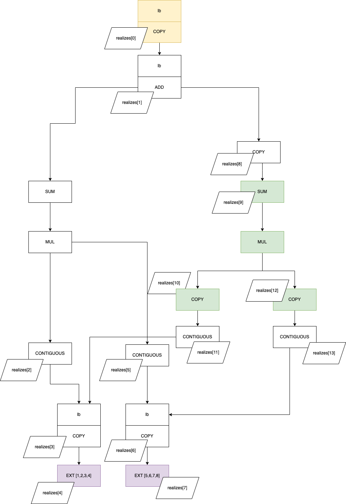
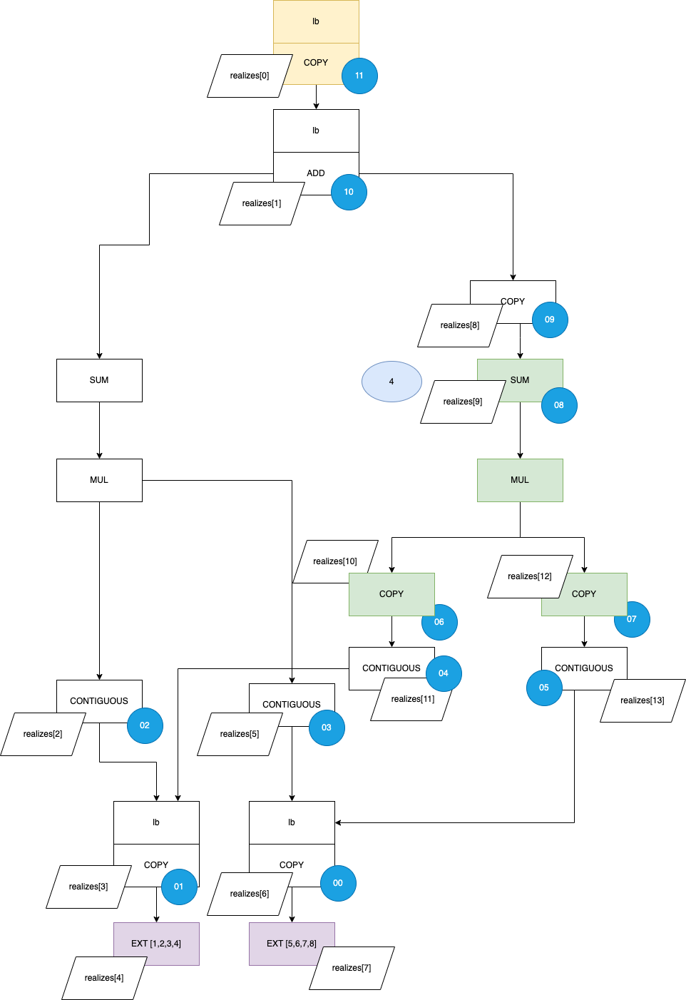

# How multigpu training works

We have a beautiful_mnist_multigpu.py example and it utilizes more than
1 gpu to do the training. How does tinygrad implement this functionality?

beautiful_mnist_multigpu builds on top of the existing beautiful_mnist. It
also utilizes TinyJit to accelerate the computation, which I detailed the
innerworkings in [my other post](jit.md), feel free to take a look if you
are interested. 

Inside beautiful_mnist_multigpu.py, we see that the data is splitted into
shards by calling the `shard_` method:

```python
      Xt, Yt = X_train[samples].shard_(GPUS, axis=0), Y_train[samples].shard_(GPUS, axis=0)  # we shard the data on axis 0
```

Let's see how that works under the hood

```python
  def shard(self, devices:Tuple[str, ...], axis:Optional[int]=None) -> Tensor:
    assert isinstance(self.lazydata, LazyBuffer), "can't shard a MultiLazyBuffer"
    canonical_devices = tuple(Device.canonicalize(x) for x in devices)
    if axis is not None and axis < 0: axis += len(self.shape)
    return Tensor(MultiLazyBuffer.from_sharded(self.lazydata, canonical_devices, axis), device=canonical_devices, requires_grad=self.requires_grad)

  def shard_(self, devices:Tuple[str, ...], axis:Optional[int]=None):
    self.lazydata = self.shard(devices, axis).lazydata
    return self
```

So we construct a new tensor, but its lazydata (if you haven't read [this](scheduleitem.md)),
is now replaced by MultiLazyBuffer. MultiLazyBuffer takes the original LazyBuffer
as the input via the `from_sharded` class method. 

Comparing to LazyBuffer, MultiLazyBuffer is more or less the same, it just
takes a list of lazybuffers that potentially reside on multiple devices.

```python
class MultiLazyBuffer:
  def __init__(self, lbs:List[LazyBuffer], axis:Optional[int], real:Optional[List[bool]]=None):
    assert all(isinstance(x, LazyBuffer) for x in lbs) and len(lbs), "all lbs must be LazyBuffers, and we need at least one of them"
    #assert all_same([(x.shape, x.dtype, x.st) for x in lbs]), "all multilazybuffer needs same shape, dtype, and st"
    self.lbs, self.axis, self.dtype, self.device, self.real = lbs, axis, lbs[0].dtype, tuple(x.device for x in lbs), real or [True]*len(lbs)
    if axis is not None:
      splits = list(itertools.accumulate([lb.shape[axis] for lb in lbs], initial=0))
      self.bounds = [(st,ed) for st,ed in zip(splits, splits[1:])]
```

I will use an example to find out how data are actually distributed to multiple 
GPUs, again with the same dot product example but with more values. I will set
a breakpoint at the variable c:

```python
from tinygrad.tensor import Tensor
from tinygrad.device import Device

GPUS = [f'{Device.DEFAULT}:{i}' for i in range(2)] # ['METAL:0', 'METAL:1']

a = Tensor([1.0,2.0,3.0,4.0]).shard_(GPUS, axis=0)
b = Tensor([5.0,6.0,7.0,8.0]).shard_(GPUS, axis=0)
c = a.dot(b) # --> breakpoint

d = c.numpy()
print(d)
```

Let's examine what the sharded tensor look like:



We see that a has a lazydata attribute of type MultiLazyBuffers (MLB), this buffer
has an `lb` attributes that contain two ordinary lazybuffers (lbs) that we have
been dealing with all along. You can guess that the two buffers each store
two elements, the first one would store `[1.0, 2.0]` and second one would have
`[3.0, 4.0]`, in fact, we have some more attributes to confirm the guess. The
MLB has a bounds attribute describing the start and end of the elements of 
each of its lbs. We also have a device attribute that describes where those lbs
live, the format of the device string is likely arbitrary choice by design. Note
that we also specified the axis, 0 meaning the zeroth axis and since our element
is single dimension, it's just a regular slicing operation. But if we have
a 2D input, sharding by 0th dimension means we are splitting the grid into two
equally sized columns, and sharding by 1st dimension means we are splitting the grid into 
two equally sized rows. 

Before continuing, it's worth pointing out that Tensor constructor can take a 
variety of data inputs. Previously we were passing in either plain python
list or numpy array, now the sharding operation is passing MultiLazyBuffer:

```python
class Tensor:
  def __init__(self):
    if isinstance(data, LazyBuffer): assert dtype is None or dtype == data.dtype, "dtype doesn't match, and casting isn't supported"
    elif isinstance(data, get_args(ConstType)): data = _loadop(LoadOps.CONST, tuple(), dtype or dtypes.from_py(data), device, data)
    elif isinstance(data, bytes): data = _fromcpu(np.frombuffer(data, np.uint8))
    elif data is None: data = _loadop(LoadOps.EMPTY, (0,), dtype or dtypes.default_float, device)
    elif isinstance(data, list):
      if (d := fully_flatten(data)) and all(isinstance(s, bool) for s in d): dtype = dtype or dtypes.bool
      elif d and all_int(d): dtype = dtype or dtypes.default_int
      else: dtype = dtype or dtypes.default_float
      if dtype == dtypes.bfloat16: data = Tensor(_fromcpu(np.array(data, np.float32)), device=device).cast(dtypes.bfloat16).lazydata
      else: data = _fromcpu(np.array(data, dtype.np))
    elif isinstance(data, np.ndarray):
      if data.shape == (): data = _loadop(LoadOps.CONST, tuple(), dtype or dtypes.from_np(data.dtype), device, data.item())
      else: data = _fromcpu(data.astype(dtype.np) if dtype is not None and dtype.np is not None else data)
```

So when we perform the .dot operation, the logic will take place on MLB, instead of
lazy buffers, this is why in the MLB definition you see the implementation for
elementwise op and reduce op. Note that all the .dot, .sum, .add and whatever opeartions
ultimately gets boiled down to either `e()` for element wise op, or `r()` for reduce
op. Previously on lazybuffer, these two methods are implemented on the LazyBuffer
itself:

```python
class LazyBuffer:
  def e(self, op:Union[LoadOps, UnaryOps, BinaryOps, TernaryOps], *in_srcs:LazyBuffer, arg:Optional[Any]=None) -> LazyBuffer:
    srcs: List[LazyBuffer] = []
    for s in (self,)+in_srcs:
      if s == s.base and s.base.contiguous_child and (root:=s.base.contiguous_child[0]()) is not None:
        srcs.append(root._view(s.base.contiguous_child[1]))
      else:
        srcs.append(s)
    assert all_same(dts:=[x.dtype.scalar() for x in (srcs[1:] if op is TernaryOps.WHERE else srcs)]), f"all dtypes must match {dts} on {op}"
    #...
```

Now on MLB, we have a separate implementation, alongside various other that need to
be handled differently because the actual data are splitted across devices. 

```python
class MultiLazyBuffer:
  def e(self, op:Union[LoadOps, UnaryOps, BinaryOps, TernaryOps], *in_srcs:MultiLazyBuffer, arg:Optional[Any]=None) -> MultiLazyBuffer:
    msrcs = (self,)+in_srcs
    assert all(isinstance(x, MultiLazyBuffer) for x in msrcs), f"all buffers must be MultiLazyBuffer {msrcs}"
    assert all_same([x.device for x in msrcs]), f"all buffers must have the same device {[x.device for x in msrcs]}"

    # NOTE: they all have to share an axis, we always choose [-1]
    axis = axes[-1] if len(axes := dedup([x.axis for x in msrcs if x.axis is not None])) else None
    srcs = []
    not_all_real = any(not all(mlb.real) for mlb in msrcs)
    new_real = [all(transposed) for transposed in zip(*[mlb.real for mlb in msrcs])] if not_all_real else self.real
    assert any(new_real), "output contains no real lb"
    for mlb in msrcs:
      if mlb.axis == axis or not_all_real:
        srcs.append(mlb.lbs)
      elif mlb.axis is None and axis is not None: 
        srcs.append(to_sharded(mlb.lbs, axis))
      else: 
        srcs.append(to_sharded([mlb.copy_to_device(lb.device) for lb in mlb.lbs], axis))
    # NOTE: lsrcs[-1].const(0) is correct for where
    return MultiLazyBuffer([lsrcs[0].e(op, *lsrcs[1:], arg=arg) if r else lsrcs[-1].const(0) for lsrcs,r in zip(zip(*srcs),new_real)], axis, new_real)
```

After the .dot operation, we end up with a lazybuffer tree like below for the variable c:



The top item is our multilazybuffer, it branches out with two regular lazy buffers
in its `lbs` attriutes. These two lazybuffers are on two different devices: Metal (white) and
Metal:1 (green). Then each arrow indicate the item it contains in the `srcs` 
array. You can see that the devices reference each other and the passage of 
data is always preceded by a COPY item. Ultimately they converge
at the two numpy arrays stored on numpy. 


and when we call .numpy(), it gets processed and passed to create_schedule
in the below form, we are looking at the element inside `outs`:



You see that even before things are passed to create_schedule, we have eliminated
some unnecessary steps, looking at the diagram, we would load the array in each
GPUs, and presumaly have each one process and dot product half of the elements.
Then we add the result together, if your list of elements are numerous this can 
be 50% time saving. The part that it does this "optimization" (it's not actualy
an optimization, techncially) is in this function:

```python
  def copy_to_device(self, device:str) -> LazyBuffer:
    llbs = []
    for i,lb in enumerate([lb.copy_to_device(device) for lb in self.real_lbs]):
      pad_arg = tuple((0,0) if a != self.axis else (sz*i, max(0, self.shape[self.axis]-sz*(i+1))) for a in range(len(lb.shape)))
      llbs.append(lb.pad(pad_arg))
    return functools.reduce(lambda x,y: x.e(BinaryOps.ADD, y), llbs)
```

You see that we are adding all of the elements together recursively. Where
is this function called? When we realize a multilazybuffer, it called `.to('CLANG')`
so the final result will be copied to CPU,

```python
  def to(self, device:Optional[Union[str, Tuple[str, ...]]]) -> Tensor:
    ret = Tensor(self.lazydata, device, requires_grad=self.requires_grad)
    return ret
```

and the Tensor initializer will then call copy_to_device if it recognizes
a multi lazy buffer being passed as data:

```python
def __init__(self):
    self.lazydata = data if data.device == device else data.copy_to_device(device)
```

I want to show you the effect of `_recurse_lb` and how scheduleitems are actually
created. After the recursion of _recursve_lb, we construct a set of lazybuffers
called `realizes`, here are all of them, as labeled by `realizes[i]`, where
i indicate the order it is being added (although in a set, order doesn't matter):



Then, the `  prescheduled = {x:_schedule_one(x, realizes, reduce_for_op) for x in realizes if x not in seen and x.realized is None and x.op is not LoadOps.CONST}` will iterate through each item in the set
and create a schedule item for all of them except the two numpy data which are
already realized (they exist already in numpy memory)

So then this simplified lazydata tree is passed to the schedule creation process
and we end up a list of scheduleitems like so (you can see them in the initializer
of the command queue):


And we can label the item back to our lazydata tree (the number in blue circles
correspond to the item index in the scheduleitem list):



The rest of the operation are more or less the same as I have explained 
in the [IR](uops.md) and [backend](backends.md) posts, so I won't go into details.
The key is understanding that multi GPU operation is about rearranging the 
lazydata tree and generating the scheduleitems. The rest of the abstraction
are identical to those of regular single device GPU training.
