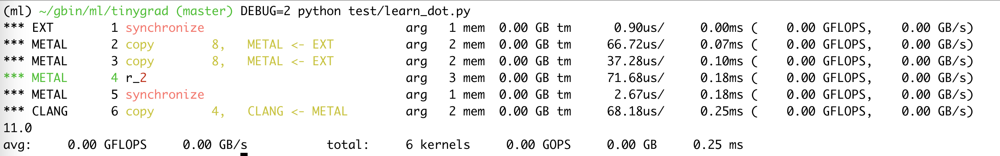

# How to profile a run

After getting tinygrad, you can start experimenting with
the examples folder, it would be good to be able to understand how well
the GPU is being utilized and where to find room for optimization, 
that's where profiling comes to play. For me, the motivation is to figure out
whether my intel macbook's performance has been maxed out, or is it underutilized 
because people don't care much about this old piece of metal? 

We use the MNIST image recognition training example:

```python
PYTHONPATH='.' python examples/beautiful_mnist.py
```

This will perform a training and show you a progress bar. On my computer, the
training is slow. Setting DEBUG=2 allow you to see the kernels being dispatched
to GPU and the relevant info on it.

```
*** EXT        1 synchronize                    arg   1 mem  0.22 GB tm      0.81us/     0.00ms (    0.00 GFLOPS,    0.00 GB/s)
*** METAL      2 copy        4,   METAL <- EXT  arg   2 mem  0.22 GB tm     72.80us/     0.07ms (    0.00 GFLOPS,    0.00 GB/s)
*** EXT        3 synchronize                    arg   1 mem  0.22 GB tm      0.60us/     0.07ms (    0.00 GFLOPS,    0.00 GB/s)
*** METAL      4 copy        4,   METAL <- EXT  arg   2 mem  0.22 GB tm     39.48us/     0.11ms (    0.00 GFLOPS,    0.00 GB/s)
*** EXT        5 synchronize                    arg   1 mem  0.22 GB tm      0.67us/     0.11ms (    0.00 GFLOPS,    0.00 GB/s)
*** METAL      6 copy        4,   METAL <- EXT  arg   2 mem  0.22 GB tm     42.56us/     0.16ms (    0.00 GFLOPS,    0.00 GB/s)
  0%|                                                                                                        | 0/70 [00:00<?, ?it/s]
```

The information might seem overwhelming, so I will again resort to the old dot product example

```python
from tinygrad.tensor import Tensor
a = Tensor([1,2])
b = Tensor([3,4])
res = a.dot(b).numpy()
print(res) # 11
```

The output is:



If you set DEBUG to 5, you will see that our ScheduleItem
are expanded with the uops and kernel code. Those haven't changed. We focus on
what wasn't covered before, the stats of each operation. For a dot product operation,
we have six operations being scheduled. The first is obtaining an acknolwedgement from
numpy (EXT), represented by "Synchronize". Second is copy the data from numpy (EXT) 
to GPU (METAL). Third is the same. These two copy put our [1,2] and [3,4] to GPU
memory. The third is our kernel code that compute the dot product. Fourth is 
an acknolwedgement from the GPU, signaling that the device that depends on GPU
can now resume (see [commmand queue tutorial](commandqueue.md)). The sixth is
a copy op from GPU to CPU such that we can print the result 11. The goal is to
quantify how long and how much resource each step takes. 

Let me breakdown the output to you:

For the first op:
```
*** EXT        1 synchronize
```

We obtain the following stats:

`arg   1`: It has 1 buffer passed to it.

`mem  0.00 GB`: Memory usage is 0.00 GB.

`tm      0.86us/     0.00ms`: tm is short for time measured. 0.86us means 
this operation took 0.86 microseconds. 0.00 means the total global time since
the program started has elapsed 0.00 milliseconds. It's not actually zero because 
the precision is only 2 decimals. But after a few op we will see it starting to
accumulate.

`(    0.00 GFLOPS,    0.00 GB/s)`: this summarizes the total number of flops for
this specific operation and the speed in which data are being moved.

The second one will now seem more obvious:
```
*** METAL      2 copy        8,   METAL <- EXT          arg   2 mem  0.00 GB tm     74.44us/     0.08ms (    0.00 GFLOPS,    0.00 GB/s)
```

It reads: the second operation runs on Metal, and is a copy op. This op has a size
of 8 bytes (recall we are copying two int32 numbers, so a 32bit int is 4 bytes, two is 8 bytes).
The op also copies from EXT to METAL. It has two buffers (one on the EXT and the other on METAL).
The memory usage is 0.00GB (precision shadowed the actual value). Time elapsed since the program started
is 0.08 milliseconds and the time it took for this op is 74.44 microseconds. 

Next part is the FLOPS and GB/s part. 

In a typical GPU, we have memory units and processing units. Between them
sits a memory interface. This interface passes data around and have two properties
that describe its capability: memory speed and memory bandwidth. 

```
                interface
                --------->  
processing unit ---------> memory
                --------->
```

In this imaginary GPU, we have a single processing unit and a single memory unit
connected by a memory interface that's 3 bit wide (i.e. there are three
lanes). Suppose each lane can pass data at 8 bits per second, then we say the 
**Memory speed** is 8bps. Since there are three lanes in total, the total throughput
within a second is 8bits * 3 = 24bps, which is termed memory bandwidth. 

I have
a Radeon Pro 5500M on my laptop, which offers 4GB of VRAM, 192GB/s memory bandwidth,
12Gbps memory speed, 4.0 FP32 TFLOPS, 1300MHz engine clocks, which is quite slow, but 
let me still break down the specs.

The memory speed 12Gbps reads 12 gigabits per second, and the
total throughput memory bandwidht is 192 giga **bytes** per second (GB/s),
recall that 1 byte is 8 bits, we can do a math to find out that the total number
of memory lanes is 192 * 8 / 12 = 128, which is called Memory Interface Width.
The unit is denoted in bits, so this GPU's has 128 bits memory interface width.
And the total amount of memory avaialble is 4GB. 

The clock rate (Engine clocks) is 1300MHz, meaning the processing unit
operates at 1300 mega hertz, which translates to 1.3 billion cycle per
second. Cycle here refers to the instruction cycle in processor, feel free to
search up on relevant info. 

And the 4.0 FP32 TFLOPS refers to how fast it can do floating point 32 arithmetic.
This is more commonly found in ML article. If you recall our dot product example (1 * 3 + 2 * 4 = 11),
we are multiplying 2 floating point numbers and adding them together. Each floating 
point number is represented by 32 bits, and we did two multiplication and 1 addition.
So the total FLOPS we did in a dot product operation is 3 FLOPS. If this whole thing
takes 1 second in a GPU, then it has a 1.0 FP32 FLOPS performance. What can my
GPU do? 4 teraflops per second, which is 4 trillion flops. I think in theory you would
calculate the total number of flops for your model during training or inference,
and figure out a theoritcal upper limits for the processing time. Do note that
this doesn't consider data movement which also takes time. 

Now if we make the MNIST run with DEBUG=2 for longer, we can see where
things take up time and also the amount of FLOPS, memory movement that occur
at each expensive kernels. 