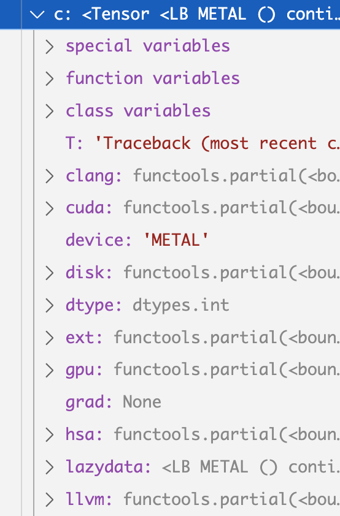
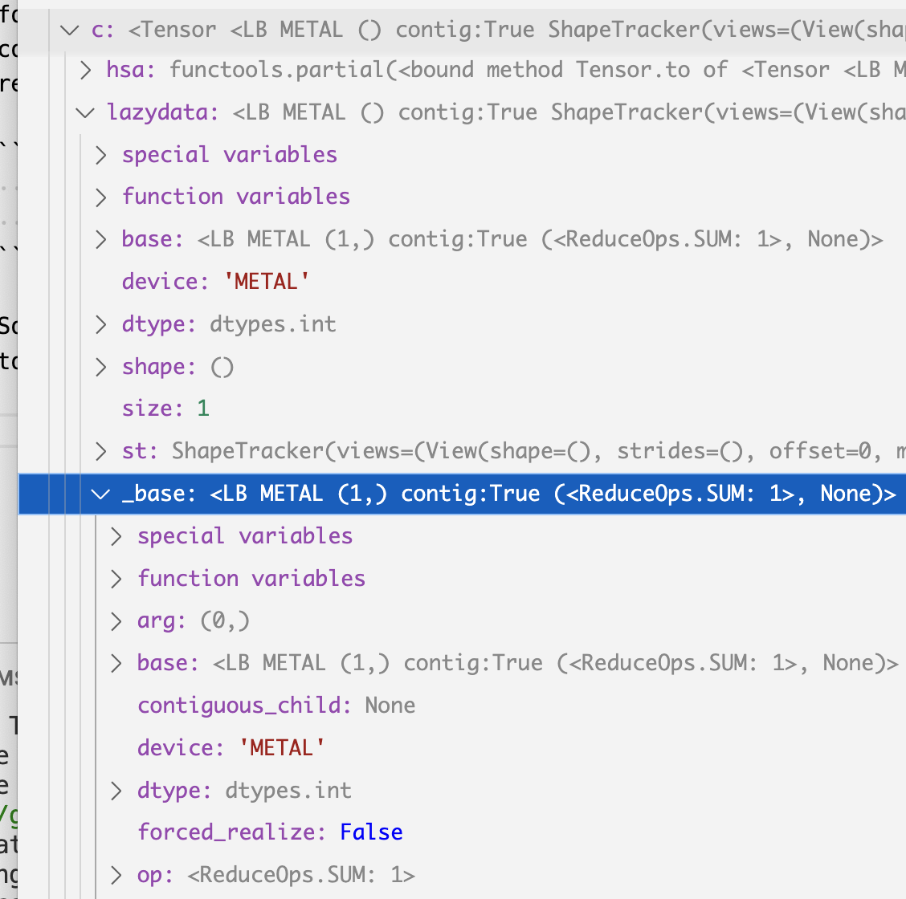
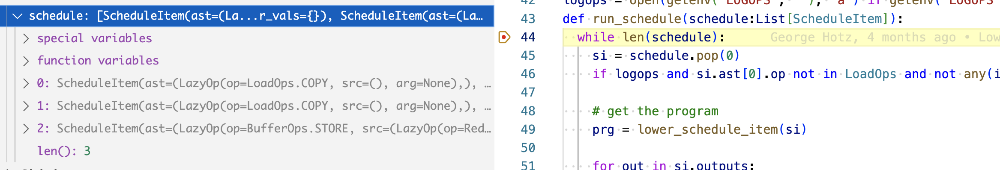
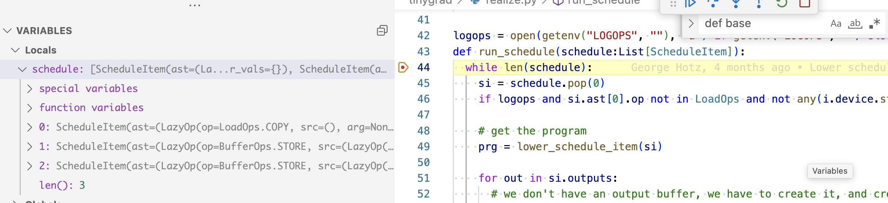
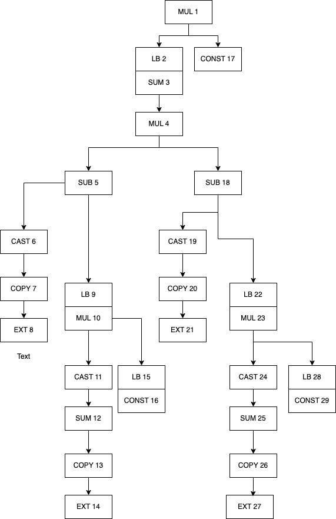
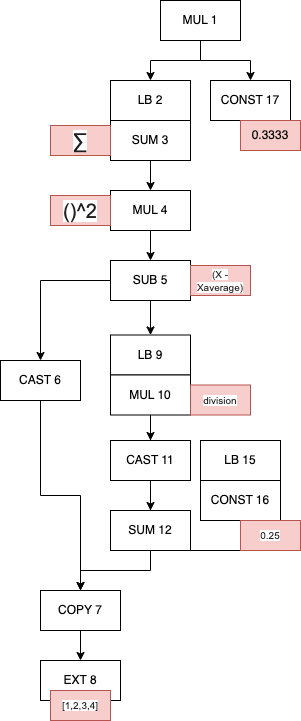

# How kernel fusion starts

## Why sometimes there are more than one kernel

In my writeup for the [dot product example](dotproduct.md), we saw
that the whole thing is fused into a single kernel, this isn't always the
case. There are certain rules that govern how a kernel is created and 
where it ends. These are called "schedule items".

```python
from tinygrad.tensor import Tensor
a = Tensor([1,2])
b = Tensor([3,4])
c = a.dot(b)
```

In the above example, I used some debugger tool to see the structure of variable
c. 



On the top level, there's a lazydata attribute. It represent what kind of data
this should hold, but not yet evaluated. This attribute is an instance of the 
corresponding LazyData class. And there are two types of it, which I term
concrete data and non-concrete data. Concrete lazy data are those that has
an operation, for example, when you add two tensor, the output tensor is a concrete
lazydata that has a "SUM" operation. The non-concrete lazydata are those that
do not have such operation, and are used to wrap a concrete lazydata, such that
shape operation like permute and reshape can be represented. For non-concrete
lazydata, there's a `_base` attribute that points to a concrete lazydata. And
for consistent API usage, both types of lazydata has a `base` attribute. If it's a
concrete lazydata, the base refers to itself, and if it's a non-concrete one, base
returns what `_base` points to:

```python
  @property
  def base(self) -> LazyBuffer: return self._base if self._base is not None else self
```

So our c variable's lazydata is a non-concrete one, and its _base attribute points
to another instance that has the attribute called `op` with the value SUM, *as it was written*.


The reason there's a non-concrete lazydata on top of the SUM instance is because
of additional shape operations on it, you can see that the `st` variable is filled
with views information on both non-concrete and concrete instance, but the details
will be discussed later. For how views work, refer to the [shapetracker post](shapetracker.md)
and [merge dimension post](mergedim.md).

If we unpack the whole thing, the relation roughly resembles the below:

```
c {
  lazydata1 {
    _base: lazydata2 {
      op: SUM
      srcs: [
        lazydata3 {
          op: MUL
          srcs: [
            lazydata4 {
              op: COPY
              srcs: [
                lazydata {
                  op: EMPTY
                  device: "EXT"
                  src: ()
                  realized: Buffer
                }
              ]
            },
            lazydata5 {
              op: COPY
              srcs: [
                lazydata {
                  op: EMPTY
                  device: "EXT"
                  src: ()
                  realized: Buffer
                }
              ]
            }
          ]
        }
      ]
    }
  }
}
```

Try matching the python code to the structure above. The two "EXT" at the end
are the two list we have provided, and they are being first multiplied, and then
summed, producing the final output. 

Recall that the generated kernel code looks like below:
```
#include <metal_stdlib>
using namespace metal;
kernel void r_2(device int* data0, const device int* data1, const device int* data2, uint3 gid [[threadgroup_position_in_grid]], uint3 lid [[thread_position_in_threadgroup]]) {
  int acc0 = 0;
  for (int ridx0 = 0; ridx0 < 2; ridx0++) {
    int val0 = *(data1+ridx0);
    int val1 = *(data2+ridx0);
    acc0 = ((val0*val1)+acc0);
  }
  *(data0+0) = acc0;
}
```

Now conceptually, if we want to run this code, we have to make sure data1 and
data2 pointer actually refers to something that has data, and the data comes from
our python memory, which is absent in the GPU. So before we run the kernel code,
we have to do two operations, to load the two list into GPU memory. Tinygrad
abstract this into something called `ScheduleItem` and it essentially represent
a single kernel operation, which could be either loading memory into GPU, running
code in GPU, or reading from GPU. Looking at our lazydata tree, we can see that 
there are three schedule item that need to be created - load data * 2, run code.
If you trace through what happens in the `numpy()` method (which evaluates the
data by running them on GPU), there's a statement inside `run_schedule` function,
put a breakpoint at the `while len(schedule)` and see what the variable contains
upon running the code 

,exactly 3 items, *as it was written*.

How are these three items generated? Essentially we run some function that goes 
through the entire lazydata tree, parse them into AST and buffers and depending
on encoded rules, we split them into multiple schedule items as needed. The function
is called `create_schedule` and it takes a list of lazydata, in our case, just
one lazydata that branches all the way down to the EMPTY op. 

```python
def create_schedule(outs:List[LazyBuffer], seen:Optional[Set[LazyBuffer]]=None) -> List[ScheduleItem]:
```

The first step to create schedule is to figure out which of the lazydata need
to be realized. What that means is which of them should be allocated memory in the
GPU. The first obvious ones are the top level SUM lazydata, and the two trailing
one that represents the two list. That's what create_schedule does, it constructs
a `realizes` list, add the top level one to it, and call `recurse_lb` which walks
the entire lazydata tree and find the one that has the `realize` attribute set. 
Recall that the lazydata for our two lists are represented in memory and hence
have the `realize` attribute set as a Buffer object (I didn't cover how lazy
data is constructed yet, so just take that for granted).

```python
  realizes: Set[LazyBuffer] = set([x.base for x in outs if not x.base.realized])
  for out in outs: _recurse_lb(out.base, realizes, allbufs, simple_pads, children, scheduled=True)
```

The actual implementation covers all the rules that a lazydata should be added to the `realize` list
```python
def _recurse_lb(buf:LazyBuffer, realizes:Set[LazyBuffer], allbufs:Dict[LazyBuffer, None],
                simple_pads:Set[LazyBuffer], children:DefaultDict[LazyBuffer, Dict[LazyBuffer, None]], scheduled=False):
  if buf in allbufs or buf.base.realized: return
  if GRAPH: log_lazybuffer(buf, scheduled)
  if isinstance(buf.dtype, ImageDType) and (prod(buf.shape) != prod(buf.dtype.shape) or
                                            not any(buf.shape[x]%4 == 0 for x in buf.st.unit_stride_axes())):
    if DEBUG >= 3: print(f"forcing image {buf.dtype} with shape {buf.shape} to float32")
    buf.dtype = dtypes.float32  # NOTE: this is what makes the dtype above not match
  if buf.base != buf:
    # realize all places where the buffer is expanded
    if prod(buf.base.st.shape) < prod(buf.st.shape):
      if len(buf.st.views) == 1 and buf.st.views[-1].mask and all_int(buf.base.st.shape) and \
          prod(buf.base.st.shape) >= prod([y-x for x,y in buf.st.views[-1].mask]):
        simple_pads.add(buf.base)
      else:
        realizes.add(buf.base)
    return _recurse_lb(buf.base, realizes, allbufs, simple_pads, children)
  if buf.forced_realize: realizes.add(buf)
  allbufs[buf] = None
  if buf.op in LoadOps: realizes.add(buf.base)
  if buf.op == LoadOps.COPY:
    assert buf.srcs[0].st.contiguous and buf.srcs[0].size == buf.srcs[0].base.size, "can only copy contig"
    realizes.add(buf.srcs[0].base)
  for x in buf.srcs:
    children[x.base][buf] = None
    _recurse_lb(x, realizes, allbufs, simple_pads, children)
```

Next step we iterates through each element in the `realizes` list and construct
schedule item 

```python
prescheduled = {x:_schedule_one(x, realizes, reduce_for_op) for x in realizes if x not in seen and x.realized is None and x.op is not LoadOps.CONST}
```

Here's the implementation for `_schedule_one`:

```python
def _schedule_one(out:LazyBuffer, realizes:Set[LazyBuffer], reduce_for_op: Dict[LazyBuffer, LazyBuffer]) -> ScheduleItem:
  inputs: List[LazyBuffer] = []
  var_vals: Dict[Variable, int] = out.st.var_vals.copy()
  if out.op in {LoadOps.CUSTOM, LoadOps.SYNC, LoadOps.WAIT, LoadOps.COPY, LoadOps.EMPTY}:
    op, inputs = LazyOp(out.op, (), out.arg), list(out.srcs)
  else:
    output_st = ShapeTracker.from_shape(reduce_for_op[out].shape if out in reduce_for_op else out.shape)
    op = _recursive_lazyop(out, inputs, var_vals, output_st, realizes, cache={})
    op = LazyOp(BufferOps.STORE, (op, ), MemBuffer(0, out.dtype, output_st.simplify().unbind()[0]))
  return ScheduleItem((op,), (out,), tuple(inputs), var_vals)
```

You can see that the `ScheduleItem` is actually being constructed, and also note
that if the output lazydata is not one of the memory loaded operation, we append
a `STORE` operation on top, indicating that we want to retain the value after GPU
computation.

In this simple example, we saw that a single kernel is generated because 
everything fits together nicely. What happens for a more complex operation? 
Let's say we want to calculate the variance of a list.

```python
a = Tensor([1,2,3,4])
b = a.var()
print(b.numpy()) # --> 1.6666667
```

Recall that the formula is to first get the average: 0.25 * (1 + 2 + 3 + 4) = 2.5
Then iteratively calculate the difference of each element w.r.t. the average
and square and sum it
```
((1 - 2.5)^2 + (2 - 2.5)^2 + (3 - 2.5)^2 + (4 - 2.5)^2) / 3 = 1.667

```

If you save it in a script.py and run it with `NOOPT=1 DEBUG=5 python script.py`
(disabling optimization so we don't overwhelm ourselves), you see that two kernel codes are generated

```c++
kernel void r_4(device float* data0, const device int* data1, uint3 gid [[threadgroup_position_in_grid]], uint3 lid [[thread_position_in_threadgroup]]) {
  int acc0 = 0;
  for (int ridx0 = 0; ridx0 < 4; ridx0++) {
    int val0 = *(data1+ridx0);
    acc0 = (val0+acc0);
  }
  *(data0+0) = ((float)(acc0)*0.25f);
}

kernel void r_4n1(device float* data0, const device int* data1, const device float* data2, uint3 gid [[threadgroup_position_in_grid]], uint3 lid [[thread_position_in_threadgroup]]) {
  float acc0 = 0.0f;
  float val0 = *(data2+0);
  for (int ridx0 = 0; ridx0 < 4; ridx0++) {
    int val1 = *(data1+ridx0);
    float alu0 = ((float)(val1)-val0);
    acc0 = ((alu0*alu0)+acc0);
  }
  *(data0+0) = (acc0*0.3333333333333333f);
}

```

The first one calculates the average, the second one calculate the actual variance.
Let's explore why there are two kernels and see if we can find ways to optimize it
into a single one (that's actually one of the bounty). We can do the same debugger
breakpoint and see how many scheduleitems are generated 

Three, the first one is a `COPY`/`EMPTY` op, indicating the initial four elements
we have as input. The second and third are two STORE op, corresponding to the two
kernels. 

I want to first dissect the structure of the tensor returned after calling a.var(), 
specifically, the lazydata tree. Before looking at the actual tree, let's look
at an imaginary one to get terminology right:


```
{
  op: SUM
  srcs: [
    {
      op: MUL
      src: []
    },
    {
      _base: {
        op: CONST
        src: ()
      }
    }
  ]
}
```

The important three key attr in a tree are 1) srcs, which has a list of lazydata; 2) op, indicating
the operation; 3) and _base, indicating whether this is a concrete lazydata or 
just a pointer. 

The full tree for our variance calculation looks like the daunting chart below, but
I'll break it down



The text in each box has two part, the letters represent the operation, for example,
SUM, MUL, etc. The number are just labels I put in so I can refer to them (they
don't exist in the source code or the actual object). The arrow indicate the `srcs`, 
so if a box ("MUL 1") has an arrow pointing it to the object below ("LB 2" and "CONST 17")
that means the lazydata MUL has an src containing two lazydata ("LB 2" and "CONST 17).
The word "LB" indicate a non-concrete data, and the box that's below it immediately
is the the `_base` attribute points to.

You may notice that the two tree that branches from "MUL 4" are identical, and indeed,
the two trees are the same instance, the MUL is indeed the square operation. "SUB 5"
is the subtraction between the current X and the average. I'll next simplify the
graph and add some labels to show what's the underlying data or operation it's meant
to represent (correction: "MUL 10" has two srcs: "CAST 11" and "LB 15", the line
was misdrawn).

. 

Looking at it, you might wonder why this lazydata tree would end up generating
two kernels, and the answer lies in how it's being handled by `create_schedule`.
I would recomment printing out the entire tree above and walk through the operations. 
But here's the breakdown.

After the `_recurse_lb` loop, we have a few variables populated:

```python
  # start by just realizing the buffers passed in
  realizes: Set[LazyBuffer] = set([x.base for x in outs if not x.base.realized])
  allbufs: Dict[LazyBuffer, None] = {}
  simple_pads: Set[LazyBuffer] = set()
  children: DefaultDict[LazyBuffer, Dict[LazyBuffer, None]] = defaultdict(dict)
  for out in outs:
    _recurse_lb(out.base, realizes, allbufs, simple_pads, children, scheduled=True)
```

`realizes` contains six lazydata, added in the order: "MUL 1", "COPY 7",
"EXT 8", "CONST 7", "MUL 10", "CONST 16". `allbufs` are just used as a deduplication
mechanism, because if you recall our first version of the lazydata tree, there
were two identical tree, `allbufs` is used to stop the search if it encounters the
same instance. The rest I will ignore for now.

`realizes` is what's directly used to generate the schedule item:

```python
  prescheduled = {x:_schedule_one(x, realizes, reduce_for_op) for x in realizes if x not in seen and x.realized is None and x.op is not LoadOps.CONST}

```

We see that if an item is in realizes, it forms a schedule item. Within the `_schedule_one`, 
we saw that there's a branch that decides what kind of scheduleitem you have, specifically,
do you have to STORE or it's just a buffer operation? A STORE operation forms a kernel,
a buffer operation means moving data from and to GPU. Let me break that down further.

All of ScheduleItem are 
executed the same way, by calling the `.exec()` method inside `run_schedule`

```python
    if prg: prg.exec(cast(List[Buffer], real_buffers), si.var_vals)
```

`prg` comes from `prg = lower_schedule_item(si)` and this is the implementation

```python
def lower_schedule_item(si:ScheduleItem) -> Optional[JITRunner]:
  assert len(set(x.device for x in si.outputs+si.inputs)) == 1 or si.ast[0].op in {LoadOps.COPY, LoadOps.WAIT}
  if si.ast[0].op is BufferOps.STORE: return Device[si.outputs[0].device].get_runner(*si.ast)
  assert len(si.ast) == 1 and len(si.outputs) == 1, "only ASTRunner supports multioutput"
  out, ast = si.outputs[0], si.ast[0]
  if ast.op is LoadOps.COPY:
    if hasattr(Device[out.device].allocator, 'transfer') and out.device.split(":")[0] == si.inputs[0].device.split(":")[0]: return BufferXfer()
    if si.inputs[0].device.startswith("DISK"): return BufferRead()
    return BufferCopy()
  if ast.op is LoadOps.CUSTOM: return CustomOp(ast.arg)
  if ast.op is LoadOps.SYNC: return SyncOp(out.device)
  return None
```

We see that if it's the lazydata starts with a STORE, we call the `get_runner` method
which then looks up what kind of device you are using, and find the corresponding
code generator utility, which ultimately calls this, and the rest are about how a single
lazydata tree that starts with STORE are translated into GPU code.
```python
# Inside to_program
self.compiler.render()
```

If it's a Buffer operation (COPY), we return a `BufferCopy()` 
constructor. 

```python
class BufferCopy(JITRunner):
  def copy(self, dest, src): dest.copyin(src.as_buffer(allow_zero_copy=True))  # may allocate a CPU buffer depending on allow_zero_copy
  def __call__(self, rawbufs:List[Buffer], var_vals:Dict[Variable, int], wait=False, jit=False):
    dest, src = rawbufs[0:2]
    assert dest.size == src.size and dest.dtype == src.dtype, f"buffer copy mismatch, {dest.size} != {src.size}, {dest.dtype} != {src.dtype}"
    st = time.perf_counter()
    self.copy(dest, src)
    et = None
    if wait or DEBUG >= 2:
      dest.d.synchronize()
      et = time.perf_counter() - st
    total_sz = dest.size*dest.dtype.itemsize
    if total_sz >= 1e6: name = f"{type(self).__name__[6:].lower()} {total_sz/1e6:7.2f}M, {dest.device[:7]:>7s} <- {src.device[:7]:7s}"
    else: name = f"{type(self).__name__[6:].lower()} {total_sz:8d}, {dest.device[:7]:>7s} <- {src.device[:7]:7s}"
    update_stats(colored(name, "yellow"), 0, total_sz, {}, et, 2, jit, device=dest.device)
```

I will skip some details here, but when you call `.exec()` on BufferCopy and
you are on a Macbook, 
the following functions are called, which essentially translates to the how you
would allocate memory in C++. 

```python
  def as_buffer(self, src:Any) -> memoryview:
    self.device.synchronize()
    return src.contents().as_buffer(src.length())
  def copyin(self, dest:Any, src:memoryview): self.as_buffer(dest)[:] = src
  def copyout(self, dest:memoryview, src:Any): dest[:] = self.as_buffer(src)
```

Anyways, the point I'm trying to illustrate is that the items in your `realizes`
list are separated into two types of operations that will be run sequentially.
In our dot product example, that are three ops. In our second case, we end up having 
six operations, and 2 of them are kernels, 4 of them are memory loading operations.
Having two lazydata with STORE is the reason we end up fusing two kernels, and
these two kernels are run one after another, the first calculates the average,
the second calculates the variance. Where did we do the Depth First Search and
created this `realizes` list? Inside `_recursve_lb`! And what conditions causes
it to add something to the list?

```python
# 1
  if buf.op == LoadOps.COPY:
  assert buf.srcs[0].st.contiguous and buf.srcs[0].size == buf.srcs[0].base.size, "can only copy contig"
    realizes.add(buf.srcs[0].base)
```

```python
#2
  if buf.op in LoadOps:
    realizes.add(buf.base)
```

```python
# 3
  if buf.base != buf:
    # realize all places where the buffer is expanded
    if prod(buf.base.st.shape) < prod(buf.st.shape):
      if len(buf.st.views) == 1 and buf.st.views[-1].mask and all_int(buf.base.st.shape) and \
          prod(buf.base.st.shape) >= prod([y-x for x,y in buf.st.views[-1].mask]):
        simple_pads.add(buf.base)
      else:
        realizes.add(buf.base)
```

So at first glance, only memory related operations are added to `realizes`, then plus the intial
STORE you put into `realizes` when it was first declared, that's what happened with the
dot product example. However, in variance example, we encounter #3 and executed
the `realizes.add(buf.base)`. If you recall the relation between concrete and non-concrete
lazydata, this conditions check essentially means "if you have a non-concrete lazydata that
represent some shape related operation on top of a concrete tensor (first if), and
the concrete lazydata has fewer elements than this non-concrete lazydata (second if),
and plus some sanity checks (third if, which i don't yet understand), then you have
to form a new kernel starting from this point in the lazydata tree. Essentially,
if you have expanded a tensor at some point in your operation, you have to first get a 
concrete value before doing the expand. 

In our variance example, we first calculate
the average, then we expand the number to the length of our tensor, such that we can
put that number into the new kernel to calculate things concurrently. Illustrated:

```

[1,2,3,4] --average -> 0.25

                        |
                        | expand
                        |
                        V
                  [0.25, 0.25, 0.25, 0.25]
                  [1,  , 2   , 3   , 4]
                        |
                        | four threads in GPU to do subtraction in parallel
                        |

                  [-0.75, -1.75, -2.75, -3.75]
[]

```

So that's why how kernel fusion starts!
