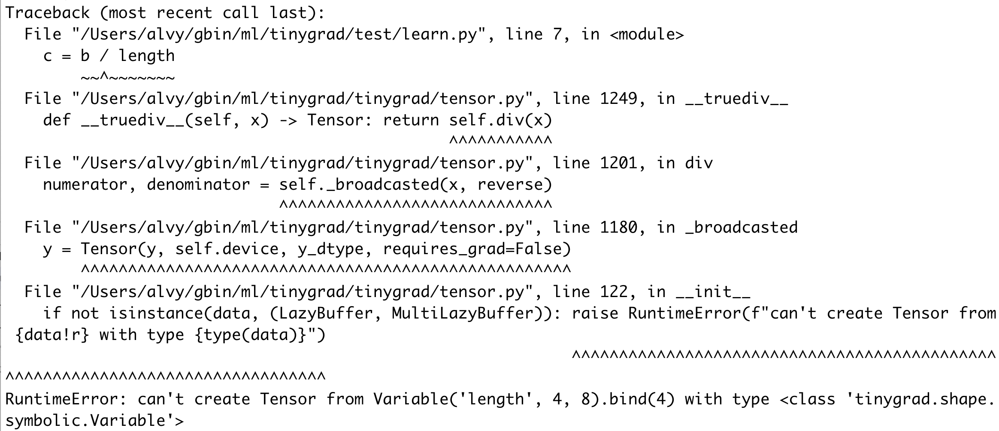

# Explaining the symbolic mean bounty

You can check out commit f3de17912f45cf7e45aa2004a0087346fd5fc54a
to experiment with how things are before the implementation.

The bounty is to add support for calculating the mean of a tensor (across
a certain dimension) using symbolic variable. To understand what that means,
let's look at a relevant example. The scrip below sums up a tensor:

```python
from tinygrad import Tensor
a = Tensor.rand(4)
b = a.sum()
print(b.numpy())
```

We can run this with `DEBUG=5 python script.py` and see the generated kernel
code:

```c++
#include <metal_stdlib>
using namespace metal;
kernel void r_4(device int* data0, const device int* data1, uint3 gid [[threadgroup_position_in_grid]], uint3 lid [[thread_position_in_threadgroup]]) {
  int acc0 = 0;
  int val0 = *(data1+0);
  int val1 = *(data1+1);
  int val2 = *(data1+2);
  int val3 = *(data1+3);
  *(data0+0) = (val3+val2+val1+val0+acc0);
}
```

There's nothing too interesting here, but suppose now we are doing the sum
operation on two different tensors:

```python
from tinygrad import Tensor
a = Tensor.rand(4)
b = a.sum()
print(b.numpy())
c = Tensor.rand(8)
d = c.sum()
print(d.numpy())
```

You will now see a second kernel, in addition to the one from earlier:

```c++
#include <metal_stdlib>
using namespace metal;
kernel void r_8(device int* data0, const device int* data1, uint3 gid [[threadgroup_position_in_grid]], uint3 lid [[thread_position_in_threadgroup]]) {
  int acc0 = 0;
  int val0 = *(data1+0);
  int val1 = *(data1+1);
  int val2 = *(data1+2);
  int val3 = *(data1+3);
  int val4 = *(data1+4);
  int val5 = *(data1+5);
  int val6 = *(data1+6);
  int val7 = *(data1+7);
  *(data0+0) = (val7+val6+val5+val4+val3+val2+val1+val0+acc0);
}
```

The downside of having two kernels is that the compilation has to be done
twice, once for each kernel. Although we can already tell that the two tensors
are quite similar, and in theory, we should have some way of reusing the same
compilation result for both tensors's sum operation. That's where symbolic 
comes to play. We can initialize a tensor with a symbolic shape, and
bind the value to it, such that the compilation has to be done only once and
cached:

```python
from tinygrad import Tensor
from tinygrad.shape.symbolic import Variable
length = Variable('length', 4, 8)
length = length.bind(4)
a = Tensor.rand(length)
b = a.sum()
print(b.numpy())

length, _ = length.unbind()
length.bind(8)
c = Tensor.rand(length)
d = c.sum()
print(d.numpy())
```

A little bit of explanation might help. `length` is a special object
of type Variable, it serves as a placeholder for a range of values, in which 
case we put 4 and 8, meaning it can represent numbers 4, 5, 6, 7, and 8. When
we create a tensor of shape `length`, we have to assign a value to it, such that
the sum can get concrete values for the operation. After that, when we want to 
assign a different value, we have to unbind it first, then re-bind, in which
case we assign value 8 and used it to create a tensor of length 8.

If you run the script again, you should see just one kernel, instead of two:

```c++
#include <metal_stdlib>
using namespace metal;
kernel void r_3Clength5B42D85D3E(device float* data0, const device float* data1, constant int& length, uint3 gid [[threadgroup_position_in_grid]], uint3 lid [[thread_position_in_threadgroup]]) {
  float acc0 = 0.0f;
  for (int ridx0 = 0; ridx0 < length; ridx0++) {
    float val0 = *(data1+ridx0);
    acc0 = (val0+acc0);
  }
  *(data0+0) = acc0;
}
```

There are two things interesting here. First, there's only one kernel, meaning
we only did the compilation once, cached it and re-used it when we sum the 
second tensor. Second, the kernel itself can serve tensors that has different
lengths, which allows us to use just one kernel.

The way this kernel works is by having an additional parameter: `constant int& length`
whose value is passed in when this kernel is dispatched. You see that in the loop,
it uses  `ridx0 < length` to bound the iteration, which allows it to work for any
length. Normally, when we dispatch a kernel, we are passing the data pointer for 
its input buffer, but here you can see that we can also pass in the special
value for the tensor's length. Things become clearer if you look at the IR Uops
that was generated:

```
   0 UOps.DEFINE_GLOBAL  : ptr.dtypes.float          []                               (0, 'data0', True)
   1 UOps.DEFINE_GLOBAL  : ptr.dtypes.float          []                               (1, 'data1', False)
   2 UOps.DEFINE_VAR     : dtypes.int                []                               <length[4-8]>
   3 UOps.DEFINE_ACC     : dtypes.float              []                               0.0
   4 UOps.CONST          : dtypes.int                []                               0
   5 UOps.LOOP           : dtypes.int                [4, 2]                           None
   6 UOps.LOAD           : dtypes.float              [1, 5]                           None
   7 UOps.ALU            : dtypes.float              [6, 3]                           BinaryOps.ADD
   8 UOps.PHI            : dtypes.float              [3, 7, 5]                        None
   9 UOps.ENDLOOP        :                           [5]                              None
  10 UOps.STORE          :                           [0, 4, 8]                        None
```

We have a `DEFINE_VAR` and the `LOOP` op uses it as the input, that's how
symbolic variable works in action. The actual implementaion is in this
older [PR](https://github.com/tinygrad/tinygrad/pull/1552).

Now back to the bounty question, can we do the same for mean? You can
try this script and you will get an error (note that I am running 
against commit id f3de17912f45cf7e45aa2004a0087346fd5fc54a) and
I used the `div` method directly to calculate the mean
because the `mean()` method has some asserts that prevent you from
trying this out at all:

```python
from tinygrad import Tensor
from tinygrad.shape.symbolic import Variable
length = Variable('length', 4, 8)
length = length.bind(4)
a = Tensor.rand(length)
b = a.sum()
c = b.div(length)
print(c.numpy())
```



The error message says you can't create a tensor using symbolic value. Tracing
the code, we see that the divison operator will attempt to create a tensor
for any non-tensor operand via the `_broadcasted` method:

```python
class Tensor:
  def div(self, x:Union[Tensor, ConstType], reverse=False, upcast=True) -> Tensor:
    numerator, denominator = self._broadcasted(x, reverse)
    if upcast: numerator, denominator = numerator.cast(least_upper_float(numerator.dtype)), denominator.cast(least_upper_float(denominator.dtype))
    return F.Div.apply(numerator, denominator)

  def _broadcasted(self, y:Union[Tensor, ConstType], reverse:bool=False, match_dtype:bool=True) -> Tuple[Tensor, Tensor]:
    x: Tensor = self
    if not isinstance(y, Tensor):
      # make y a Tensor
      # assert isinstance(y, (float, int, bool)), f"{type(y)=}, {y=}"
      if isinstance(self.dtype, ImageDType) or dtypes.is_float(x.dtype) or (dtypes.is_int(x.dtype) and isinstance(y, int)): y_dtype = x.dtype
      else: y_dtype = dtypes.from_py(y)
      y = Tensor(y, self.device, y_dtype, requires_grad=False)

    if match_dtype:
      output_dtype = least_upper_dtype(x.dtype, y.dtype)
      x, y = x.cast(output_dtype), y.cast(output_dtype)

    if reverse: x, y = y, x

    # broadcast
    out_shape = broadcast_shape(x.shape, y.shape)
    return x._broadcast_to(out_shape), y._broadcast_to(out_shape)
```

If you ponder about why `sum` works and `mean` doesn't, it's because summing
things up does not introduce new variables, it's just adding the values
within itself. However, calculating the mean requires you to divide the sum
by a new value, and this new value has to be of type tensor. Similarly, 
you can see that `max` and `min` also work, whereas `std` and `var` do not.
The goal of the bounty is now clear - allow Tensor to accept symbolic values.
Let's look at how things might be done, when you create a tensor, its initializer
checks the data type:

```python
    if isinstance(data, LazyBuffer): assert dtype is None or dtype == data.dtype, "dtype doesn't match, and casting isn't supported"
    # ...
    if not isinstance(data, (LazyBuffer, MultiLazyBuffer)): raise RuntimeError(f"can't create Tensor from {data!r} with type {type(data)}")
    if isinstance(device, tuple):
      # TODO: what if it's a MultiLazyBuffer on other devices?
      self.lazydata: Union[LazyBuffer, MultiLazyBuffer] = MultiLazyBuffer.from_sharded(data, device, None) if isinstance(data, LazyBuffer) else data
    else:
      self.lazydata = data if data.device == device else data.copy_to_device(device)

```

Feel free to now take a look at the PR that implemented it and hopefully
it become clear what it accomplished: https://github.com/tinygrad/tinygrad/pull/4362