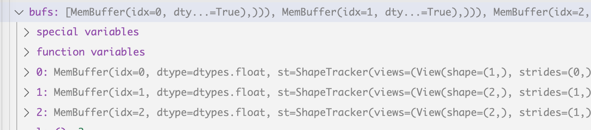
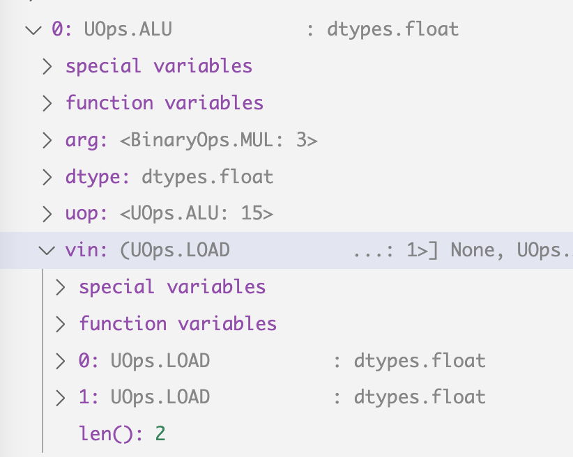

# Kernel Fusion part 3: the linear layer UOps

In my [high level overview of kernel fusion](dotproduct.md) and the
[schedule item](scheduleitem.md) post, I discussed the three
layers of abstraction in generating a kernel: ScheduleItem, Uops and
the final kernel code and gave a detailed explanation of how ScheduleItem
is generated. Let me discuss the next layer regarding how ScheduleItem is
turned into a linear representation (Uops) of all the operations that need to
be performed, and their optimzation. 

Recall that a dot product operation will output this ScheduleItem to be converted
to kernel code:

```
  0 ━┳ STORE MemBuffer(idx=0, dtype=dtypes.int, st=ShapeTracker(views=(View(shape=(1,), strides=(0,), offset=0, mask=None, contiguous=True),)))
  1  ┗━┳ SUM (0,)
  2    ┗━┳ MUL
  3      ┣━━ LOAD MemBuffer(idx=1, dtype=dtypes.int, st=ShapeTracker(views=(View(shape=(2,), strides=(1,), offset=0, mask=None, contiguous=True),)))
  4      ┗━━ LOAD MemBuffer(idx=2, dtype=dtypes.int, st=ShapeTracker(views=(View(shape=(2,), strides=(1,), offset=0, mask=None, contiguous=True),)))
```

Remember that the above AST looking tree is the "ScheduleItem" we I discussed
in the last post, and it gets converted into the following in the next step:

```
step  Op_name               type                      input                           arg
   0 UOps.DEFINE_GLOBAL  : ptr.dtypes.int            []                               (0, 'data0', True)
   1 UOps.DEFINE_GLOBAL  : ptr.dtypes.int            []                               (1, 'data1', False)
   2 UOps.DEFINE_GLOBAL  : ptr.dtypes.int            []                               (2, 'data2', False)
   3 UOps.DEFINE_ACC     : dtypes.int                []                               0
   4 UOps.CONST          : dtypes.int                []                               0
   5 UOps.CONST          : dtypes.int                []                               2
   6 UOps.LOOP           : dtypes.int                [4, 5]                           None
   7 UOps.LOAD           : dtypes.int                [1, 6]                           None
   8 UOps.LOAD           : dtypes.int                [2, 6]                           None
   9 UOps.ALU            : dtypes.int                [7, 8]                           BinaryOps.MUL
  10 UOps.ALU            : dtypes.int                [9, 3]                           BinaryOps.ADD
  11 UOps.PHI            : dtypes.int                [3, 10, 6]                       None
  12 UOps.ENDLOOP        :                           [6]                              None
  13 UOps.STORE          :                           [0, 4, 11]                       None
```

Please refer back to the [high level overview](dotproduct.md) for more context.

The journey starts from the `corealize` method in the Tensor class

```python
  @staticmethod
  def corealize(lst:Iterable[Tensor]):
    run_schedule(create_schedule(flatten([x.lazydata.lbs if isinstance(x.lazydata, MultiLazyBuffer) else [x.lazydata] for x in lst])))
```

We take the created ScheduleItem (discussed in [this post](scheduleitem.md)) and 
call the `run_schedule` function, which invokes `prg = lower_schedule_item(si)`,
within which if the item has a `STORE` operation at the top level it starts the
process of converting ScheduleItem to Uops via the `get_runner` method.

```python
  if si.ast[0].op is BufferOps.STORE: return Device[si.outputs[0].device].get_runner(*si.ast)
```

Inside `get_runner`, it initialize a linearizer and call a to_program method (`*ast` is our ScheduleItem):

```python
  def get_runner(self, *ast:LazyOp) -> CompiledASTRunner: return self.to_program(self.get_linearizer(*ast))
```

The Linearizer class is what's responsible for converting an AST (ScheduleItem) to
linear operations, hence its name. Inside it we see a condtion check for the 
`NOOPT` env variable, and that's where things diverge depending on whether you have
optimization set up. We will assume the NOOPT is set to true for now so we don't 
go in there. Spoiler though, inside the if block, it sets up certain flags for the
optimization, rather than performing them directly.

```python
    if not NOOPT:
```

You will also see a check for the `DEBUG` variable:

```python
    if DEBUG >= 3:
      from tinygrad.features.graph import print_tree
      for op in ast: print_tree(op)
```

This is actually what prints out the scheduleitem or AST we saw above.

Overall, it initialize an object with some default settings, and is passed to
the `to_program` method.

`to_program` calls two important methods, first is the `linearize` method,
this is where the process of converting things actually happens

```python
    k.linearize()
```

Next thing `to-program` does is set up the actual code generator and facility to
run it:

```python
    ret = CompiledASTRunner(k.name, self.compiler.render(to_function_name(k.name), k.uops), self.dname, k.global_size, k.local_size,
                            k.uops.vars(), min(info.flops, ops * run_count), min(info.mem_estimate, mem * run_count), outcount=len(k.outbufs))
```

You can see the `self.compiler.render()` is what generates the actual code, and
`CompiledASTRunner` takes that code and expose an `exec` method so they can be
executed on GPU.

I will focus on the `linearize()` method in this post:

```python
  def linearize(self):
```

It's actually a very long function. An important property to keep an eye on
is the `uops` attribute on the Linearizer instance, This attribute contains a list
of, you guessed it, Uops, which is what we saw earlier when I printedd the entire
UOps list. So by looking at when and where items are added to the list, we can 
make sense of how the process works.

This is where `self.uops` is initialized:

```python
    self.uops:UOpGraph = UOpGraph()
```

And this is an example where items are appended:

```python
        self.buf_uops[i] = self.uops.add(UOps.DEFINE_GLOBAL,
                                         buf.dtype if isinstance(buf.dtype, ImageDType) else PtrDType(buf.dtype), (),
                                         (buf.idx, f"data{buf.idx}", any(buf.idx == x.idx for x in self.outbufs)))
```

The above calls the `add` method on UOpGraph, and add a `DEFINE_GLOBAL` uop with
dtype set to the buffer's data type, with zero input, argument set to the
index. Let's briefly look at the implementation of the `add` method:

```python
  def add(self, uop:UOps, dtype:Optional[DType]=None, vin:Tuple[UOp, ...]=tuple(), arg:Any=None, cachable=True, insert_before=None,
          simplify=True) -> UOp:
    ret = UOp(uop, dtype, vin, arg)
    if simplify and (rewritten:=constant_folder.rewrite(ret)) is not None:
      if rewritten in self.uops: return rewritten  # ignore cachable
      ret = rewritten
    key = (ret.uop, ret.dtype, ret.vin, ret.arg)
    if insert_before is None: insert_before = len(self.uops)
    # check if the cached expr is valid with the given insert place.
    if cachable and (expr:=self.saved_exprs.get(key, None)) is not None and self.uops.index(expr) <= insert_before: return expr
    self.uops.insert(insert_before, ret)
    if cachable: self.saved_exprs[key] = ret
    return ret
```

You see that it construct the UOp as a plain class instance, and set up some caches,
afterwards it just does a plain list insert `self.uops.insert(insert_before, ret)`.

So by adding a breakpoint on the `add` method, I managed to figure out exactly when
a uop is added. Now think about conceptually, how would you turn the AST into
linear form? 

Step 1 is to initialize variables that will be used in the kernel, we must have
an output pointer passed to the argument, and for any input, we also need to have
them as arguments passed. So if we have a kernel function like this

```
(int* data0, int* data1, int* data2) {

}
```

We need to have three `DEFINE_GLOBALS`, that's exactly what happens
```
    for i,buf in enumerate(self.bufs):
      if isinstance(buf, MemBuffer):
        self.buf_uops[i] = self.uops.add(UOps.DEFINE_GLOBAL,
                                         buf.dtype if isinstance(buf.dtype, ImageDType) else PtrDType(buf.dtype), (),
                                         (buf.idx, f"data{buf.idx}", any(buf.idx == x.idx for x in self.outbufs)))
```

`self.bufs` was initialized inside the __init__ method in the `Linearizer` class:

```
    self.bufs: List[Union[MemBuffer, ConstBuffer, LocalBuffer]] = self.outbufs + dedup([x.arg for x in self.lazyops if x.op in loadops])
```

In our case, it has three items:


The first membuffer is the output data pointer, the other two are the two list we are operating the dot product operation on. They came from the scheduleitem that I covered in details in my last post. 

Next after lots of code that didn't take any effect (not in our simple dot product),
we encounter a reduce set up:

```python
    if self.reduceop is not None:
      # define indexes
      reduce_idxs = [Variable(f"ridx{i}", 0, self.full_shape[i]-1) for i in range(self.first_reduce+self.group_for_reduces, self.shape_len-self.upcasted)]  # noqa: E501
      fake_reduce_idxs = [x*0 for x in reduce_idxs]

      # define accumulator
      out_buf = -1 if self.group_for_reduces else 0
      acc = self.global_load(out_buf, global_idxs+local_idxs+fake_reduce_idxs+upcast_idxs, self.get_reduce_acc(self.reduceop))

      # reduce loop
      loop_ctx = render_loop(reduce_idxs)
```

A reduce op is something that convert multiple elements into one, for example, our 
SUM operation. `reduce_idxs` contains one element, a Variable that ranges from 0
to 1. I will cover what a `Variable` is in a separate post, but for now, think
of it as a regular integer but with some special methods. Conceptually, if we want 
to reduce a list of element into a single one, we need an accumulator and then
run a loop on our list, this is in fact what happens at this stage (before any
optimization).

We first define an accumulator by calling global_load:
```python
      acc = self.global_load(out_buf, global_idxs+local_idxs+fake_reduce_idxs+upcast_idxs, self.get_reduce_acc(self.reduceop))
```

`global_load` is a complicated function, but in this case, just the following line
has effect:

```python
          self.load_cache[key] = self.uops.add(UOps.DEFINE_ACC, localtype, (), dtypes.as_const(this_const, localtype), cachable=False)
```

A DEFINE_ACC is added to the uops list. Next we enter the `render_loop` function

```python
      loop_ctx = render_loop(reduce_idxs)
```

render_loop is defined as such:

```python
    def render_loop(xx:List[Variable]) -> Tuple[UOp, ...]:
      new_loops = {x.expr:self.uops.add(UOps.LOOP, dtypes.int32, (
        self.const(x.min) if isinstance(x.min, int) else cast(Node, x.min).render(self.render_ops, self),
        self.const(x.max+1) if isinstance(x.max, int) else cast(Node, x.max+1).render(self.render_ops, self)), cachable=False) for x in xx if not isinstance(x, NumNode) and x.expr is not None}  # noqa: E501
      self.loop_uops.update(new_loops)
      return tuple(new_loops.values())
```

The key to it is that for the reduce operation we have, we append a LOOP 
uop to the uops list. The loop will have a termination, which is set to the max
value of our reduce op plus 1.

We then iterate through the `.earlybufs` property to set up a variable that
contains the buffers before any reduce operation is performed. The .earlybufs
is initialized like this

```python
    self.earlybufs = [x.arg for x in self.reduceop.lazyops if x.op in BufferOps] if self.reduceop else []
```

Then we parse the entire AST for the reduce part (SUM) and fill in the remaining
uops within the loop:

```python
        self.ast_parse(self.reduceop, acc, self.acc_offsets(self.full_buf_index), loaded_buffers, do_reduce=True, loop_ctx=loop_ctx)
```

Let's look at what ast_parse does:

```python
  def ast_parse(self, x:LazyOp, acc: List[UOp], offs:Optional[List[int]], loaded_buffers:Dict[Union[MemBuffer, ConstBuffer, LocalBuffer], List[UOp]], do_reduce=False, loop_ctx=tuple(), cache=None) -> List[UOp]:  # noqa: E501
```

x is our SUM op, acc is the DEFINE_ACC we have set up, offs is zero (which I didn't cover, but being 
zero means we operate on the input without any offset). `loaded_buffers` derives from
`.earlybufs` with some modification, but essentially means the available data our
loop can access -- put into context, they are the two tensor we are applying dot
product operation on and then summing the elements. 

We see that it goes into the `.src` and perform a recursion:

```python
    values = [self.ast_parse(v, acc, offs, loaded_buffers, loop_ctx=loop_ctx, cache=cache) for v in x.src]
```

Recall our AST looks like this:
```
  0 ━┳ STORE MemBuffer(idx=0, dtype=dtypes.int, st=ShapeTracker(views=(View(shape=(1,), strides=(0,), offset=0, mask=None, contiguous=True),)))
  1  ┗━┳ SUM (0,)
  2    ┗━┳ MUL
  3      ┣━━ LOAD MemBuffer(idx=1, dtype=dtypes.int, st=ShapeTracker(views=(View(shape=(2,), strides=(1,), offset=0, mask=None, contiguous=True),)))
  4      ┗━━ LOAD MemBuffer(idx=2, dtype=dtypes.int, st=ShapeTracker(views=(View(shape=(2,), strides=(1,), offset=0, mask=None, contiguous=True),)))
  ```

The .src of the SUM node is MUL, whose `.src` are the two LOAD op, so the recursion's
base case terminates upon the loading of the two membuffers, which are our input list:

```python
    if x.op in BufferOps: return loaded_buffers[x.arg]
```

And the MUL operation is constructed:

```python
      ret = [self.uops.add(UOps.ALU, dtypes.bool if x.op in {BinaryOps.CMPLT, BinaryOps.CMPEQ} else val[-1].dtype, val, x.op) for val in zip(*values)]
```

which results in:


The above read: append a ALU operation (arithmetic logic unit) to the linear ops list,
this op's type is the same as input type, and the val is each element in the LOAD buffer,
with the specific op type being MUL (x.op). In summary, that's how you would express
the following multiplication operation in linear op format:

```c++
    int val0 = *(data1+ridx0);
    int val1 = *(data2+ridx0);
    acc = val0 * val1;
```

And finally we return back to the SUM callstack and execute this line:

```python
    if x.op in ops:
      ret: List[UOp] = []
      input_acc = acc[:]
      for val, off in zip(zip(*values), cast(List[int], offs)):
        acc[off] = self.uops.add(UOps.ALU, acc[off].dtype, vin=val+(acc[off],), arg=ops[cast(ReduceOps, x.op)])
        ret.append(acc[off])
      for off in range(len(acc)):
        if input_acc[off] != acc[off]:
          acc[off] = self.uops.add(UOps.PHI, input_acc[off].dtype, (input_acc[off], acc[off]) + tuple(loop_ctx))

```

The first loop add all the input from our MUL recursion together by doing `self.uops.add(UOps.ALU)`,
and the second loop relates to single static assignment and constructs a PHI op.
I don't understand it 100% so I will just recommend you look up the concept on 
Google (a good example is LLVM).

The remaining part is more or less the same as before, but for all the
remaining operation after the SUM part (which we actually don't have any)

```python
    loaded_buffers.update({b:self.global_load(i, global_idxs+local_idxs+fake_reduce_idxs+upcast_idxs) \
                           for i,b in enumerate(self.bufs) if b not in self.earlybufs and b.__class__ is not LocalBuffer})

    # run late AST (without the store)
    for op in self.ast:
      val = self.ast_parse(op.src[0], acc, None, loaded_buffers)
      self.global_store(op.arg.idx, global_idxs+local_idxs+fake_reduce_idxs+upcast_idxs, val)
```

And finally, we enter the optimization step (I will probably cover the optimize part in a separate post)

```python
    self.uops.uoptimize()
```

and end the uops generation part.