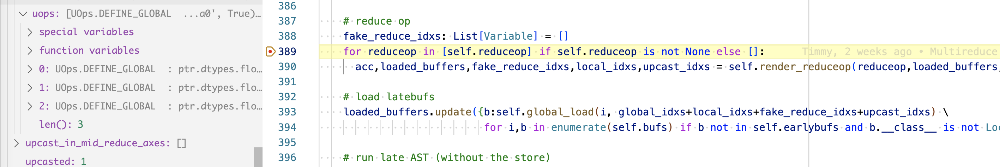
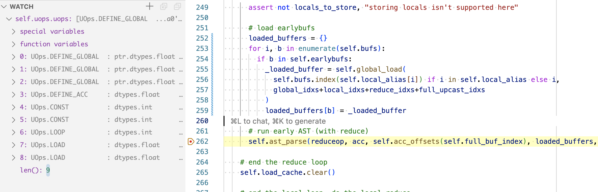
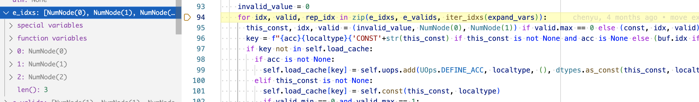
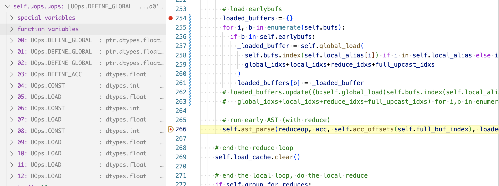

Recall our dot product example,

```python
from tinygrad import Tensor

a = Tensor([1,2,3,4])
b = Tensor([5,6,7,8])
a = a.dot(b)
a.numpy()
```

I want to illustrate one of the common optimization that made the generated
kernel code go from this (when run with `NOOPT=1 DEBUG=5 python script.py`):

```python
kernel void r_4(device int* data0, const device int* data1, const device int* data2, uint3 gid [[threadgroup_position_in_grid]], uint3 lid [[thread_position_in_threadgroup]]) {
  int acc0 = 0;
  for (int ridx0 = 0; ridx0 < 4; ridx0++) {
    int val0 = *(data1+ridx0);
    int val1 = *(data2+ridx0);
    acc0 = ((val0*val1)+acc0);
  }
  *(data0+0) = acc0;
}
```

to this (when run with `DEBUG=5 python script.py`):

```c++
kernel void r_4(device int* data0, const device int* data1, const device int* data2, uint3 gid [[threadgroup_position_in_grid]], uint3 lid [[thread_position_in_threadgroup]]) {
  int acc0 = 0;
  int val0 = *(data1+0);
  int val1 = *(data1+1);
  int val2 = *(data1+2);
  int val3 = *(data1+3);
  int val4 = *(data2+0);
  int val5 = *(data2+1);
  int val6 = *(data2+2);
  int val7 = *(data2+3);
  *(data0+0) = ((val3*val7)+(val2*val6)+(val1*val5)+(val0*val4)+acc0);
}
```

The NOOPT flag tells tinygrad not to do any optimization, so we get a plain
loop construct, whereas by default it will see that having the loop is not 
not necessary for a plain addition of only 4 elements.

If you recall, the operation is converted into the IR UOps before being
converted into GPU code. In fact, the IR is where the optimization takes
place. When we run the script without optimization, this is the IR:

```
   0 UOps.DEFINE_GLOBAL  : ptr.dtypes.int            []                               (0, 'data0', True)
   1 UOps.DEFINE_GLOBAL  : ptr.dtypes.int            []                               (1, 'data1', False)
   2 UOps.DEFINE_GLOBAL  : ptr.dtypes.int            []                               (2, 'data2', False)
   3 UOps.DEFINE_ACC     : dtypes.int                []                               0
   4 UOps.CONST          : dtypes.int                []                               0
   5 UOps.CONST          : dtypes.int                []                               4
   6 UOps.LOOP           : dtypes.int                [4, 5]                           None
   7 UOps.LOAD           : dtypes.int                [1, 6]                           None
   8 UOps.LOAD           : dtypes.int                [2, 6]                           None
   9 UOps.ALU            : dtypes.int                [7, 8]                           BinaryOps.MUL
  10 UOps.ALU            : dtypes.int                [9, 3]                           BinaryOps.ADD
  11 UOps.PHI            : dtypes.int                [3, 10, 6]                       None
  12 UOps.ENDLOOP        :                           [6]                              None
  13 UOps.STORE          :                           [0, 4, 11]                       None
```

You can find more details on what they mean in [this](uops-doc.md) and [this](uops.md) 
guide, but the key here is we see the LOOP and ENDLOOP instruction. In the 
second version, however, we don't see it:

```
   0 UOps.DEFINE_GLOBAL  : ptr.dtypes.float          []                               (0, 'data0', True)
   1 UOps.DEFINE_GLOBAL  : ptr.dtypes.float          []                               (1, 'data1', False)
   2 UOps.DEFINE_GLOBAL  : ptr.dtypes.float          []                               (2, 'data2', False)
   3 UOps.DEFINE_ACC     : dtypes.float              []                               0.0
   4 UOps.CONST          : dtypes.int                []                               0
   5 UOps.CONST          : dtypes.int                []                               3
   6 UOps.LOOP           : dtypes.int                [4, 5]                           None
   7 UOps.LOAD           : dtypes.float              [1, 6]                           None
   8 UOps.LOAD           : dtypes.float              [2, 6]                           None
   9 UOps.ALU            : dtypes.float              [7, 8]                           BinaryOps.MUL
  10 UOps.ALU            : dtypes.float              [9, 3]                           BinaryOps.ADD
  11 UOps.PHI            : dtypes.float              [3, 10, 6]                       None
  12 UOps.ENDLOOP        :                           [6]                              None
  13 UOps.STORE          :                           [0, 4, 11]                       None
```

The uops are generated via the `.linearize()` method invocation in the `Linearizer`
instance, in fact, we can construct this directly:

```python
from tinygrad import Tensor
from tinygrad.engine.schedule import create_schedule
from tinygrad.codegen.linearizer import Linearizer
a = Tensor([1,2,3,4]).realize()
b = Tensor([5,6,7,8]).realize()
c = a.dot(b)
s = create_schedule([c.lazydata])[0]
k = Linearizer(*s.ast)
k.linearize()
k.uops.print()
```

We have to add `.realize()` to the input to have their data ready in this
simplified version which doesn't have the helper code that handle them. Run this script
directly without any flags `python script.py`, and you get the same uops output:

```
  0 UOps.DEFINE_GLOBAL  : ptr.dtypes.float          []                               (0, 'data0', True)
   1 UOps.DEFINE_GLOBAL  : ptr.dtypes.float          []                               (1, 'data1', False)
   2 UOps.DEFINE_GLOBAL  : ptr.dtypes.float          []                               (2, 'data2', False)
   3 UOps.DEFINE_ACC     : dtypes.float              []                               0.0
   4 UOps.CONST          : dtypes.int                []                               0
   5 UOps.CONST          : dtypes.int                []                               3
   6 UOps.LOOP           : dtypes.int                [4, 5]                           None
   7 UOps.LOAD           : dtypes.float              [1, 6]                           None
   8 UOps.LOAD           : dtypes.float              [2, 6]                           None
   9 UOps.ALU            : dtypes.float              [7, 8]                           BinaryOps.MUL
  10 UOps.ALU            : dtypes.float              [9, 3]                           BinaryOps.ADD
  11 UOps.PHI            : dtypes.float              [3, 10, 6]                       None
  12 UOps.ENDLOOP        :                           [6]                              None
  13 UOps.STORE          :                           [0, 4, 11]                       None
```

Now if you want to see the generated kernel code on Metal (this part was briefly
covered in [here](uops-doc.md) and [here](codegen.md)):

```python
from tinygrad.renderer.cstyle import uops_to_cstyle, MetalLanguage
print(uops_to_cstyle(MetalLanguage(), 'codegen', k.uops.uops))
```

The trick to unroll the loop is called upcast:

```python
k = Linearizer(*s.ast)
k.upcast() # ---> insert this
k.linearize()
```

and the generated uops and kernel code become:

```
   0 UOps.DEFINE_GLOBAL  : ptr.dtypes.float          []                               (0, 'data0', True)
   1 UOps.DEFINE_GLOBAL  : ptr.dtypes.float          []                               (1, 'data1', False)
   2 UOps.DEFINE_GLOBAL  : ptr.dtypes.float          []                               (2, 'data2', False)
   3 UOps.DEFINE_ACC     : dtypes.float              []                               0.0
   4 UOps.CONST          : dtypes.int                []                               0
   5 UOps.LOAD           : dtypes.float              [1, 4]                           None
   6 UOps.CONST          : dtypes.int                []                               1
   7 UOps.LOAD           : dtypes.float              [1, 6]                           None
   8 UOps.CONST          : dtypes.int                []                               2
   9 UOps.LOAD           : dtypes.float              [1, 8]                           None
  10 UOps.LOAD           : dtypes.float              [2, 4]                           None
  11 UOps.LOAD           : dtypes.float              [2, 6]                           None
  12 UOps.LOAD           : dtypes.float              [2, 8]                           None
  13 UOps.ALU            : dtypes.float              [5, 10]                          BinaryOps.MUL
  14 UOps.ALU            : dtypes.float              [7, 11]                          BinaryOps.MUL
  15 UOps.ALU            : dtypes.float              [9, 12]                          BinaryOps.MUL
  16 UOps.ALU            : dtypes.float              [13, 3]                          BinaryOps.ADD
  17 UOps.ALU            : dtypes.float              [14, 16]                         BinaryOps.ADD
  18 UOps.ALU            : dtypes.float              [15, 17]                         BinaryOps.ADD
  19 UOps.STORE          :                           [0, 4, 18]                       None
```

```c++
kernel void codegen(device int* data0, const device int* data1, const device int* data2, uint3 gid [[threadgroup_position_in_grid]], uint3 lid [[thread_position_in_threadgroup]]) {
  int acc0 = 0;
  int val0 = *(data1+0);
  int val1 = *(data1+1);
  int val2 = *(data1+2);
  int val3 = *(data1+3);
  int val4 = *(data2+0);
  int val5 = *(data2+1);
  int val6 = *(data2+2);
  int val7 = *(data2+3);
  *(data0+0) = ((val3*val7)+(val2*val6)+(val1*val5)+(val0*val4)+acc0);
}
```

## How the internal works

So how does it work? The upcast method increments an attribute called `.upcasted`
and when the linearize method is called, it checks for that attribute
and manipulate the uops. 

```python
  def upcast(self):
    check(self.full_shape[-1] != 1, "can't upcast a dimension with size 1")
    self.upcasted += 1
```

The controller is the `upcasted` attribute, you can actually increase the number
of elements to a crazy amount and see that if you just call `upcast()`, it will
unroll. A heuristic check for the size of such a loop must be checked before 
you call `upcast()`.

Let's see the relevant portion of `linearize()` that acts on this attribute.
Recall that we have a reduce op SUM, to combine the multiplication result (you 
may want to refer to the [scheduleitem post](scheduleitem.md) for more details).
And the part of the linearize that handles it is here:

```python
    fake_reduce_idxs: List[Variable] = []
    for reduceop in [self.reduceop] if self.reduceop is not None else []:
      acc,loaded_buffers,fake_reduce_idxs,local_idxs,upcast_idxs = self.render_reduceop(reduceop,loaded_buffers,global_idxs,local_idxs,upcast_idxs)
```

Up until this point, our uops contain only the DEFINE_GLOBALs:



The `render_reuceop` method will complete the entire loop construct, you can
see that after its execution, our uops will have everything except the STORE:

Let's look inside render_reduceop:

```python
  def render_reduceop(self, reduceop: LazyOp, loaded_buffers:Dict[Union[MemBuffer, ConstBuffer, LocalBuffer], List[UOp]], \
                      global_idxs, local_idxs, upcast_idxs):
    acc = self.global_load(out_buf, global_idxs+local_idxs+fake_reduce_idxs+upcast_idxs, self.get_reduce_acc(reduceop))
    loop_ctx = self.render_loop(reduce_idxs)

    loaded_buffers = {}
    for i, b in enumerate(self.bufs):
      if b in self.earlybufs:
        _loaded_buffer = self.global_load(
          self.bufs.index(self.local_alias[i]) if i in self.local_alias else i,
          global_idxs+local_idxs+reduce_idxs+full_upcast_idxs
        )
        loaded_buffers[b] = _loaded_buffer

    self.ast_parse(reduceop, acc, self.acc_offsets(self.full_buf_index), loaded_buffers, do_reduce=True, loop_ctx=loop_ctx)
```

The snippet is pseudocode but it outlines the major events that happen in the
method. We first define an accumulator, which will add the "DEFINE_ACC" to 
list of uops. Then we call `render_loop` that actually inserts the "LOOP" uop.
After that we enumerate through the buffers and find the one that's in "earlybufs".
What is earlybufs? It was defined when the linearizer was constructed:

```
    self.earlybufs = [x.arg for x in self.reduceop.lazyops if x.op in BufferOps] if self.reduceop else []
```

It is essentially the buffers that serve as input to the SUM operation, in which
case, the two vectors we pass in, and are defined as data1 and data2 in the form
of "DEFINE_GLOBALS". So the for loop will add two "LOAD" uops, with their input
coming from the "LOOP" and "DEFINE_GLOBAL" uops.

By this point, our uops look like this, note the breakpoint is at `self.ast_parse`.



The `ast_parse` method will take the reduce op, our sum operation, and walk down
the AST tree to start inserting ALU ops:

```python
  def ast_parse(self, x:LazyOp, acc: List[UOp], offs:Optional[List[int]], loaded_buffers:Dict[Union[MemBuffer, ConstBuffer, LocalBuffer], List[UOp]], do_reduce=False, loop_ctx=tuple(), cache=None) -> List[UOp]: # noqa: E501
    values = [self.ast_parse(v, acc, offs, loaded_buffers, loop_ctx=loop_ctx, cache=cache) for v in x.src]
    ops = {ReduceOps.SUM:BinaryOps.ADD, ReduceOps.MAX:BinaryOps.MAX}
    if x.op in ops:
      #...
    else:
      ret = [self.uops.add(UOps.ALU, dtypes.bool if x.op in {BinaryOps.CMPLT, BinaryOps.CMPEQ} else val[-1].dtype, val, x.op) for val in zip(*values)]
    return ret

```

Here I outlined the pseudocode for a base case (note that it is a recursion),
you can see that if it's an ADD operation, then an ALU node will be inserted.

The interesting part now comes when we have called the `upcast()` method. Let's 
see how things change. 

We start at the same for loop as before

```python
    for reduceop in [self.reduceop] if self.reduceop is not None else []:
      acc,loaded_buffers,fake_reduce_idxs,local_idxs,upcast_idxs = self.render_reduceop(reduceop,loaded_buffers,global_idxs,local_idxs,upcast_idxs)
```

`reduceop` will be the same, with the identical AST for this SUM operation.
The difference is in the upcast_idxs, where previously it was empty, now it
has the value of `[NumNode(0)]`.

```python
  def render_reduceop(self, reduceop: LazyOp, loaded_buffers:Dict[Union[MemBuffer, ConstBuffer, LocalBuffer], List[UOp]], \
                      global_idxs, local_idxs, upcast_idxs):
    # define indicies
    full_upcast_idxs = [Variable(f"_uidx{i}", 0, s-1) for i, s in enumerate(self.full_shape[self.shape_len-self.upcasted:])]
    reduce_idxs = [Variable(f"ridx{i}", 0, self.full_shape[i]-1) for i in range(self.first_reduce+self.group_for_reduces, self.shape_len-self.upcasted)]  # noqa: E501
    fake_reduce_idxs = [x*0 for x in reduce_idxs]
```

In our previous run, the full_upcast_idxs would be empty, and the reduce_idxs 
would have one element. Now it is the opposite, full_upcast_idxs has the value
`[Variable('_uidx0', 0, 2)]` and `reduce_idxs` is empty. What the content
mean will become clearer later, but do note that the length of it controls 
whether the loop form or not. Having an empty `reduce_idxs` will not result
in any "LOOP" uop being added. 

In the next step, the buffers are enumerated the same way, except full_upcast_idxs
have content now:

```python
      loaded_buffers = {}
      for i, b in enumerate(self.bufs):
        if b in self.earlybufs:
          _loaded_buffer = self.global_load(
            self.bufs.index(self.local_alias[i]) if i in self.local_alias else i,
            global_idxs+local_idxs+reduce_idxs+full_upcast_idxs
          )
          loaded_buffers[b] = _loaded_buffer
```

I didn't go into details of what `global_load` does in the loop version,
because it is conceptually straightforward. In each loop iteration, we need
to access the data from input buffers, by indexing into the current loop
index. However, in the upcasted version, the access pattern is more complex,
and the entrypoint to that is by passing in the full_upcast_idxs and
global_load will branch into a different execution path. Let me outline
the major step of execution in `global_load`:

```python
  def global_load(self, i:int, idxs:List[Node], acc=None, barrier:Optional[UOp]=None) -> List[UOp]:
    e_idxs, e_valids = expand_node(g_idx, expand_vars), expand_node(g_valid, expand_vars)
    for idx, valid, rep_idx in zip(e_idxs, e_valids, iter_idxs(expand_vars)):
      buf_uop = self.buf_uops[i]
      assert buf_uop is not None, f"buffer {i} wasn't UOped"
      rendered_idx = idx.render(self.render_ops, self)
      valid_tuple = (valid.render(self.render_ops, self), self.const(invalid_value, localtype)) if valid.min == 0 else tuple()
      self.load_cache[key] = self.uops.add(UOps.LOAD, localtype, (buf_uop, rendered_idx) + valid_tuple + ((barrier,) if barrier else ()))
```

We can work backward to see that in the first version, the for loop is executed
only once, so we get a single LOAD. Now, we have to unroll this loop so all
of the content has a LOAD, our input has 3 elements, so the for loop must
be executed three times. You can see that the length of `e_idxs` is in fact
3:



And the number also tells you that for each iteration, the idx is the position
of the input array that you should index into, so we will get the data at position
0, 1 and 2. 

If you look at the argument passed to `self.uops.add(UOps.LOAD, ...)`, you 
should see that there's a `rendered_idx`, this would be the input to the LOAD
operation, and the `rendered_idx` is in fact the instance of the uop. It 
is fetched by the `idx.render()` method:

```python
  def render(self, ops=None, ctx=None) -> Any:
    if ops is None: ops = render_python
    assert self.__class__ in (Variable, NumNode) or self.min != self.max
    return ops[type(self)](self, ops, ctx)
```

This is its definition, `ops` is a list of predefined instruction for
how to render certain stuff, but the important thing is `ctx`, which is our
linearizer instance, and it contains all its existing uops on the `.uops`
attribute. If you look at one of the render instruction, you can see
that it is indeed indexing into this attribute:

```python
    NumNode: lambda self, ops, ctx: ctx.const(self.b)
```

`ctx.const` is a method on the linearizer:

```python
  def const(self, b:ConstType, dtype:DType=dtypes.int32, insert_before=None) -> UOp:
    return self.uops.add(UOps.CONST, dtype, tuple(), b, insert_before=insert_before)
```

and there we get the `CONST` uops. Iterate it three times, we will have written 
all the LOAD ops, and by the time we get to `ast_parse`, our uops look like this:



We have six LOADs, corresponding to the six elements in the input array. And
three CONST, corresponding to the three index positions (0, 1, 2) to access
the element from. And the AST is now more straightforward, you simply traverse
down the tree, and their input will lead you to the correct uop and things
will just keep appending to the list.

The key takeaway here is that the loop unrolling is controlled by setting
the `upcasted` attribute. Then, the reduce_idxs and full_upcasted_idxs will
be determined accordingly, which control whether a LOOP is constructed or not,
and how to access the element in the inputs.